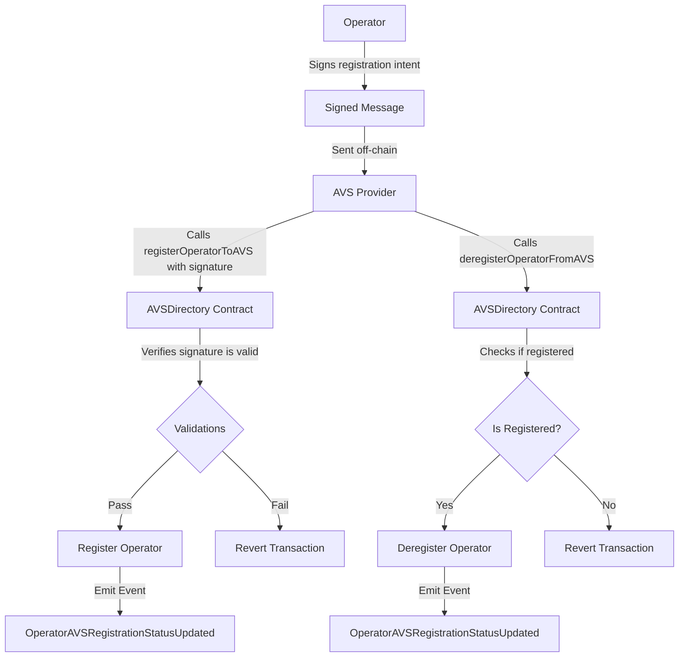

# AVSDirectory

## Contract Overview

The `AVSDirectory` contract serves as a central registry for Active Validator Services (AVS) in the EigenLayer protocol. Its primary purpose is to manage the relationships between AVS providers and operators, enabling operators to register with specific AVS systems and allowing AVS providers to maintain a list of their authorized operators.

Within the broader EigenLayer architecture, this contract sits as a critical coordination layer between staking operators and the specialized validation services (AVS) that need their resources. It essentially facilitates the "matching" between those who provide staking services and the applications that need validators.

The contract implements several important design patterns:
- **Upgradeable Pattern**: Using OpenZeppelin's upgradeable contracts framework to allow future improvements
- **Guardian Pattern**: Through the Pausable mixin to enable emergency stops
- **Ownership Pattern**: Restricting certain functions to authorized entities
- **Signature Verification**: Using off-chain signatures to confirm operator consent

## Contract Interface

### Public/External Functions

- **initialize(address initialOwner, uint256 initialPausedStatus)**: Sets up the contract with an initial owner and pause state.
- **updateAVSMetadataURI(string calldata metadataURI)**: Allows an AVS to update its metadata URI, which contains information about the service.
- **cancelSalt(bytes32 salt)**: Enables an operator to invalidate a specific salt they used in signatures, preventing replay attacks.
- **registerOperatorToAVS(address operator, SignatureWithSaltAndExpiry memory operatorSignature)**: Enables an AVS to register an operator who has cryptographically consented to the registration.
- **deregisterOperatorFromAVS(address operator)**: Allows an AVS to remove an operator from its registry.
- **calculateOperatorAVSRegistrationDigestHash(address operator, address avs, bytes32 salt, uint256 expiry)**: Calculates the message digest for operator registration signatures.

### Key Events

- **AVSMetadataURIUpdated**: Emitted when an AVS updates its metadata URI.
- **OperatorAVSRegistrationStatusUpdated**: Emitted when an operator's registration status with an AVS changes.

### Important State Variables

- **avsOperatorStatus**: Maps AVS addresses and operator addresses to their registration status.
- **operatorSaltIsSpent**: Tracks which signature salts have been used by operators to prevent replay attacks.
- **delegation**: A reference to the DelegationManager contract that tracks operator status in the broader EigenLayer system.

## Logic Flow

### Operator Registration to AVS

1. An operator decides to offer their services to a specific AVS.
2. The operator creates and signs a message containing their intent to register with the AVS, including a unique salt and expiry time.
3. The AVS calls `registerOperatorToAVS` with the operator's address and signature.
4. The contract verifies:
   - The operator is not already registered to this AVS
   - The signature salt has not been used before
   - The operator is registered in the core EigenLayer protocol
   - The signature is valid and not expired
5. Upon successful verification, the contract:
   - Marks the salt as spent
   - Updates the operator's status to REGISTERED
   - Emits an OperatorAVSRegistrationStatusUpdated event

### Operator Deregistration

1. When an AVS wants to remove an operator, they call `deregisterOperatorFromAVS` with the operator's address.
2. The contract verifies the operator is currently registered with the AVS.
3. The operator's status is changed to UNREGISTERED.
4. An OperatorAVSRegistrationStatusUpdated event is emitted.

### Security Mechanisms

- **Reentrancy Guard**: Prevents malicious reentrant calls that could manipulate state.
- **Pausability**: Allows emergency freezing of operator registration/deregistration.
- **Salt Invalidation**: Operators can cancel any salt to prevent unauthorized registrations.
- **Signature Expiry**: All signatures have a time-bound validity period.
- **Ownership Controls**: Only authorized actors can perform sensitive operations.

## Visual Representation

## Dependencies and Interactions

The AVSDirectory contract has several important dependencies:

- **DelegationManager**: Referenced through the `delegation` variable, this contract is used to verify if an address is registered as an operator in the EigenLayer protocol.
- **PauserRegistry**: Provides the infrastructure for emergency pausing capabilities.
- **AVSDirectoryStorage**: Inherited contract that defines the storage layout for AVSDirectory.
- **SignatureUtilsMixin**: Provides utilities for validating cryptographic signatures.

The contract is designed to be a supporting infrastructure component for the broader EigenLayer ecosystem. AVS providers interact with this contract to manage their operator relationships, while operators interact with it indirectly through signature-based consent mechanisms. This design enables a secure, consent-based system for delegating operator resources to various validation services.

It's worth noting that the contract includes functions marked for deprecation in a future release, indicating that the registration process is evolving, likely toward a more robust slashing-aware implementation as mentioned in the comments.