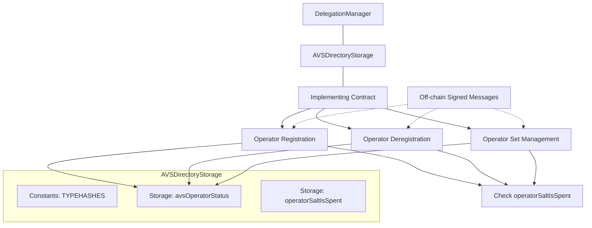

# AVSDirectoryStorage

## Contract Overview

The `AVSDirectoryStorage` contract serves as a foundational storage layer for managing the relationship between operators and AVS (Actively Validated Services) in the EigenLayer protocol. As an abstract contract, it defines the essential storage variables, constants, and immutable values that will be used by implementing contracts.

This contract plays a crucial role in the EigenLayer ecosystem by providing the data structures necessary to track which operators are registered with which AVS services and manage the registration lifecycle. EigenLayer is a restaking protocol that allows Ethereum validators to reuse their staked ETH as security for other services, and this contract helps facilitate these connections.

The key design pattern used is the storage contract pattern, where storage variables are separated from logic to create a cleaner inheritance chain and reduce the risk of storage collisions during upgrades. The contract also implements EIP-712 for typed structured data hashing and signing, enabling secure off-chain authorization of on-chain actions.

## Contract Interface

### Key State Variables

1. **`avsOperatorStatus`**: A double mapping that tracks the registration status of operators for each AVS. This relationship is central to the contract's purpose.

2. **`operatorSaltIsSpent`**: A mapping to prevent replay attacks by tracking which signed messages (identified by their salt) have already been processed.

3. **`delegation`**: An immutable reference to the EigenLayer's `DelegationManager` contract, which this contract needs to interact with.

### Constants

1. **Type Hash Constants**: 
   - `OPERATOR_AVS_REGISTRATION_TYPEHASH`
   - `OPERATOR_SET_REGISTRATION_TYPEHASH`
   - `OPERATOR_SET_FORCE_DEREGISTRATION_TYPEHASH`

   These constants define the structure of various signed messages for EIP-712 typed data signing, enabling secure off-chain approvals.

2. **Pause Flags**:
   - `PAUSED_OPERATOR_REGISTER_DEREGISTER_TO_AVS`
   - `PAUSED_OPERATOR_SET_REGISTRATION_AND_DEREGISTRATION`

   These flags control the ability to pause specific registration/deregistration functionalities in the system.

### Public Functions

As an abstract storage contract, this contract does not implement business logic functions directly, but it does expose:

- `avsOperatorStatus(address avs, address operator)`: Returns the registration status of an operator for a specific AVS.
- `operatorSaltIsSpent(address operator, bytes32 salt)`: Shows whether a particular salt has been used for a given operator.

## Logic Flow

As a pure storage contract, the logic flow is minimal:

1. The contract is initialized with a reference to the `DelegationManager` contract, which is stored immutably.
2. The contract establishes storage locations for tracking operator-AVS relationships.
3. It defines typehashes for EIP-712 structured data signing, enabling secure off-chain authorizations for various operations.

The actual implementation of registration, deregistration, and other business logic will be provided by inheriting contracts.

## Visual Representation

## Dependencies and Interactions

This contract has the following dependencies:

1. **IAVSDirectory Interface**: The contract implements this interface, which defines the core functionality required for an AVS Directory.

2. **IDelegationManager Interface**: The contract interacts with the DelegationManager contract, which is a core component of EigenLayer for managing delegation relationships. The DelegationManager would be consulted when operators register or deregister with AVS services to confirm their eligibility.

3. **Inheriting Contracts**: As an abstract storage contract, it's designed to be inherited by one or more implementation contracts that will provide the actual business logic for operations like operator registration and deregistration.

The `__gap` variable at the end of the contract is a storage gap pattern. It reserves storage slots to allow future versions to add new variables without affecting the storage layout, which is critical for upgradeable contracts to prevent storage collisions.

It's worth noting that the contract includes a deprecated storage variable (`__deprecated_DOMAIN_SEPARATOR`), and the `avsOperatorStatus` mapping is marked for future deprecation, indicating ongoing evolution of the contract design. This suggests the system is being actively maintained and improved over time.