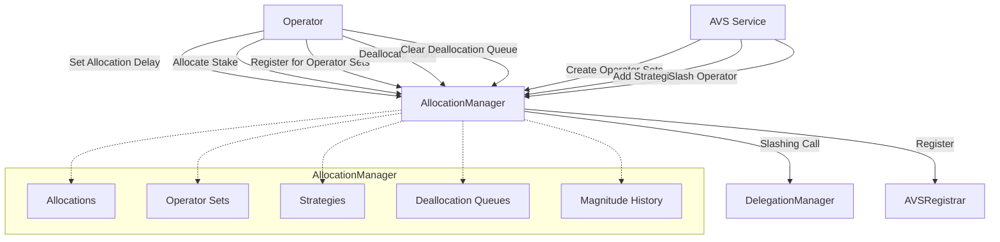

# AllocationManager

## Contract Overview

The `AllocationManager` contract is a core component of a Web3 infrastructure system that manages the allocation of stake (position magnitude) by operators to various Actively Validated Services (AVSs). It facilitates the creation, management, and slashing of operator allocations to different operator sets within AVS services.

At its heart, this contract serves as the coordination layer between operators who provide stake and AVS platforms that require slashable stake to ensure proper behavior. The contract enables operators to allocate portions of their staked assets to specific AVS services, making this stake "slashable" if the operator misbehaves while serving that AVS.

### Key Functionality

1. **Stake Allocation**: Operators can allocate their staked assets to specific AVS operator sets
2. **Slashing Protection**: AVS services can slash operators who violate their protocols
3. **Operator Set Management**: Creation and management of operator sets within AVSs
4. **Registration**: Operators can register/deregister from operator sets
5. **Delayed Modifications**: Time-based delays for critical operations like deallocations and configuration changes

### Design Patterns 

The contract employs several sophisticated design patterns:

- **Upgradeable Contract**: Uses OpenZeppelin's upgradeable contract framework
- **Security Measures**: Implements reentrancy guards and access control systems
- **Role-Based Permissions**: Uses a permission controller system for flexible authorization
- **Time-Delayed Operations**: Critical operations have built-in time delays for security
- **Enumerable Collections**: Uses sets and queues to efficiently manage collections of data
- **Snapshots**: Records historical magnitude data to reference at specific blocks

## Contract Interface

### Key State Variables

- `allocations`: Maps operators, operator sets, and strategies to allocation information
- `registeredSets`: Tracks which operator sets an operator is registered to
- `encumberedMagnitude`: Tracks the currently allocated magnitude for each operator-strategy pair
- `_maxMagnitudeHistory`: Historical record of maximum magnitudes for each operator-strategy pair
- `_operatorSets`: Tracks all operator sets for a given AVS
- `_operatorSetMembers`: Tracks members of each operator set
- `_operatorSetStrategies`: Associates strategies with operator sets

### Public & External Functions

#### Operator Functions
- `modifyAllocations`: Allows operators to increase or decrease their allocations to operator sets
- `clearDeallocationQueue`: Processes pending deallocations that have completed their delay period
- `registerForOperatorSets`: Registers an operator with specific operator sets
- `deregisterFromOperatorSets`: Removes an operator from specific operator sets
- `setAllocationDelay`: Sets the delay between allocation and when the stake becomes slashable

#### AVS Functions
- `slashOperator`: Allows an AVS to slash an operator for misbehavior
- `setAVSRegistrar`: Sets the registrar contract for an AVS
- `updateAVSMetadataURI`: Updates the metadata URI for an AVS
- `createOperatorSets`: Creates new operator sets for an AVS
- `addStrategiesToOperatorSet`: Adds strategies to an operator set
- `removeStrategiesFromOperatorSet`: Removes strategies from an operator set

#### View Functions
- Multiple getter functions for retrieving allocations, operator sets, magnitudes, and more

### Key Events

- `AllocationUpdated`: Emitted when an allocation is modified
- `OperatorSlashed`: Emitted when an operator is slashed
- `OperatorAddedToOperatorSet`: Emitted when an operator joins an operator set
- `OperatorRemovedFromOperatorSet`: Emitted when an operator leaves an operator set
- `OperatorSetCreated`: Emitted when a new operator set is created
- `StrategyAddedToOperatorSet`: Emitted when a strategy is added to an operator set
- `StrategyRemovedFromOperatorSet`: Emitted when a strategy is removed from an operator set

## Logic Flow

### Allocation Flow

1. An operator must first set their allocation delay using `setAllocationDelay`
2. The operator then allocates stake to an operator set via `modifyAllocations`
3. The allocation immediately encumbers the operator's magnitude
4. After the allocation delay passes, the allocation becomes slashable
5. The operator can deallocate stake, but it remains slashable during the deallocation delay
6. After the deallocation delay, `clearDeallocationQueue` can be called to finalize the deallocation

### Registration Flow

1. An AVS creates operator sets using `createOperatorSets`
2. An AVS adds strategies to operator sets via `addStrategiesToOperatorSet`
3. Operators allocate stake to operator sets
4. Operators register with the operator sets via `registerForOperatorSets`
5. If an operator misbehaves, the AVS can slash them via `slashOperator`
6. Operators or AVSs can deregister operators via `deregisterFromOperatorSets`

### Slashing Flow

1. An AVS detects operator misbehavior
2. The AVS calls `slashOperator` with the appropriate parameters
3. The contract checks that the operator is slashable
4. For each strategy, the contract:
   - Calculates the amount to slash based on the provided wad proportion
   - Reduces the operator's current magnitude and the strategy's encumbered magnitude
   - Adjusts any pending deallocations proportionally
   - Updates the max magnitude
   - Calls the DelegationManager to slash the operator's shares
5. The slashing event is recorded

## Visual Representation

## Dependencies and Interactions

The `AllocationManager` interacts with several other contracts in the system:

1. **DelegationManager**: Handles delegation of stake to operators and slashing of operator shares
   - Referenced in `slashOperator` to reduce an operator's shares when slashed
   - Used to verify operator status and retrieve operator shares

2. **AVSRegistrar**: Manages the registration of operators with AVS services
   - Called during operator registration/deregistration with operator sets
   - Each AVS can have its own registrar implementation

3. **PermissionController**: Manages permissions for various actions
   - Used to verify that callers are authorized for functions like `slashOperator` or `createOperatorSets`

4. **Strategy Contracts**: Represent the underlying stake positions
   - The contract doesn't directly interact with these but references them for allocation and slashing

## Security Considerations

The contract employs several security mechanisms:

1. **Time-Delayed Operations**: 
   - Deallocations have a delay (DEALLOCATION_DELAY) before they take effect
   - Allocation configuration has a delay (ALLOCATION_CONFIGURATION_DELAY) before changes take effect
   - Allocations have operator-specific delays before becoming slashable

2. **Access Control**:
   - Functions are protected by permission checks via the `checkCanCall` modifier
   - Functions are pausable via the `onlyWhenNotPaused` modifier

3. **Slashable Window**:
   - When operators deregister, they remain slashable for a period defined by DEALLOCATION_DELAY
   - Ensures operators cannot avoid slashing by deregistering

4. **Reentrancy Protection**:
   - The contract inherits from ReentrancyGuardUpgradeable to prevent reentrancy attacks

5. **Upgradeable Design**:
   - The contract is designed to be upgradeable to fix bugs or add features

The delayed operations and careful state management ensure that operators cannot manipulate the system to avoid slashing, providing security guarantees to AVS services that rely on the slashing mechanism.