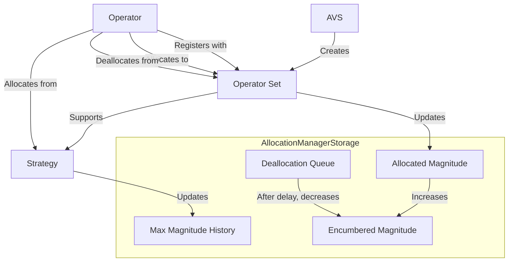

# AllocationManagerStorage

## Contract Overview

The `AllocationManagerStorage` contract is a foundational storage component in a broader system that manages allocations of stake across different operators and strategies in a Web3 delegated staking architecture. It serves as an abstract base contract that defines the storage variables, constants, and immutable values used throughout the allocation management system.

This contract is designed to support Active Validator Services (AVS) within the EigenLayer ecosystem, allowing operators to register for different operator sets and allocate/deallocate staked assets across them. It functions as a critical component in the system architecture, providing the storage layer for what is likely a more complex allocation management implementation.

The contract implements several design patterns:
- **Storage pattern**: Separating storage concerns from logic implementation
- **Enumerable sets**: Using OpenZeppelin's EnumerableSet library for efficient set operations
- **Double-ended queue**: Supporting ordered processing of deallocations
- **Snapshots**: Maintaining historical records of magnitude allocations

## Contract Interface

### Key State Variables

1. **Delegation Management**
   - `delegation`: Immutable reference to the DelegationManager contract in EigenLayer
   - `DEALLOCATION_DELAY`: Delay period before deallocations can be cleared
   - `ALLOCATION_CONFIGURATION_DELAY`: Delay before allocation configurations take effect

2. **AVS and Operator Set Mappings**
   - `_avsRegistrar`: Maps AVS addresses to their registrar contracts
   - `_operatorSets`: Tracks operator set IDs created by each AVS
   - `_operatorSetStrategies`: Lists strategies supported by each operator set
   - `_operatorSetMembers`: Records members of each operator set

3. **Operator Mappings**
   - `_allocationDelayInfo`: Contains allocation delay information for operators
   - `registeredSets`: Operator sets an operator is registered with
   - `allocatedSets`: Operator sets an operator has allocations in
   - `registrationStatus`: Registration status of operators in operator sets
   - `allocatedStrategies`: Strategies an operator has allocations from in an operator set
   - `allocations`: Current and pending allocation data for operators

4. **Strategy and Deallocation Mappings**
   - `_maxMagnitudeHistory`: Historical records of operators' maximum magnitude
   - `encumberedMagnitude`: Amount of magnitude allocated by operators for strategies
   - `deallocationQueue`: Ordered queue of pending deallocations

### Constants

- `PAUSED_MODIFY_ALLOCATIONS`: Flag index to pause allocation/deallocation operations
- `PAUSED_OPERATOR_SLASHING`: Flag index to pause operator slashing
- `PAUSED_OPERATOR_SET_REGISTRATION_AND_DEREGISTRATION`: Flag index to pause registration/deregistration

### Constructor
```solidity
constructor(IDelegationManager _delegation, uint32 _DEALLOCATION_DELAY, uint32 _ALLOCATION_CONFIGURATION_DELAY)
```
Initializes the contract with references to the delegation manager and timing parameters for deallocations and configuration changes.

## Logic Flow

The `AllocationManagerStorage` contract doesn't implement operational logic directly as it's an abstract storage contract. However, we can describe the data structure and flow:

1. **AVS Management**
   - AVSs can register metadata and create operator sets
   - Each operator set can support multiple strategies
   - AVSs can designate a separate registrar contract to handle operator registration/deregistration

2. **Operator Registration**
   - Operators can register for operator sets without necessarily allocating stake
   - Registration status is tracked for each operator and operator set combination

3. **Allocation Management**
   - Operators allocate stake magnitude from different strategies to operator sets
   - The system tracks maximum available magnitudes, encumbered magnitudes, and allocated magnitudes
   - When deallocations occur, they enter a time-locked queue to ensure they remain slashable

4. **Deallocation Process**
   - Deallocations are added to a queue and subject to a delay period
   - After the delay period, deallocations can be cleared, releasing the encumbered magnitude
   - Deallocations must be processed in order (FIFO) through the queue

5. **Security Controls**
   - Pause flags allow for emergency stops of different system functions
   - Delay mechanisms ensure changes to allocation configurations can't be misused

## Visual Representation



## Dependencies and Interactions

### External Dependencies
1. **OpenZeppelin Libraries**
   - `@openzeppelin/contracts/utils/structs/EnumerableSet.sol`: Used for efficient set membership operations
   - `@openzeppelin/contracts/utils/structs/DoubleEndedQueue.sol`: Used for ordered processing of deallocations

2. **Custom Libraries and Interfaces**
   - `Snapshots`: Library for tracking historical values
   - `IAllocationManager`: Interface that this contract implements
   - `IDelegationManager`: Interface for interacting with the EigenLayer delegation system

### Contract Interactions
1. **DelegationManager Integration**
   - Communicates with the EigenLayer delegation system to access delegation information
   - Used to verify delegation relationships and stakes

2. **AVS and Registrar Interaction**
   - Allows AVSs to configure custom registrar contracts
   - Supports registration and deregistration workflows

3. **Storage for Inherited Contracts**
   - Provides structured storage for child contracts that implement the actual allocation logic
   - Uses a storage gap to ensure future extensions don't clash with storage layout

The contract has been designed with careful consideration for flexibility, security, and efficient state management. The use of multiple mapping patterns enables complex relationships between operators, strategies, and operator sets while maintaining clear boundaries and efficient lookups.