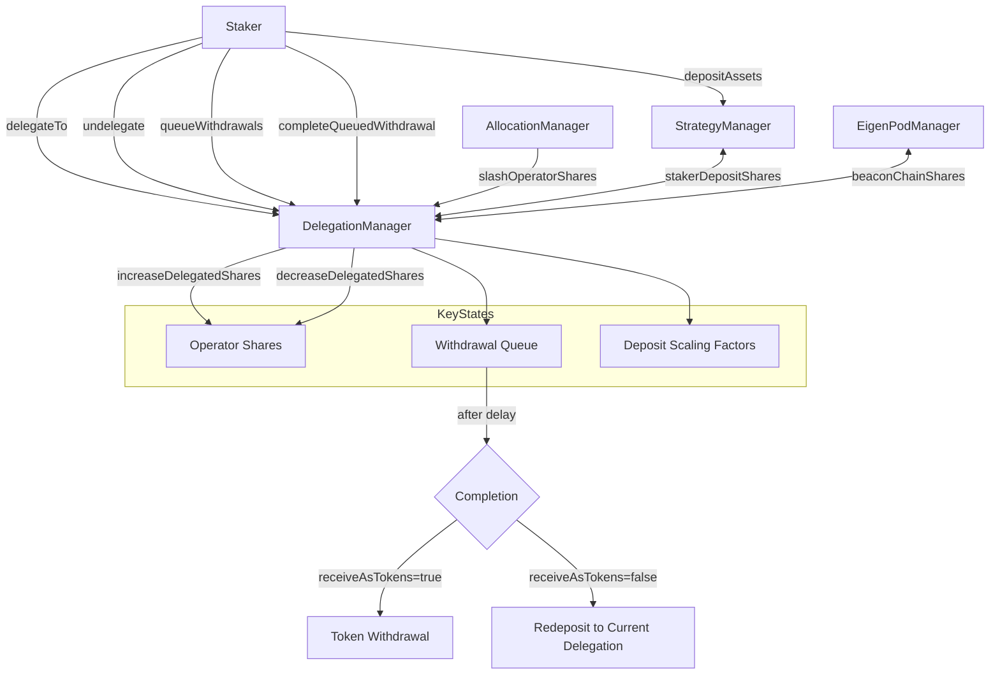

# DelegationManager

The DelegationManager contract is a core component of EigenLayer that manages delegation relationships between stakers and operators. It enables stakers to delegate their assets to operators, who can then use those assets to provide services in the EigenLayer ecosystem.

## Contract Overview

This contract serves as the central delegation system in EigenLayer, enabling:

1. Operators to register and manage their services
2. Stakers to delegate their assets to operators
3. Delegation approval workflows with optional signature verification
4. Withdrawal queuing and completion with slashing protection
5. Accurate accounting of delegated shares across different strategies

The DelegationManager implements several important design patterns, including upgradeability (via OZ's `Initializable`), access control mechanisms, slashing support, and snapshot-based historical data tracking. It inherits from multiple foundational contracts to create a robust delegation system that integrates with EigenLayer's other core components.

## Contract Interface

### Key State Variables

- `delegatedTo`: Maps each staker address to the operator they've delegated to
- `operatorShares`: Tracks the total delegated shares for each operator per strategy
- `_depositScalingFactor`: Keeps track of each staker's deposit scaling factors, which adjust for slashing
- `_operatorDetails`: Stores configuration data for registered operators
- `pendingWithdrawals`: Tracks withdrawals that have been queued but not completed
- `MIN_WITHDRAWAL_DELAY_BLOCKS`: Minimum delay period before withdrawals can be completed

### Public/External Functions

#### Operator Management
- `registerAsOperator`: Allows any address to register as an operator
- `modifyOperatorDetails`: Updates operator configuration parameters
- `updateOperatorMetadataURI`: Updates operator metadata information

#### Delegation Management
- `delegateTo`: Enables a staker to delegate their assets to an operator
- `undelegate`: Removes delegation and queues withdrawals
- `redelegate`: Combines undelegate and delegateTo in a single transaction

#### Withdrawal Management
- `queueWithdrawals`: Places withdrawals in the queue with appropriate slashing protection
- `completeQueuedWithdrawal`/`completeQueuedWithdrawals`: Completes queued withdrawals after delay period

#### Share Management
- `increaseDelegatedShares`: Updates share accounting when a staker deposits more assets
- `decreaseDelegatedShares`: Updates share accounting when a staker's assets are reduced
- `slashOperatorShares`: Called by AllocationManager to apply slashing to an operator's shares

### Important Events

- `OperatorRegistered`: Emitted when a new operator registers
- `StakerDelegated`/`StakerUndelegated`: Emitted when delegation status changes
- `OperatorSharesIncreased`/`OperatorSharesDecreased`: Tracks changes in operator's delegated shares
- `SlashingWithdrawalQueued`/`SlashingWithdrawalCompleted`: Emitted during withdrawal lifecycle
- `DepositScalingFactorUpdated`: Tracks changes in a staker's scaling factor

## Logic Flow

### Operator Registration Flow

1. A potential operator calls `registerAsOperator`
2. The contract verifies the caller is not already delegated
3. Initial operator configuration is set (delegation approver, allocation delay)
4. The operator is "delegated to themselves" (self-delegation marks them as an operator)
5. Events are emitted to track the registration and metadata

### Delegation Flow

1. A staker calls `delegateTo` with their chosen operator
2. The contract verifies the staker isn't already delegated and the operator is registered
3. If the operator has a delegationApprover, the signature is verified
4. The staker's deposits are calculated and delegated to the operator via `_delegate`
5. For each strategy the staker has deposits in:
   - A scaling factor is calculated based on any operator slashing
   - The operator's shares are increased by the staker's withdrawable shares
   - Events are emitted to record the delegation

### Withdrawal Flow

The withdrawal process consists of two main phases:

1. **Queuing a withdrawal**:
   - Initiated by `queueWithdrawals` or `undelegate`
   - The staker specifies which strategies and how many shares to withdraw
   - The contract creates a withdrawal record with scaled shares
   - The withdrawal is stored by its root hash and must wait a delay period
   - During the delay period, the shares remain slashable

2. **Completing a withdrawal**:
   - After the delay period, `completeQueuedWithdrawal` can be called
   - The contract verifies the withdrawal exists and the delay has passed
   - The withdrawal's shares are calculated based on current slashing factors
   - If `receiveAsTokens` is true, shares are withdrawn as tokens
   - If `receiveAsTokens` is false, shares are redeposited to the staker's current delegation

### Slashing Mechanism

The contract implements a sophisticated slashing mechanism:

1. Operators have a "magnitude" (tracked by AllocationManager) that represents their slashing status
2. When a staker delegates, their "deposit scaling factor" is set relative to the operator's magnitude
3. When slashing occurs, the operator's magnitude is reduced, which affects:
   - The withdrawable shares of all delegated stakers
   - The shares that can be withdrawn from queued withdrawals
4. Shares in the withdrawal queue remain slashable during the withdrawal delay period
5. Slashing applies to both active shares and shares in the withdrawal queue

## Visual Representation

## Dependencies and Interactions

The DelegationManager interacts with several key contracts:

1. **StrategyManager**: 
   - Manages staker deposits for liquid assets
   - Provides share accounting for token strategies
   - Called to remove/add shares during withdrawals

2. **EigenPodManager**: 
   - Manages staker deposits for beacon chain ETH
   - Provides beaconChainSlashingFactor for stakers
   - Handles withdrawals for beacon chain ETH

3. **AllocationManager**: 
   - Tracks operator allocation delays
   - Maintains operator magnitude (slashing status)
   - Initiates slashing via `slashOperatorShares`

4. **PermissionController**: 
   - Controls which addresses can call certain functions
   - Enables delegation and operations via proxies

Key libraries supporting the contract include:

1. **SlashingLib**: Contains utilities for calculating slashed amounts
2. **Snapshots**: Provides historical tracking of values over time
3. **SignatureUtilsMixin**: Handles signature verification for delegation approval

The contract relies on EIP-712 typed signatures for secure delegation approval, allowing operators to implement custom authorization logic via their delegationApprovers.

---

The DelegationManager plays a crucial role in EigenLayer's security model by implementing a withdrawal delay and slashing mechanism. This ensures that malicious operators cannot immediately withdraw assets after misconduct, giving the protocol time to detect and penalize bad behavior. The careful accounting of shares, scaling factors, and slashing protection creates a system that balances flexibility with security.