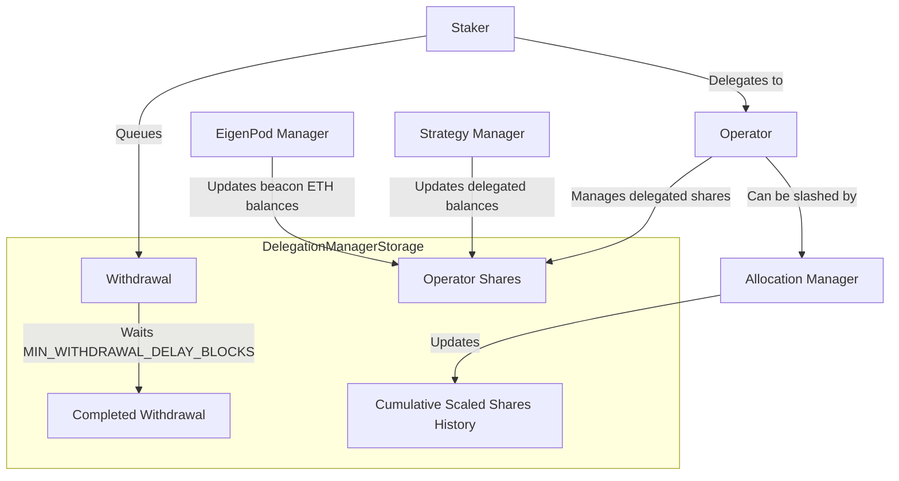

# DelegationManagerStorage

## Contract Overview

The `DelegationManagerStorage` contract serves as the foundation for EigenLayer's delegation mechanism, functioning as a central storage contract for the `DelegationManager` system. Its primary purpose is to maintain all state variables required for managing delegations between stakers and operators within the EigenLayer ecosystem.

This contract follows the storage-logic separation pattern, where storage concerns are isolated from logic implementation. This architecture significantly simplifies the upgrade process for the protocol, allowing for updates to business logic without disrupting the underlying data structures.

Key design patterns used include:
- **Storage-Logic Separation**: Storage variables are defined separately from logic implementation
- **Immutable Pattern**: Core dependencies are set during construction and cannot be changed
- **OpenZeppelin Library Integration**: Leveraging established libraries for complex data structures
- **EIP-712 Compliance**: For typed signature verification in delegation approvals
- **Deprecation Handling**: Maintaining backward compatibility while evolving the codebase

## Contract Interface

### Key State Variables

1. **Delegation Relationships**:
   - `operatorShares`: Tracks the amount of shares delegated to each operator by strategy
   - `delegatedTo`: Maps each staker to their chosen operator (or address(0) if not delegated)
   - `_operatorDetails`: Stores configuration details for each operator, primarily delegation approval settings

2. **Withdrawal Management**:
   - `pendingWithdrawals`: Tracks whether a withdrawal with a specific hash is pending
   - `_stakerQueuedWithdrawalRoots`: Maintains a list of queued withdrawals for each staker
   - `_queuedWithdrawals`: Stores the details of each queued withdrawal
   - `cumulativeWithdrawalsQueued`: Counts total withdrawals queued by each staker

3. **Slashing and Scaling**:
   - `_depositScalingFactor`: Maintains scaling factors applied to stakers' deposits per strategy
   - `_cumulativeScaledSharesHistory`: Tracks history of cumulative staker withdrawals for slashing calculations

4. **Constants and Immutables**:
   - `beaconChainETHStrategy`: Virtual strategy representing staked ETH on the beacon chain
   - `strategyManager`: Reference to the EigenLayer Strategy Manager contract
   - `eigenPodManager`: Reference to the EigenLayer EigenPod Manager contract
   - `allocationManager`: Reference to the EigenLayer Allocation Manager contract
   - `MIN_WITHDRAWAL_DELAY_BLOCKS`: Minimum delay before withdrawals can be completed

### Events

The contract inherits from `IDelegationManager`, which defines events such as:
- `OperatorRegistered`: Emitted when a new operator is registered
- `StakerDelegated`: Emitted when a staker delegates to an operator
- `WithdrawalQueued`: Emitted when a withdrawal is queued
- `WithdrawalCompleted`: Emitted when a withdrawal is completed

## Logic Flow

### Delegation Process

The contract stores the relationship between stakers and operators through the `delegatedTo` mapping. When a staker delegates their assets:

1. The relationship is recorded in `delegatedTo`
2. The operator's delegated shares are tracked in `operatorShares`
3. Any scaling factors applied to the staker's deposits are recorded in `_depositScalingFactor`

This design ensures that the contract maintains an accurate record of all delegated assets, which is critical for calculating rewards, handling slashing events, and managing withdrawals.

### Withdrawal Workflow

Withdrawals follow a queued approach:

1. A withdrawal is initiated and assigned a unique hash (withdrawal root)
2. The withdrawal is recorded in `_queuedWithdrawals` and added to the staker's set of withdrawals in `_stakerQueuedWithdrawalRoots`
3. The withdrawal enters a mandatory waiting period of at least `MIN_WITHDRAWAL_DELAY_BLOCKS`
4. Once the waiting period ends, the withdrawal can be completed
5. Upon completion, the withdrawal is removed from the staker's set of queued withdrawals

### Slashing Mechanism

The contract implements slashing protection through:

1. Tracking delegate relationships to determine which operators are responsible for stakers
2. Maintaining a history of cumulative scaled shares in `_cumulativeScaledSharesHistory`
3. Working with the `AllocationManager` to calculate and apply slashing penalties when operators violate protocol rules

## Visual Representation

## Dependencies and Interactions

The `DelegationManagerStorage` contract interacts with multiple core components of the EigenLayer ecosystem:

1. **StrategyManager**: This contract is responsible for tracking delegated shares across different strategies. When a staker's position changes, the StrategyManager updates the `operatorShares` in the DelegationManager.

2. **EigenPodManager**: Manages staked ETH on the beacon chain. It communicates with the DelegationManager to update the operator shares for the beacon chain ETH strategy when validators' statuses change.

3. **AllocationManager**: Handles the slashing of operators who violate protocol rules. It interacts with the DelegationManager to update operator shares and cumulative scaled shares history when slashing events occur.

4. **OpenZeppelin Libraries**: The contract uses OpenZeppelin's EnumerableSet library for managing sets of withdrawal roots, providing efficient addition, removal, and enumeration operations.

5. **Snapshots Library**: Used for maintaining historical records of cumulative scaled shares, essential for calculating slashing penalties accurately.

The contract serves as a central data repository that coordinates information flow between these components, ensuring that delegation relationships, share accounting, and withdrawal management are handled consistently across the entire protocol.