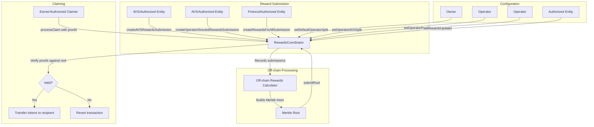

# RewardsCoordinator

## Contract Overview

The RewardsCoordinator contract is a critical component of the EigenLayer ecosystem, responsible for managing and distributing rewards to stakers and operators. It serves as a mechanism to incentivize participation in the EigenLayer network while providing a fair and transparent way to distribute ERC20 token rewards.

The primary functions of this contract include:
- Enabling AVSs (Actively Validated Services) to distribute rewards to their operators and stakers
- Facilitating customizable reward distributions based on various strategies and multipliers
- Managing operator-staker split configurations for different reward types
- Providing a secure, Merkle tree-based reward claiming system to efficiently process claims

Within the broader EigenLayer architecture, the RewardsCoordinator interfaces with multiple other contracts, including the DelegationManager, StrategyManager, and AllocationManager, making it a central hub for reward flow throughout the system.

The contract implements several design patterns:
- Upgradeable contracts (using OpenZeppelin's upgradeable contracts framework)
- Role-based access control
- Merkle trees for efficient verification of reward claims
- Time-delayed execution of configuration changes
- Pausable functionality for emergency situations

## Contract Interface

### Key State Variables
- `_distributionRoots`: Array of Merkle tree roots that define reward distributions
- `rewardsUpdater`: Address authorized to submit and disable reward distribution roots
- `activationDelay`: Time delay before configuration changes take effect
- `defaultOperatorSplitBips`: Default percentage (in basis points) for operator-staker reward split
- `cumulativeClaimed`: Mapping tracking the amount of rewards claimed by each earner for each token
- Various maps tracking reward submission hashes for different reward types

### Public/External Functions

**Reward Submission Functions**:
- `createAVSRewardsSubmission(RewardsSubmission[])`: Allows AVSs to submit rewards for distribution
- `createRewardsForAllSubmission(RewardsSubmission[])`: Enables designated submitters to create rewards for all stakers
- `createRewardsForAllEarners(RewardsSubmission[])`: Creates rewards for all stakers and operators
- `createOperatorDirectedAVSRewardsSubmission(address, OperatorDirectedRewardsSubmission[])`: Enables directed rewards from AVSs to specific operators
- `createOperatorDirectedOperatorSetRewardsSubmission(OperatorSet, OperatorDirectedRewardsSubmission[])`: Allows rewards to be directed to specific operator sets

**Claim Management Functions**:
- `processClaim(RewardsMerkleClaim, address)`: Processes a single reward claim
- `processClaims(RewardsMerkleClaim[], address)`: Processes multiple reward claims
- `setClaimerFor(address)`: Sets an address permitted to claim rewards on behalf of the sender
- `setClaimerFor(address, address)`: Sets a claimer for a specific earner (only callable by authorized parties)

**Configuration Functions**:
- `submitRoot(bytes32, uint32)`: Submits a new Merkle root for reward distribution
- `disableRoot(uint32)`: Disables a Merkle root before it's activated
- `setActivationDelay(uint32)`: Configures the activation delay for configuration changes
- `setDefaultOperatorSplit(uint16)`: Sets the default split percentage between operators and stakers
- `setOperatorAVSSplit(address, address, uint16)`: Sets custom split for a specific operator-AVS pair
- `setOperatorPISplit(address, uint16)`: Sets custom split for an operator's protocol-incentivized rewards
- `setOperatorSetSplit(address, OperatorSet, uint16)`: Sets custom split for an operator within a specific set

**View Functions**:
- `getOperatorAVSSplit(address, address)`: Returns the split percentage for an operator-AVS pair
- `getOperatorPISplit(address)`: Returns the operator's protocol-incentivized rewards split
- `getOperatorSetSplit(address, OperatorSet)`: Returns the split percentage for an operator in a specific set
- `getDistributionRootsLength()`: Returns the number of distribution roots
- `getCurrentDistributionRoot()`: Returns the most recently submitted root
- `getCurrentClaimableDistributionRoot()`: Returns the latest active and non-disabled root

### Important Events

- `AVSRewardsSubmissionCreated`: Emitted when AVS rewards are submitted
- `RewardsSubmissionForAllCreated`: Emitted when rewards for all stakers are submitted
- `OperatorDirectedAVSRewardsSubmissionCreated`: Emitted when operator-directed AVS rewards are submitted
- `DistributionRootSubmitted`: Emitted when a new distribution root is submitted
- `DistributionRootDisabled`: Emitted when a distribution root is disabled
- `RewardsClaimed`: Emitted when rewards are claimed
- `ClaimerForSet`: Emitted when a claimer is set for an earner
- Various events for split percentage changes and configuration updates

## Logic Flow

### Reward Submission Workflow

1. **AVS Reward Submission**:
   - An AVS calls `createAVSRewardsSubmission` with reward parameters
   - The contract validates the submission parameters (timeframes, strategies, amounts)
   - Upon validation, tokens are transferred from the AVS to the contract
   - The submission is recorded and an event is emitted

2. **Operator-Directed Rewards**:
   - AVS or authorized caller uses `createOperatorDirectedAVSRewardsSubmission`
   - Rewards are explicitly directed to specific operators
   - The contract validates operator list and reward parameters
   - Tokens are transferred to the contract and recorded for future claims

3. **Protocol-Incentivized Rewards**:
   - Authorized submitters call `createRewardsForAllSubmission` or `createRewardsForAllEarners`
   - These are system-wide rewards to incentivize participation
   - Validated rewards are stored for inclusion in future Merkle distributions

### Merkle Root Generation (Off-chain)

While not directly visible in the contract, the system includes an off-chain component:
1. A rewards calculator aggregates all reward submissions for a period
2. It builds Merkle trees: a top-level tree of earners and nested trees for each earner's tokens
3. It submits the Merkle root via the `rewardsUpdater` role

### Claim Processing

1. **Root Submission**:
   - The `rewardsUpdater` calls `submitRoot` with a new Merkle root
   - The root becomes activated after `activationDelay` time passes
   
2. **Claim Verification and Processing**:
   - Users (or their authorized claimers) call `processClaim` with Merkle proofs
   - The contract verifies the proofs against the active root
   - The contract calculates unclaimed amounts by comparing with previously claimed amounts
   - Tokens are transferred to the recipient
   - Claim records are updated to prevent double claiming

### Split Configuration

1. **Split Configuration**:
   - Operators or AVSs can set custom split percentages for their rewards
   - New configurations have an activation delay before taking effect
   - Split percentages define how rewards are divided between operators and delegators

## Visual Representation

## Dependencies and Interactions

### Contract Dependencies
- **OpenZeppelin Libraries**:
  - `Initializable`: For upgradeable contract pattern
  - `OwnableUpgradeable`: For ownership management
  - `ReentrancyGuardUpgradeable`: To prevent reentrancy attacks
  - `SafeERC20`: For safe ERC20 token transfers

### System Contract Interactions
- **DelegationManager**: Verifies operator status and manages delegation relationships
- **StrategyManager**: Validates strategies used for rewards calculations
- **AllocationManager**: Provides information about operator sets and allocations
- **PermissionController**: Controls which addresses can call certain functions

### External Dependencies
- **Merkle Library**: Used for proof verification in the reward claiming process

### Security Considerations
1. **Reentrancy Protection**: All state-changing functions use `nonReentrant` to prevent reentrancy attacks
2. **Pausable Functionality**: Critical functions can be paused in emergency situations
3. **Time-Delayed Execution**: Configuration changes take effect after a delay, allowing time to detect malicious changes
4. **Verification Before Transfer**: All claims are verified against Merkle proofs before transfers
5. **Access Control**: Different roles for different functions (owner, rewardsUpdater, claimers, etc.)

The RewardsCoordinator serves as the central rewards management system for EigenLayer, handling the full lifecycle of rewards from submission to claiming while ensuring security and flexibility. Its design allows for various reward distribution strategies while maintaining a clear separation of concerns between different entities in the system.