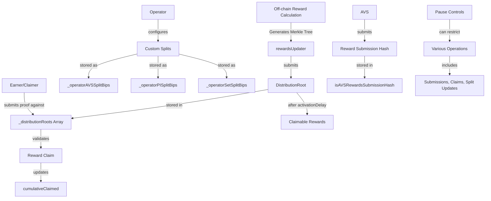

# RewardsCoordinatorStorage

## 1. Contract Overview

RewardsCoordinatorStorage is a foundational storage contract that serves as the data layer for the RewardsCoordinator system in EigenLayer's ecosystem. The contract is designed as an abstract storage layer using the common "storage and logic separation" pattern to facilitate smooth upgrades without compromising stored data.

This contract centralizes the storage variables required for managing and distributing rewards within EigenLayer. It's responsible for storing information about reward distributions, operator splits, claims, and maintaining various state variables that track the reward ecosystem's status.

The primary purpose of this contract is to define the data structures and state variables that enable:
- Management of merkle root-based reward distributions
- Configuration of reward sharing between operators and delegators
- Tracking of reward claims by earners
- Governance of reward submission permissions

This contract uses several key design patterns:
- Separation of storage and logic (for upgradability)
- Merkle trees for efficient verification of rewards
- Role-based access control for critical functions
- Pause mechanisms for emergency control

## 2. Contract Interface

### Key State Variables

- **`_distributionRoots`**: Internal array of merkle roots used for verifying reward claims
- **`rewardsUpdater`**: Address authorized to submit new merkle roots for rewards
- **`activationDelay`**: Time delay before a newly submitted merkle root becomes claimable
- **`currRewardsCalculationEndTimestamp`**: Tracks the latest reward calculation timestamp
- **`defaultOperatorSplitBips`**: Default percentage (in basis points) for operator rewards split
- **`claimerFor`**: Mapping that defines which addresses can claim on behalf of earners
- **`cumulativeClaimed`**: Tracks total rewards claimed by each earner for each token
- **`submissionNonce`**: Counter for tracking reward submissions per AVS
- **Various permission mappings**: Track valid rewards submission hashes and authorized submitters
- **`_operatorAVSSplitBips`**: Custom split configurations for operators across different AVSs
- **`_operatorPISplitBips`**: Custom split configurations for operators for Programmatic Incentives
- **`_operatorSetSplitBips`**: Custom split configurations for operators in different operator sets

### Constants

- **Pause flags**: Constants defining specific functionality that can be paused (indices 0-9)
- **Leaf salts**: Constants to differentiate between earner and token leaf types in merkle trees
- **`MAX_REWARDS_AMOUNT`**: Upper limit on reward amounts (1e38 - 1)
- **`ONE_HUNDRED_IN_BIPS`**: Representation of 100% in basis points (10,000)
- **`beaconChainETHStrategy`**: Canonical virtual strategy for beacon chain ETH

### Immutable Variables

- **`delegationManager`**: Interface to EigenLayer's delegation system
- **`strategyManager`**: Interface to EigenLayer's strategy management
- **`allocationManager`**: Interface to EigenLayer's allocation management
- **`CALCULATION_INTERVAL_SECONDS`**: Time interval for reward calculations (configured to 1 day)
- **`MAX_REWARDS_DURATION`**: Maximum timespan for a rewards submission
- **`MAX_RETROACTIVE_LENGTH`**: Maximum retroactive time for a rewards submission
- **`MAX_FUTURE_LENGTH`**: Maximum future start time for a rewards submission
- **`GENESIS_REWARDS_TIMESTAMP`**: Earliest possible timestamp for rewards submissions

## 3. Logic Flow

Since this is a storage contract, it doesn't contain extensive logic flow. However, it establishes the data structure and relationships that enable the following key workflows:

1. **Reward Distribution Process**
   - External systems calculate rewards based on staking and participation
   - Authorized `rewardsUpdater` submits merkle roots containing reward distributions
   - Roots become active after the `activationDelay` period
   - Earners (or their designated claimers) can verify and claim their rewards using merkle proofs

2. **Operator Split Configuration**
   - Operators can customize their reward splits with delegators
   - Splits can be configured at different levels:
     - Per AVS (AVS-specific splits)
     - For Programmatic Incentives (PI splits)
     - For specific operator sets (set-specific splits)
   - Default split applies when custom splits are not configured

3. **Reward Claiming Mechanism**
   - Earners prove their rewards using merkle proofs against active distribution roots
   - System verifies the proof and checks for double-claiming using `cumulativeClaimed`
   - Rewards are distributed according to configured splits between operators and delegators
   - Claims can be processed by the earner or their designated claimer

4. **Permission and Validation System**
   - Submissions are validated against registered hashes
   - Different types of reward submissions have separate validation mappings
   - Pausing mechanisms allow for emergency control of critical functions

## 4. Visual Representation

## 5. Dependencies and Interactions

The contract integrates with several core EigenLayer components:

1. **DelegationManager**
   - Interacts with this contract to manage delegations between stakers and operators
   - Used to verify delegation relationships when distributing rewards

2. **StrategyManager**
   - Communicates with this contract to understand staking strategies
   - Essential for validating claims and correlating reward calculations with staked assets

3. **AllocationManager**
   - Interacts with this contract for managing service provider allocations
   - Used in determining reward allocations between operators and AVSs

This storage contract itself doesn't directly interact with these dependencies—it simply stores their references for use by the implementation contract. The RewardsCoordinator implementation contract will use these interfaces to validate and process rewards based on delegation relationships, staking amounts, and allocation details.

The contract is designed to support multiple AVS (Actively Validated Services) entities, each of which can create and manage their own reward submissions. Different types of reward submissions are supported, including:
- AVS-specific rewards
- Rewards for all participants
- Operator-directed rewards
- Operator set performance rewards

The storage contract enforces validation of submission hashes to ensure that only legitimate, authorized reward distributions can be processed within the system.