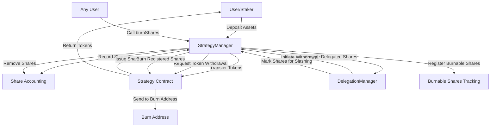

# StrategyManager

## Contract Overview

The StrategyManager contract is a central component of EigenLayer, serving as the primary interface for managing deposits into and withdrawals from various investment strategies. Its core purpose is to enable users ("stakers") to deposit assets into different whitelisted strategies, track their shares, and facilitate the withdrawal process.

This contract forms the backbone of EigenLayer's asset management system, acting as the gateway through which users interact with the platform's investment strategies. It sits between users and the actual investment strategies, managing deposit accounting while delegating the actual investment logic to strategy-specific contracts.

The StrategyManager implements several key design patterns:
- **Proxy Pattern**: The contract is designed to be upgradeable, using OpenZeppelin's upgradeable contract patterns
- **Role-Based Access Control**: Different functions are restricted to specific roles (owner, strategy whitelister, delegation manager)
- **Security Guards**: Implements ReentrancyGuard to prevent re-entrancy attacks and Pausable to allow halting of sensitive functions during emergencies
- **Signature Verification**: Supports signature-based operations for improved UX and gasless transactions

## Contract Interface

### Public/External Functions

#### Initialization & Configuration
- `initialize(address initialOwner, address initialStrategyWhitelister, uint256 initialPausedStatus)`: Sets up the initial contract state
- `setStrategyWhitelister(address newStrategyWhitelister)`: Changes who can whitelist strategies (owner only)
- `addStrategiesToDepositWhitelist(IStrategy[] calldata strategiesToWhitelist)`: Adds strategies that users can deposit into
- `removeStrategiesFromDepositWhitelist(IStrategy[] calldata strategiesToRemoveFromWhitelist)`: Removes strategies from the whitelist

#### User Deposit Functions
- `depositIntoStrategy(IStrategy strategy, IERC20 token, uint256 amount)`: Allows users to deposit tokens into a strategy
- `depositIntoStrategyWithSignature(...)`: Enables gasless deposits through signature verification

#### Share Management Functions
- `removeDepositShares(address staker, IStrategy strategy, uint256 depositSharesToRemove)`: Removes shares from a staker
- `addShares(address staker, IStrategy strategy, uint256 shares)`: Adds shares to a staker's account
- `withdrawSharesAsTokens(address staker, IStrategy strategy, IERC20 token, uint256 shares)`: Withdraws shares as tokens
- `increaseBurnableShares(IStrategy strategy, uint256 addedSharesToBurn)`: Increases shares marked for burning
- `burnShares(IStrategy strategy)`: Burns shares, sending them to a predefined burn address

#### View Functions
- `getDeposits(address staker)`: Returns a staker's deposits across all strategies
- `getStakerStrategyList(address staker)`: Returns the list of strategies a staker has deposits in
- `stakerStrategyListLength(address staker)`: Returns the number of strategies a staker has deposits in
- `calculateStrategyDepositDigestHash(...)`: Calculates a hash for signature verification
- `getBurnableShares(IStrategy strategy)`: Returns the burnable shares for a strategy
- `getStrategiesWithBurnableShares()`: Returns all strategies with burnable shares

### Key Events

- `Deposit(address staker, IStrategy strategy, uint256 shares)`: Emitted when a user deposits into a strategy
- `StrategyAddedToDepositWhitelist(IStrategy strategy)`: Emitted when a strategy is whitelisted
- `StrategyRemovedFromDepositWhitelist(IStrategy strategy)`: Emitted when a strategy is removed from the whitelist
- `StrategyWhitelisterChanged(address oldWhitelister, address newWhitelister)`: Emitted when the strategy whitelister is changed
- `BurnableSharesIncreased(IStrategy strategy, uint256 addedSharesToBurn)`: Emitted when burnable shares are increased
- `BurnableSharesDecreased(IStrategy strategy, uint256 decreasedSharesToBurn)`: Emitted when burnable shares are decreased

### Important State Variables

- `strategyWhitelister`: Address authorized to manage the strategy whitelist
- `strategyIsWhitelistedForDeposit`: Mapping that tracks which strategies are approved for deposits
- `stakerStrategyList`: Maps stakers to their list of strategies
- `stakerDepositShares`: Double mapping tracking how many shares each staker has in each strategy
- `nonces`: Tracks nonces for signature-based operations
- `burnableShares`: EnumerableMap tracking shares marked for burning by strategy
- `delegation`: The DelegationManager contract that tracks delegation relationships

## Logic Flow

### Deposit Flow

1. **User Initiates Deposit**: A user calls `depositIntoStrategy` with a whitelisted strategy, token, and amount, or uses `depositIntoStrategyWithSignature` for a gasless operation.

2. **Token Transfer**: The contract transfers tokens from the user to the strategy contract.

3. **Strategy Deposit**: The strategy contract processes the tokens and returns shares representing ownership of the deposited assets.

4. **Share Accounting**:
   - The contract records the shares to the staker's account using `_addShares`.
   - If this is the staker's first deposit in this strategy, the strategy is added to their `stakerStrategyList`.

5. **Delegation Update**: The DelegationManager is notified to update the delegated shares, connecting the deposit to the staker's chosen operator.

### Withdrawal Flow

The withdrawal process is managed primarily through the DelegationManager, which calls into this contract:

1. **Share Removal**: The DelegationManager calls `removeDepositShares` to reduce a staker's shares.

2. **Accounting Update**:
   - The shares are deducted from the staker's balance.
   - If all shares in a strategy are withdrawn, the strategy is removed from the staker's list.

3. **Token Withdrawal**: When appropriate, `withdrawSharesAsTokens` is called to convert shares back to tokens, which are sent to the staker.

### Share Burning Flow

1. **Marking Shares for Burning**: The DelegationManager calls `increaseBurnableShares` to mark shares for burning (typically used for slashing).

2. **Burning Shares**: Anyone can call `burnShares` to execute the burning, which:
   - Removes the burnable shares record
   - Withdraws the shares to the burn address, effectively removing them from circulation

## Visual Representation

## Dependencies and Interactions

The StrategyManager interacts primarily with these components:

1. **Strategy Contracts**: These implement the `IStrategy` interface and handle the actual investment logic. The StrategyManager doesn't know the specifics of how strategies invest funds; it only interacts through their standardized interface for deposits, withdrawals, and share accounting.

2. **DelegationManager**: A critical component that manages the delegation relationships between stakers and operators. The StrategyManager notifies the DelegationManager of deposits to update delegated shares, and the DelegationManager initiates withdrawals through the StrategyManager.

3. **OpenZeppelin Libraries**: The contract relies heavily on OpenZeppelin's security modules:
   - `Initializable`: For the upgradeable proxy pattern
   - `OwnableUpgradeable`: For ownership and access control
   - `ReentrancyGuardUpgradeable`: To prevent re-entrancy attacks
   - `SafeERC20`: For safe token transfers

4. **SignatureUtilsMixin**: Provides signature verification for gasless operations, enhancing user experience by allowing meta-transactions.

5. **Pausable**: Enables emergency pause functionality to halt critical operations if needed.

The StrategyManager uses a whitelist-based approach to control which strategies users can deposit into, providing a security layer that ensures users can only interact with vetted and approved strategies. This whitelist is managed by a dedicated role (the strategyWhitelister), separating these administrative controls from general contract ownership.

Overall, this contract embodies EigenLayer's approach to flexible, secure asset management, allowing users to participate in a range of strategies while maintaining proper accounting and delegation relationships.