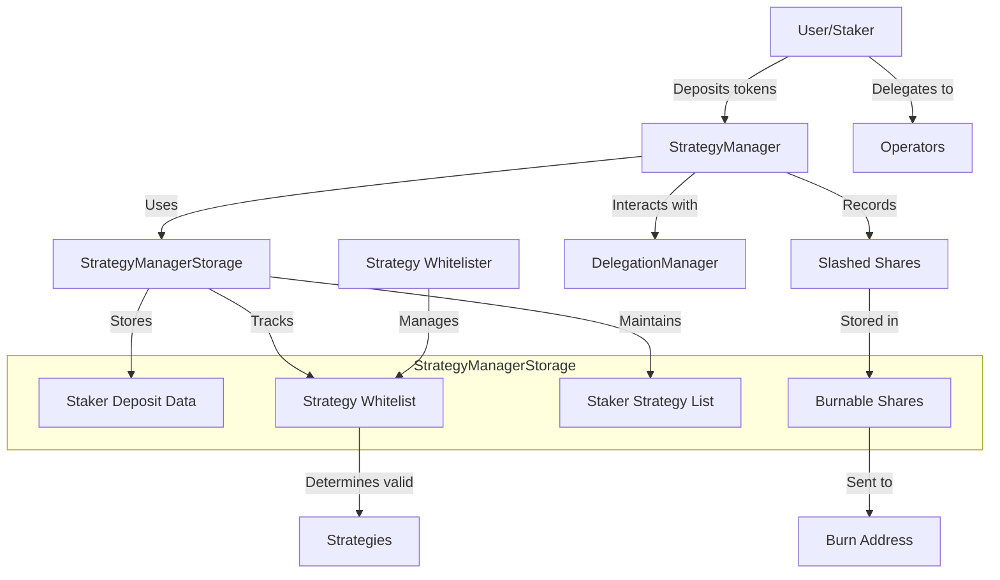

# StrategyManagerStorage

## Contract Overview
StrategyManagerStorage is a foundational abstract contract in the EigenLayer ecosystem that defines storage variables for the StrategyManager contract. EigenLayer is a restaking protocol that allows ETH and other tokens to be used as security for various services in the Web3 ecosystem. 

This contract serves as the storage layer for StrategyManager, which handles asset deposits, withdrawals, and strategy management within EigenLayer. By separating storage from logic, the contract follows the proxy upgrade pattern, making the system more maintainable and upgradeable without complex storage migration issues.

The contract primarily stores information about:
- Which strategies are whitelisted for deposits
- User deposits across various strategies
- Permissions for strategy whitelisting
- Relationships between stakers and strategies
- Shares that need to be burned after slashing events

The design pattern here is the separation of concerns between storage and logic, which is a common pattern in upgradeable contract systems.

## Contract Interface

### Key State Variables
- `delegation`: Immutable reference to the DelegationManager contract, which handles delegation of restaked assets.
- `nonces`: Mapping to track signature nonces for each signer, used for replay protection.
- `strategyWhitelister`: Address authorized to whitelist strategies.
- `stakerDepositShares`: Double mapping that tracks the amount of shares a staker has in each strategy.
- `stakerStrategyList`: Mapping that stores the list of strategies a staker is participating in.
- `strategyIsWhitelistedForDeposit`: Mapping to track whether a strategy is whitelisted for deposits.
- `burnableShares`: EnumerableMap that tracks shares that have been slashed but not yet burned.

### Constants
- `DEPOSIT_TYPEHASH`: EIP-712 typehash used for deposit signature verification.
- `MAX_STAKER_STRATEGY_LIST_LENGTH`: Limits the number of strategies a staker can participate in to 32.
- `PAUSED_DEPOSITS`: Flag index used to pause deposits.
- `DEFAULT_BURN_ADDRESS`: Default address for burning slashed shares (0x00000000000000000000000000000000000E16E4).

### Events
While the contract itself doesn't emit events (as it's an abstract storage contract), the IStrategyManager interface it implements would define events for significant state changes like deposits, withdrawals, and strategy whitelisting.

## Logic Flow

Since this is primarily a storage contract, it doesn't implement complex logic flows itself. However, it sets up the data structures that enable the following workflows in the implementation contract:

1. **Strategy Management**:
   - The strategyWhitelister can add or remove strategies from the whitelist.
   - Strategies must be whitelisted before they can accept deposits.

2. **Deposit Flow**:
   - When a user deposits assets, the implementation contract updates stakerDepositShares.
   - The strategy is added to stakerStrategyList if not already present.
   - The list is capped at MAX_STAKER_STRATEGY_LIST_LENGTH for gas efficiency and security.

3. **Signature Verification**:
   - The contract includes structures for EIP-712 signature verification.
   - Nonces prevent signature replay attacks.

4. **Slashing Mechanism**:
   - When operators are slashed, shares are recorded in burnableShares.
   - These shares will eventually be burned by transferring to the DEFAULT_BURN_ADDRESS.

## Visual Representation

## Dependencies and Interactions

1. **OpenZeppelin EnumerableMap**:
   - Used for efficient management of the burnableShares collection.
   - Provides O(1) lookups and iteration capabilities.

2. **DelegationManager**:
   - The StrategyManagerStorage holds a reference to the DelegationManager contract.
   - DelegationManager handles the delegation of restaked assets to operators.

3. **Strategy Contracts**:
   - The contract interacts with multiple strategy contracts (implementing IStrategy).
   - Strategies are the investment vehicles for restaked assets.

4. **AVS Directory & EigenPod System**:
   - While not directly used in this storage contract, the imports suggest interaction with the broader EigenLayer ecosystem.
   - AVSDirectory would manage the registration and details of AVS (Actively Validated Services).
   - EigenPodManager would handle ETH staking on the beacon chain.

The contract contains multiple deprecated storage variables (noted with `__deprecated_` prefix), indicating the evolution of the protocol over time. These variables are kept to maintain storage layout compatibility during upgrades. The contract also includes a storage gap of 36 slots to allow for future additions without disrupting the storage layout.

The careful organization of this storage contract demonstrates the team's focus on upgradeability and security, which are critical factors in a protocol managing significant value through restaking.