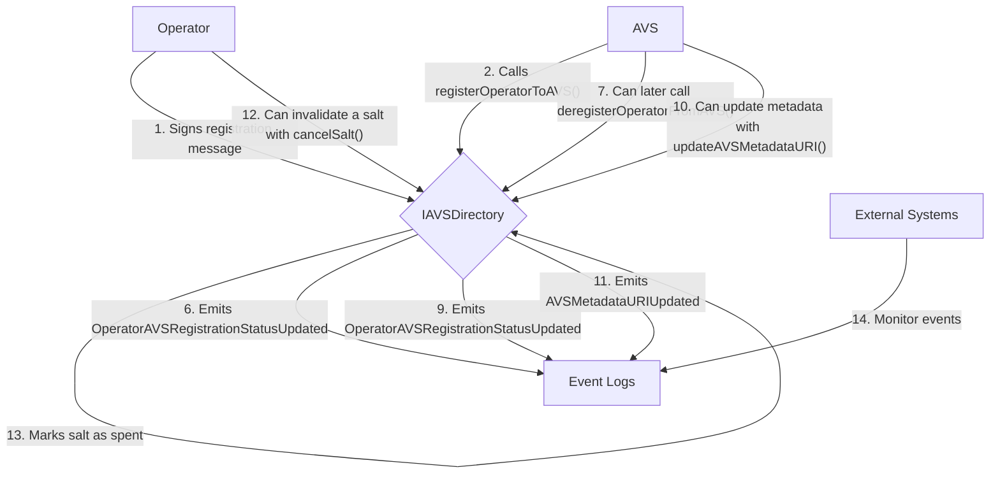

# IAVSDirectory

## Contract Overview

The `IAVSDirectory` interface defines a critical component in an EigenLayer-based system that manages the relationship between operators and Active Validator Services (AVSs). It serves as a registry that tracks the registration status of operators with different AVSs in the ecosystem.

This contract acts as a directory service that enables:
1. Operators to register with specific AVSs
2. AVSs to manage their operator sets
3. Both parties to maintain verifiable registration records on-chain

The contract implements several key design patterns:
- **Registry Pattern**: Maintains a centralized directory of operator-AVS relationships
- **Signature Verification**: Uses EIP-712 signatures for secure registration processes
- **Salt-Based Replay Protection**: Prevents replay attacks through single-use salts
- **Pausable**: Contains functionality to pause critical operations during emergencies
- **Ownable**: Includes initialization with an initial owner, suggesting administrative controls

## Contract Interface

### Key Functions

#### Initialization and Administration
- `initialize(address initialOwner, uint256 initialPausedStatus)`: Sets up the contract with an initial owner and paused status.

#### Registration Management
- `registerOperatorToAVS(address operator, SignatureWithSaltAndExpiry memory operatorSignature)`: Allows an AVS to register an operator using the operator's signed consent.
- `deregisterOperatorFromAVS(address operator)`: Enables an AVS to remove an operator from its registry.
- `cancelSalt(bytes32 salt)`: Gives operators the ability to invalidate a previously used salt, preventing future use of a signature.

#### Metadata Management
- `updateAVSMetadataURI(string calldata metadataURI)`: Allows AVSs to update their metadata URI, which is emitted in an event but not stored on-chain.

#### View Functions
- `operatorSaltIsSpent(address operator, bytes32 salt)`: Checks if a particular salt has been used by an operator.
- `calculateOperatorAVSRegistrationDigestHash(address operator, address avs, bytes32 salt, uint256 expiry)`: Generates the digest hash that operators must sign to register with an AVS.
- `OPERATOR_AVS_REGISTRATION_TYPEHASH()` and `OPERATOR_SET_REGISTRATION_TYPEHASH()`: Return the EIP-712 typehashes used for signature verification.

### Important Events

- `OperatorAVSRegistrationStatusUpdated(address indexed operator, address indexed avs, OperatorAVSRegistrationStatus status)`: Emitted when an operator's registration status with an AVS changes.
- `AVSMetadataURIUpdated(address indexed avs, string metadataURI)`: Emitted when an AVS updates its metadata URI.

### Key State Variables

While the interface doesn't explicitly define state variables, it implies the presence of:
- A mapping of operator addresses to their AVS registration statuses
- A mapping to track spent salts for signature replay protection
- A registry of operator set registration information

## Logic Flow

### Operator Registration Flow

1. **Preparation**:
   - The operator decides to register with a specific AVS
   - The operator generates a unique salt and calculates an expiry time

2. **Signature Creation**:
   - The operator calls `calculateOperatorAVSRegistrationDigestHash` to obtain the message to sign
   - The operator signs this digest using their private key
   - The signature, along with the salt and expiry, is provided to the AVS

3. **Registration**:
   - The AVS calls `registerOperatorToAVS` with the operator's address and signed data
   - The contract verifies:
     - The signature is valid using EIP-712 signature verification
     - The salt hasn't been used before
     - The signature hasn't expired
   - If all checks pass, the operator is registered with the AVS
   - The salt is marked as spent
   - An `OperatorAVSRegistrationStatusUpdated` event is emitted

4. **Deregistration**:
   - An AVS can deregister an operator by calling `deregisterOperatorFromAVS`
   - The contract updates the operator's registration status
   - An `OperatorAVSRegistrationStatusUpdated` event is emitted

### Salt Management Flow

1. The operator can cancel a previously used salt by calling `cancelSalt`
2. This marks the salt as spent, preventing any signatures using this salt from being processed
3. This serves as a security mechanism to invalidate signatures that may have been compromised

### Metadata Update Flow

1. An AVS can update its metadata by calling `updateAVSMetadataURI`
2. The contract emits an `AVSMetadataURIUpdated` event with the new URI
3. External systems can monitor these events to keep track of the latest AVS metadata

## Visual Representation

## Dependencies and Interactions

The `IAVSDirectory` interface extends several other interfaces:

1. **ISignatureUtilsMixin**: Provides utilities for signature verification, crucial for secure operator registration. It defines the `SignatureWithSaltAndExpiry` struct used in registration.

2. **IPauserRegistry**: Not directly referenced in the functions but imported, suggesting the contract implements pausable functionality for emergency scenarios.

3. **IStrategy**: Imported but not directly referenced, potentially related to strategies that operators might execute.

The contract also interacts with:

- **EigenLayer's DelegationManager**: The `OperatorNotRegisteredToEigenLayer` error suggests that operators must first be registered with EigenLayer before they can register with an AVS.

- **Operator Sets**: The code references a transition from legacy M2 AVSs to a new system using "operator sets." The interface provides both legacy functions and indicates future migration to operator sets for more sophisticated operator management.

Additionally, the contract implements EIP-712 for secure typed signature verification, used extensively in the registration process to ensure that operators have given consent to be registered with an AVS.

The interface serves as a central connector in the system, linking operators, AVSs, and EigenLayer together in a secure and verifiable manner.