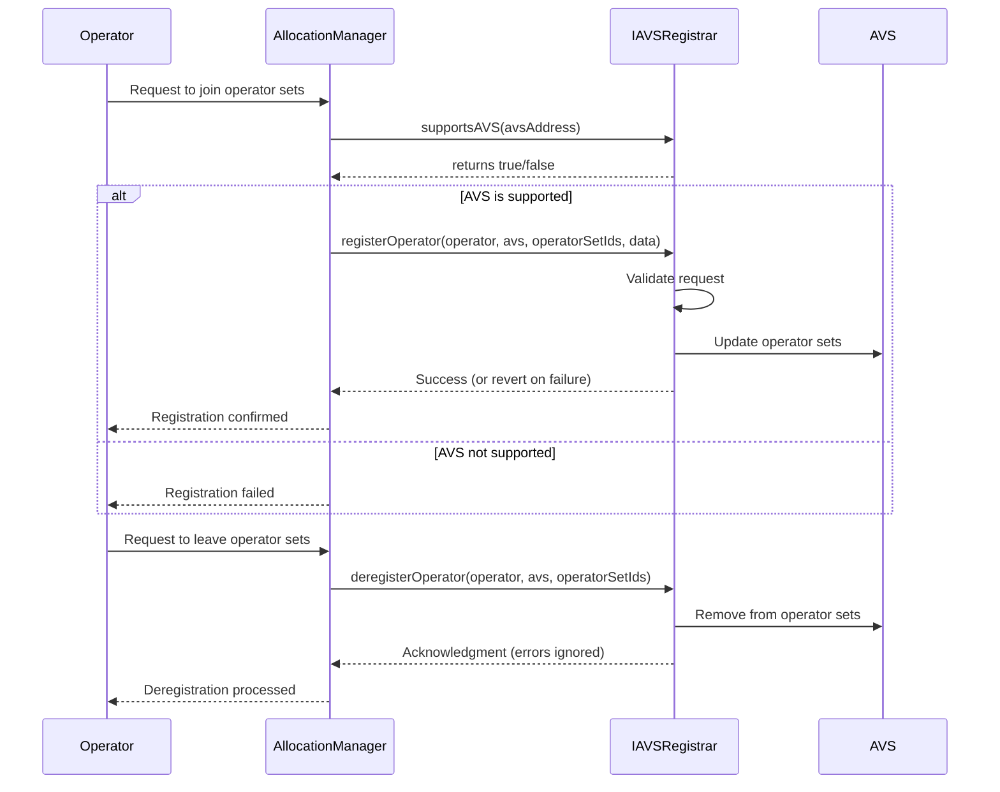

# IAVSRegistrar

## Contract Overview

`IAVSRegistrar` is an interface contract that defines a standardized way for Active Validator Services (AVS) to handle operator registration and deregistration. In Web3 infrastructure, AVSs are specialized services built on top of blockchain networks that require validators or operators to perform specific tasks. This interface sits as a crucial middleware component between the operators and an allocation management system.

The primary purpose of this interface is to provide a consistent API for an allocation management system to register and deregister operators with specific AVS services across different operator sets. It acts as a gateway that authenticates and manages operator participation in various AVS functionalities.

The contract follows the interface design pattern, which enforces a consistent structure for all implementing contracts and enables interoperability within the system. This approach allows for multiple different AVS implementations to be integrated with the same allocation management system.

## Contract Interface

### Public/External Functions

1. **`registerOperator(address operator, address avs, uint32[] calldata operatorSetIds, bytes calldata data)`**
   - **Purpose**: Registers an operator to participate in one or more operator sets within an AVS
   - **When Called**: Called by the AllocationManager when an operator wants to join specific AVS operator sets
   - **Behavior**: Must revert if registration fails, ensuring atomicity of the registration process
   - **Parameters**:
     - `operator`: The address of the operator being registered
     - `avs`: The AVS address the operator is registering with
     - `operatorSetIds`: Array of IDs representing the operator sets the operator wants to join
     - `data`: Arbitrary data for custom registration parameters

2. **`deregisterOperator(address operator, address avs, uint32[] calldata operatorSetIds)`**
   - **Purpose**: Removes an operator from one or more operator sets within an AVS
   - **When Called**: Called by the AllocationManager when an operator wants to leave specific sets
   - **Behavior**: If this function reverts, the error is ignored, allowing for graceful degradation
   - **Parameters**: Similar to `registerOperator` but for the deregistration process

3. **`supportsAVS(address avs)`**
   - **Purpose**: Verification method to check if a specific AVS is supported by this registrar
   - **When Called**: Before attempting registration, to validate compatibility
   - **Returns**: Boolean indicating whether the AVS is supported

### Key State Variables

While not explicitly defined in the interface (as interfaces don't contain state variables), implementing contracts would likely include:

- A reference to the authorized AllocationManager address
- A mapping of supported AVS addresses
- Data structures tracking operator membership in different sets

## Logic Flow

The contract defines a standardized flow for operator management:

1. **Validation**: Before registration, a client can verify AVS support using `supportsAVS()`
2. **Registration Process**:
   - The AllocationManager calls `registerOperator()` with operator details and target operator sets
   - The implementing contract validates the request (proper permissions, valid sets, etc.)
   - If valid, the operator is added to the specified sets; otherwise, the transaction reverts
3. **Deregistration Process**:
   - The AllocationManager calls `deregisterOperator()` with sets to remove the operator from
   - The implementing contract attempts to remove the operator from those sets
   - Any errors are ignored to ensure the process completes

The interface design prioritizes security through clear permissions (only the AllocationManager can call registration functions) and ensures atomicity in registration while providing fault tolerance during deregistration.

## Visual Representation

## Dependencies and Interactions

`IAVSRegistrar` is designed to interact with several key components in the system:

1. **AllocationManager**: This external contract calls the registration and deregistration functions. It appears to be the authorized controller for operator management.

2. **AVS Contracts**: The interface is designed to connect with various AVS implementations. Each implementing contract would handle the specifics of how operators are managed within that particular AVS.

3. **Operators**: While operators don't directly interact with this interface, they are the entities being registered and deregistered. They likely interact with the AllocationManager which then interacts with this interface.

The design suggests a modular system where multiple AVS services can be integrated with a single allocation management infrastructure. This interface standardizes how operators join and leave different operational subsets within each AVS, allowing for flexibility in operator assignment while maintaining a consistent management approach across the ecosystem.

When implementing this interface, developers would need to define the specific mechanics of:
- How operator sets are structured
- What validation occurs during registration
- How the AVS leverages the registered operators for its services

This interface provides substantial flexibility while ensuring a consistent API for the allocation management system to work with.