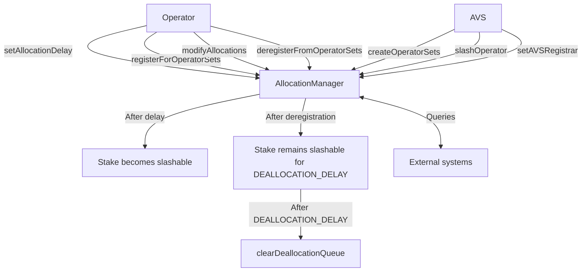

# IAllocationManager

## Contract Overview

IAllocationManager serves as a core interface for managing token allocations, slashing, and operator registrations in a decentralized staking system. This interface is designed to manage how operators allocate their slashable stake across various AVSs (Actively Validated Services) and their operator sets.

The primary purpose of this contract is to create a well-structured mechanism for:
1. Operators to register with AVSs and allocate their staked tokens
2. AVSs to create operator sets and slash operators who misbehave
3. Managing the lifecycle of stake allocations, including pending allocations and deallocations

This contract fits within a broader Web3 infrastructure that enables secure delegation, attestation, and slashing mechanics. It uses a modular design that separates different responsibilities across specialized components, allowing operators to participate in multiple services while managing their slashable risk exposure.

Key design patterns used include:
- Interface segregation (separating errors, events, and types)
- Role-based access control (operators, AVSs, and delegation manager)
- Time-delayed state transitions (allocation delays, deallocation periods)
- Event-driven architecture for off-chain indexing

## Contract Interface

### Key Types

The contract defines several important structs:

- **Allocation**: Represents stake allocation from a strategy to an operator set, tracking current magnitude, pending changes, and when they take effect
- **AllocationDelayInfo**: Tracks an operator's configuration for delays between allocation and when stake becomes slashable
- **RegistrationStatus**: Indicates whether an operator is registered for a set and how long they remain slashable
- **OperatorSet**: Defines a group of operators working together as part of an AVS

### Public Functions

#### Operator Management
- **setAllocationDelay**: Sets how long it takes for an operator's allocation to become slashable
- **registerForOperatorSets**: Registers an operator for one or more operator sets within an AVS
- **deregisterFromOperatorSets**: Removes an operator from operator sets but keeps their stake slashable for a period
- **modifyAllocations**: Updates how an operator's stake is allocated across operator sets

#### AVS Management
- **createOperatorSets**: Allows an AVS to create new sets of operators
- **setAVSRegistrar**: Sets the contract that handles registration for an AVS
- **updateAVSMetadataURI**: Updates AVS metadata (emits event for off-chain indexing)
- **slashOperator**: Allows an AVS to slash a misbehaving operator
- **addStrategiesToOperatorSet**: Adds new strategies to an existing operator set
- **removeStrategiesFromOperatorSet**: Removes strategies from an operator set

#### Cleanup
- **clearDeallocationQueue**: Processes pending deallocations after the slashable period

#### Querying
- The interface provides numerous view functions to query:
  - Operator allocations and encumbered magnitudes
  - Registration statuses
  - Slashable stake amounts
  - Operator set memberships and strategies

### Events

Key events include:
- **AllocationDelaySet**: When an operator configures their allocation delay
- **AllocationUpdated**: When an operator's allocation magnitude changes
- **EncumberedMagnitudeUpdated**: When an operator's allocated magnitude changes for a strategy
- **OperatorSlashed**: When an AVS slashes an operator for misbehavior
- **OperatorSetCreated**: When an AVS creates a new operator set
- **OperatorAddedToOperatorSet/OperatorRemovedFromOperatorSet**: When operators join or leave sets

## Logic Flow

### Allocation Process
1. An operator first calls `setAllocationDelay` to establish how long their allocations will take to become slashable
2. The operator registers with one or more AVSs using `registerForOperatorSets`
3. The operator allocates their stake to various operator sets using `modifyAllocations`
4. After the allocation delay passes, the stake becomes slashable by the AVS

### Slashing Mechanism
1. If an operator misbehaves, an AVS calls `slashOperator` with slashing parameters
2. For each specified strategy, the contract:
   - Reduces the operator's current allocation magnitude proportionally
   - Reduces the strategy's max and encumbered magnitudes
   - Adjusts any pending deallocations proportionally
   - Updates the operator's shares in the DelegationManager

### Deregistration Process
1. An operator or AVS calls `deregisterFromOperatorSets` to remove the operator from sets
2. The operator's stake remains slashable for a DEALLOCATION_DELAY period
3. After this period, `clearDeallocationQueue` can be called to remove deallocations from the queue
4. This updates the operator's encumbered magnitude accordingly

## Visual Representation

## Dependencies and Interactions

The AllocationManager interacts with several other core contracts:

1. **Delegation Manager**: The AllocationManager interacts with a delegation system to determine the actual token amounts backing the allocations and to update shares during slashing.

2. **Strategy Contracts**: Implementing the `IStrategy` interface, these contracts represent different staking strategies from which operators can allocate their stake.

3. **AVS Registrars**: Implementing the `IAVSRegistrar` interface, these contracts handle the AVS-specific registration logic when operators register or deregister.

4. **OperatorSetLib**: A library that manages the structure and operations on operator sets.

5. **IPauserRegistry**: Likely used to enable emergency pausing of operations.

The AllocationManager serves as a coordination layer between these components, managing how operators allocate their stake across different AVSs and how slashing is executed, while leaving the specifics of delegation and AVS-specific registration to their respective specialized contracts.

This modular design allows for a flexible system where strategies, AVSs, and operators can interact according to well-defined interfaces, with the AllocationManager serving as the central hub for allocation management and slashing mechanics.