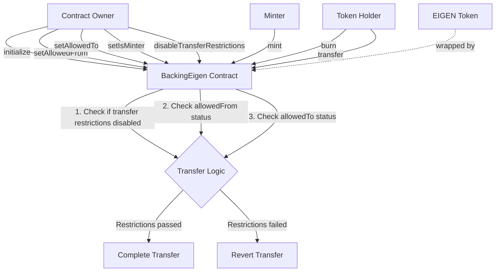

# IBackingEigen

## 1. Contract Overview

IBackingEigen is an interface contract that defines the functionality for a tokenized representation of Eigen tokens with enhanced control mechanisms for transfers, minting, and burning. This interface extends the standard ERC20 interface (from OpenZeppelin) by adding additional governance and security-related functions.

The primary purpose of this interface is to define a token contract that wraps the original EIGEN token with additional features like:
- Controlled transfers through allowlist mechanisms
- Minting and burning capabilities with designated minters
- Time-based transfer restrictions that can be disabled
- Support for checkpointing functionality for potential governance purposes

This interface appears to be part of a token system where certain tokens can be wrapped with additional restrictions and controls, likely for governance or security purposes in the broader Eigen ecosystem.

## 2. Contract Interface

### Public/External Functions

#### Transfer Control Functions
- `setAllowedFrom(address from, bool isAllowedFrom)`: Enables the owner to specify which addresses are allowed to send tokens.
- `setAllowedTo(address to, bool isAllowedTo)`: Enables the owner to specify which addresses are allowed to receive tokens.
- `disableTransferRestrictions()`: Permits the owner to remove all transfer restrictions permanently.

#### Token Management Functions
- `initialize(address initialOwner)`: Sets up the contract with its initial state and owner.
- `setIsMinter(address minterAddress, bool newStatus)`: Allows the owner to designate which addresses can mint new tokens.
- `mint(address to, uint256 amount)`: Lets a minter create new tokens for a specified recipient.
- `burn(uint256 amount)`: Allows token holders to destroy their own tokens.

#### View Functions
- `EIGEN()`: Returns the address of the original EIGEN token that this contract wraps.
- `transferRestrictionsDisabledAfter()`: Returns the timestamp after which transfer restrictions no longer apply.
- `clock()`: Returns the current timestamp for checkpoint tracking.
- `CLOCK_MODE()`: Returns a string indicating the contract uses timestamps rather than block numbers.

### Important Events
While no events are explicitly defined in the interface, implementations would likely include events for:
- Transfer restriction changes
- Minter status changes
- Burning or minting operations

### Key State Variables (Implied)
- `EIGEN`: Address of the wrapped Eigen token
- `transferRestrictionsDisabledAfter`: Timestamp for automatic restriction removal
- `isMinter`: Mapping of addresses to boolean values indicating minting permission
- Two implied mappings for `allowedFrom` and `allowedTo` addresses

## 3. Logic Flow

The main workflows of this contract interface revolve around controlled token transfers and supply management:

### Transfer Control Workflow
1. By default, the contract would restrict transfers based on the `allowedFrom` and `allowedTo` mappings
2. The contract owner can modify these restrictions by:
   - Allowing specific addresses to send tokens using `setAllowedFrom`
   - Allowing specific addresses to receive tokens using `setAllowedTo`
3. Transfer restrictions automatically expire after the timestamp specified in `transferRestrictionsDisabledAfter`
4. The owner can manually and permanently disable transfer restrictions using `disableTransferRestrictions`

### Token Supply Management
1. The contract owner designates minters using the `setIsMinter` function
2. Authorized minters can create new tokens using the `mint` function, specifying a recipient and amount
3. Token holders can reduce supply by burning their tokens using the `burn` function

### Checkpointing System
The contract implements EIP-6372's clock interface, indicating it supports a timestamp-based checkpointing system, likely for voting or governance purposes. This is evident from:
1. The `clock()` function that returns the current timestamp
2. The `CLOCK_MODE()` function that specifies timestamp usage

## 4. Visual Representation

## 5. Dependencies and Interactions

### External Dependencies
- **OpenZeppelin Contracts**: The interface extends OpenZeppelin's `IERC20` interface, inheriting standard ERC20 token functionality.

### Contract Interactions
- **EIGEN Token**: The contract references and likely wraps the original EIGEN token, potentially allowing for conversion between the two.
- **Governance Infrastructure**: Based on the checkpointing functionality, this contract likely interacts with governance contracts for voting or proposal systems.
- **Minters**: Designated addresses authorized to increase the token supply, which may include other system contracts.

### Security Mechanisms
1. **Controlled Token Movements**: The allowlist system for senders and receivers provides fine-grained control over token flow.
2. **Restricted Minting**: Only designated minters can create new tokens, preventing unauthorized inflation.
3. **Time-Based Restrictions**: Transfer restrictions can be automatically or manually lifted, allowing for initial protection that can be relaxed once the system matures.
4. **Ownership Controls**: Critical functions are restricted to the contract owner, providing centralized governance during initial deployment.

This interface design balances the need for initial centralized control with mechanisms for eventual decentralization, as evidenced by the ability to disable transfer restrictions permanently.