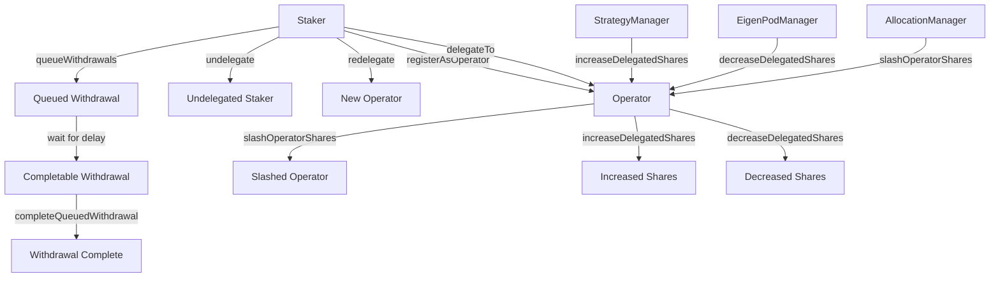
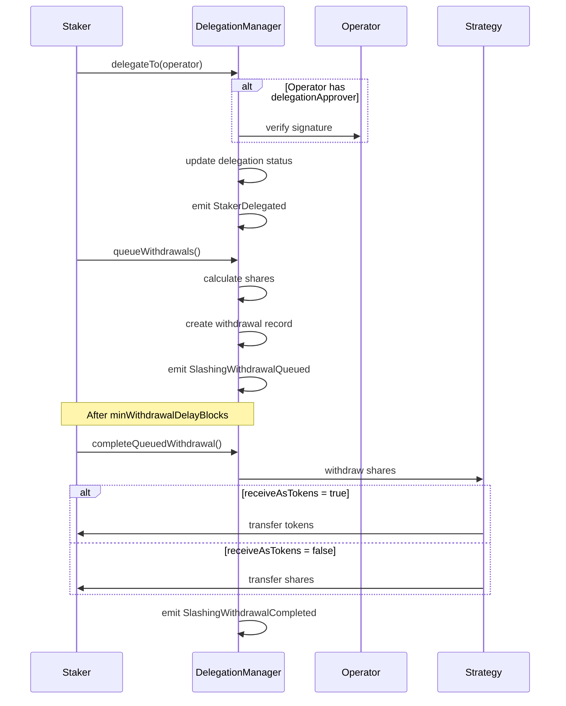

# IDelegationManager

## 1. Contract Overview

The `IDelegationManager` interface defines the contract responsible for managing delegation relationships between stakers and operators in the EigenLayer protocol. EigenLayer is a restaking platform that allows users (stakers) to delegate their staked assets to operators who can then use those assets to provide security to various applications built on top of the protocol.

### Purpose and Main Functionality

This contract handles several core functions:
- Enabling users to register as operators in the EigenLayer ecosystem
- Facilitating the delegation of staked assets from stakers to operators
- Managing the withdrawal process when stakers want to retrieve their assets
- Tracking delegation relationships and shares across the system
- Handling slashing mechanisms to penalize malicious behavior

### System Architecture Position

The `IDelegationManager` sits at the core of the EigenLayer delegation system. It interacts with several other components:

1. **StrategyManager** - Manages the different strategies that hold staked assets
2. **EigenPodManager** - Handles beacon chain ETH staking
3. **AllocationManager** - Manages allocation of staked assets to applications
4. **Various Strategies** - Contracts that hold and manage staked assets (e.g., beaconChainETHStrategy)

### Key Design Patterns

1. **Role-based Access Control** - Different functions can only be called by specific roles (operators, stakers, etc.)
2. **EIP-712 Signatures** - Used for delegation approvals
3. **Queued Withdrawals** - Implements a delayed withdrawal mechanism for security
4. **Slashing Mechanism** - Enables penalties for malicious behavior
5. **Delegation Relationships** - One-to-many relationship model where multiple stakers can delegate to a single operator

## 2. Contract Interface

### Public/External Functions

#### Operator Management
- `registerAsOperator` - Allows a user to register as an operator
- `modifyOperatorDetails` - Updates an operator's delegation approver
- `updateOperatorMetadataURI` - Updates metadata about an operator

#### Delegation Management
- `delegateTo` - Allows a staker to delegate their assets to an operator
- `undelegate` - Undelegates a staker from their current operator
- `redelegate` - Undelegates from current operator and delegates to a new one in one transaction

#### Withdrawal Management
- `queueWithdrawals` - Queues withdrawals of staker's deposit shares
- `completeQueuedWithdrawal` - Completes a previously queued withdrawal
- `completeQueuedWithdrawals` - Completes multiple queued withdrawals

#### Shares Management
- `increaseDelegatedShares` - Called when a staker's deposit shares increase
- `decreaseDelegatedShares` - Called when a staker's beacon chain ETH balance decreases
- `slashOperatorShares` - Slashes an operator's shares after malicious behavior

#### View Functions
- `delegatedTo` - Returns the operator a staker is delegated to
- `isDelegated` - Checks if a staker is actively delegated
- `isOperator` - Checks if an address is registered as an operator
- `getOperatorShares` - Returns shares delegated to an operator
- `getWithdrawableShares` - Returns a staker's withdrawable shares
- `getDepositedShares` - Returns a staker's deposited shares
- `getQueuedWithdrawal` - Returns details of a queued withdrawal

### Key Events

- `OperatorRegistered` - Emitted when a new operator registers
- `StakerDelegated` - Emitted when a staker delegates to an operator
- `StakerUndelegated` - Emitted when a staker undelegates
- `StakerForceUndelegated` - Emitted when a staker is forcefully undelegated
- `OperatorSharesIncreased` - Emitted when an operator's shares increase
- `OperatorSharesDecreased` - Emitted when an operator's shares decrease
- `OperatorSharesSlashed` - Emitted when an operator's shares are slashed
- `SlashingWithdrawalQueued` - Emitted when a withdrawal is queued
- `SlashingWithdrawalCompleted` - Emitted when a queued withdrawal is completed

### Key State Variables

While the interface doesn't directly show state variables, it implies several important ones:
- Mapping of stakers to operators they're delegated to
- Tracking of operator shares across different strategies
- Storage of queued withdrawals
- Deposit scaling factors for stakers
- Operator registration status
- Slashing-related information for operators and strategies

## 3. Logic Flow

### Operator Registration Flow
1. A user calls `registerAsOperator` with their delegation approver address and metadata
2. The contract verifies the user isn't already delegated to another operator
3. The user is registered as an operator and is considered "delegated to themselves"
4. The `OperatorRegistered` event is emitted

### Delegation Flow
1. A staker calls `delegateTo` specifying which operator to delegate to
2. If the operator has set a delegation approver, the contract verifies a valid signature
3. The staker is marked as delegated to the operator
4. Any currently staked assets are delegated to the operator
5. The `StakerDelegated` event is emitted

### Withdrawal Flow
1. A staker calls `queueWithdrawals` to initiate withdrawal of their assets
2. The contract removes shares from the staker and operator's balances
3. A withdrawal record is created with a unique root hash and a minimum delay period begins
4. After the delay period, the staker calls `completeQueuedWithdrawal`
5. The contract verifies the withdrawal is valid and the delay has passed
6. The staker receives either tokens or shares based on their preference
7. The withdrawal record is removed from the queue

### Slashing Flow
1. The AllocationManager detects malicious behavior by an operator
2. It calls `slashOperatorShares` to penalize the operator
3. The operator's share balance is reduced based on the severity of the violation
4. The `OperatorSharesSlashed` event is emitted
5. Stakers delegated to the slashed operator will receive fewer assets when they withdraw

### Redelegation Flow
1. A staker calls `redelegate` with the address of the new operator they wish to delegate to
2. The contract first undelegates the staker from their current operator
3. All of the staker's withdrawable shares are queued for withdrawal
4. The contract then delegates the staker to the new operator
5. The staker's assets will be delegated to the new operator after withdrawals are completed

## 4. Visual Representation

## 5. Dependencies and Interactions

### Core Contract Interactions

1. **With StrategyManager**
   - The StrategyManager calls `increaseDelegatedShares` when a staker's deposit increases
   - The DelegationManager calls into StrategyManager during the withdrawal process
   - The DelegationManager may receive callbacks from StrategyManager for shares accounting

2. **With EigenPodManager**
   - The EigenPodManager calls `decreaseDelegatedShares` when a staker's beacon chain ETH decreases
   - DelegationManager has special handling for the beaconChainETHStrategy

3. **With AllocationManager**
   - The AllocationManager calls `slashOperatorShares` when applying slashing penalties
   - AllocationManager tracks allocations of operators' delegated stake

4. **With Strategy Contracts**
   - DelegationManager interacts with various strategy contracts to manage shares
   - Specific handling for beaconChainETHStrategy which represents beacon chain ETH stakes

### External Dependencies

1. **IStrategy Interface**
   - Used to interact with different staking strategies
   - Each strategy represents a different type of staked asset

2. **IPauserRegistry**
   - Likely used for emergency pause functionality

3. **ISignatureUtilsMixin**
   - Provides utilities for signature verification
   - Used in the delegation approval process

4. **SlashingLib**
   - Library providing slashing calculation functionality

The DelegationManager sits at the heart of the EigenLayer staking and delegation system, facilitating the core functionality that allows EigenLayer to provide security to various applications through restaking. It manages the complex relationships between stakers, operators, and the strategies that hold their assets, while implementing security measures like delayed withdrawals and slashing to protect the integrity of the system.