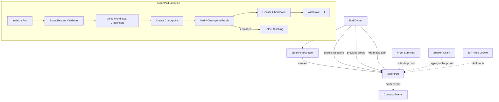

# IEigenPod

## Contract Overview

IEigenPod is a key interface in the EigenLayer protocol that defines the functionality for restaking Ethereum beacon chain ETH. The contract serves as a personal vault for users who want to participate in EigenLayer's restaking ecosystem without unstaking their ETH from the beacon chain.

The main purpose of this contract is to allow validators to "restake" their beacon chain ETH on EigenLayer, effectively putting the same ETH at risk for multiple networks. This process doesn't require physically moving ETH from the beacon chain but rather proving via cryptographic proofs that a user's validator has withdrawal credentials pointing to their EigenPod.

This interface is part of a larger system where the EigenPodManager creates and manages individual EigenPods for users. The contract implements several design patterns including:
- Proxy pattern (evidenced by the initialize method)
- Role-based access control (owner vs proof submitter roles)
- Cryptographic proof verification
- Checkpointing mechanism for tracking validator balances

## Contract Interface

### Key State Variables
- `proofSubmitter`: An address delegated by the pod owner that can submit proofs on their behalf
- `withdrawableRestakedExecutionLayerGwei`: Amount of ETH withdrawn from the beacon chain but still staked in EigenLayer
- `eigenPodManager`: Reference to the EigenPodManager contract that manages all EigenPods
- `podOwner`: The owner of this specific EigenPod
- `validatorPubkeyHashToInfo`: Mapping that stores important information about each validator
- `activeValidatorCount`: Number of validators with proven withdrawal credentials
- `currentCheckpoint` and related variables: Track the ongoing checkpoint process

### Public/External Functions

**Initialization and Setup**
- `initialize(address owner)`: Sets up the EigenPod with an owner
- `setProofSubmitter(address newProofSubmitter)`: Designates an address that can submit proofs on behalf of the owner

**Staking and Withdrawing**
- `stake(bytes pubkey, bytes signature, bytes32 depositDataRoot)`: Creates a new ETH validator through this EigenPod
- `withdrawRestakedBeaconChainETH(address recipient, uint256 amount)`: Withdraws ETH that has been restaked
- `recoverTokens(IERC20[] tokenList, uint256[] amountsToWithdraw, address recipient)`: Allows the owner to recover any ERC20 tokens sent to the pod

**Checkpoint Management**
- `startCheckpoint(bool revertIfNoBalance)`: Initiates a checkpoint to update validator balances
- `verifyCheckpointProofs(...)`: Verifies proofs for validator balances in the current checkpoint

**Validator Management**
- `verifyWithdrawalCredentials(...)`: Proves that validators have their withdrawal credentials pointed to this EigenPod
- `verifyStaleBalance(...)`: Proves that a validator has been slashed on the beacon chain

### Events

- `EigenPodStaked`: Emitted when a new validator is staked through this EigenPod
- `ValidatorRestaked`: Emitted when a validator's withdrawal credentials are verified
- `ValidatorBalanceUpdated`: Emitted when a validator's balance is updated
- `RestakedBeaconChainETHWithdrawn`: Emitted when restaked ETH is withdrawn
- `CheckpointCreated` and `CheckpointFinalized`: Track the checkpoint lifecycle
- `ValidatorCheckpointed`: Emitted when a validator is successfully included in a checkpoint
- `ValidatorWithdrawn`: Emitted when a validator is proven to have 0 balance

## Logic Flow

The EigenPod operates through several key workflow processes:

### Staking and Restaking Process
1. A user first sets up an EigenPod through the EigenPodManager
2. The user can then:
   - Stake new validators directly through the EigenPod using `stake()`
   - "Restake" existing validators by proving their withdrawal credentials point to the EigenPod using `verifyWithdrawalCredentials()`

### Checkpoint Management Process
Checkpoints are a crucial mechanism for tracking validator balances and rewarding pod owners:

1. The pod owner (or proof submitter) initiates a checkpoint using `startCheckpoint()`
2. For each active validator, proofs are submitted via `verifyCheckpointProofs()`
3. Once all validators are proven, the checkpoint is finalized
4. During finalization:
   - The pod tracks the total change in validator balances
   - Validators with 0 balance are marked as withdrawn
   - The pod owner is awarded shares based on the balance changes and any unaccounted ETH

### Withdrawal Process
1. When a validator withdraws ETH from the beacon chain, it goes to their EigenPod
2. The pod owner must complete a checkpoint to account for these withdrawals
3. After successful checkpointing, the owner can call `withdrawRestakedBeaconChainETH()` to transfer the ETH

### Security Mechanisms
- Role-based access: Different functions are restricted to the pod owner, EigenPodManager, or designated proof submitter
- Robust error handling: Comprehensive error messages for different failure scenarios
- Cryptographic proofs: All balance and validator status changes require cryptographic proofs from the beacon chain
- Slashing detection: Active validators can be proven to be slashed, triggering a checkpoint

## Visual Representation

## Dependencies and Interactions

### External Dependencies
1. **Beacon Chain**: The contract relies heavily on the Ethereum beacon chain, using cryptographic proofs to verify:
   - Validator withdrawal credentials
   - Validator balances
   - Validator status (active, withdrawn, slashed)

2. **EIP-4788 Oracle**: The contract uses the EIP-4788 beacon block roots oracle to verify the authenticity of beacon chain proofs:
   - The `getParentBlockRoot()` function queries this oracle to get beacon block roots
   - This allows the contract to verify that proofs are from legitimate beacon chain states

3. **OpenZeppelin Contracts**: Imports the IERC20 interface for token recovery functionality

### System Interactions
1. **EigenPodManager**: This contract is created and managed by the EigenPodManager, which:
   - Initializes the EigenPod with an owner
   - Acts as the entry point for certain operations
   - Maintains registry of all EigenPods in the system

2. **Beacon Deposit Contract**: When staking new validators, this contract forwards ETH to the beacon chain deposit contract

3. **BeaconChainProofs Library**: Contains the data structures and verification logic for all beacon chain proofs used by the contract

4. **IEigenPodTypes, IEigenPodEvents, IEigenPodErrors**: These interfaces define the core data structures, events, and error messages used throughout the contract

The EigenPod represents a significant innovation in Ethereum's staking ecosystem, allowing beacon chain stakers to put their staked ETH to work in securing additional networks without needing to withdraw it from the beacon chain. The contract uses a sophisticated proof and checkpoint system to track validator balances and status, ensuring accurate accounting while maintaining security.