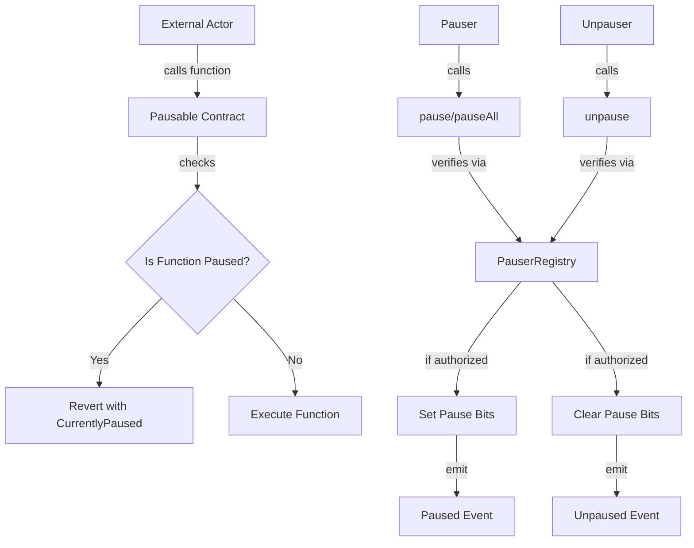

# IPausable

## 1. Contract Overview

### Purpose and Main Functionality
The `IPausable` interface defines a framework for implementing pausability in smart contracts within the EigenLayer ecosystem. This mechanism allows authorized entities to temporarily halt specific functionalities of a contract in emergency situations or when maintenance is required, providing an essential safety feature for complex blockchain systems.

### System Architecture Context
Within the EigenLayer system, `IPausable` serves as a foundational security interface that other contracts can implement to gain granular pause/unpause capabilities. It works in conjunction with the `PauserRegistry` contract, which manages the authorization logic for pause/unpause operations. This separation of concerns allows for a flexible security model where different entities can have different levels of control over pausing functionality.

### Key Design Patterns
- **Interface-based Design**: Defines a standard interface for pausable contracts to implement
- **Role-Based Access Control**: Delegates authorization to dedicated pauser and unpauser roles
- **Bit Flag Pattern**: Uses a bitwise approach for granular control over pausing specific functionalities
- **Event-driven Updates**: Emits events to notify listeners of changes in pause status

## 2. Contract Interface

### Public/External Functions
- `pauserRegistry()`: Returns the address of the PauserRegistry contract this contract uses for access control
- `pause(uint256 newPausedStatus)`: Allows the pauser to pause specific functionalities by setting bits in the paused status
- `pauseAll()`: Convenience function to pause all functionalities at once
- `unpause(uint256 newPausedStatus)`: Allows the unpauser to unpause specific functionalities
- `paused()`: Returns the current paused status as a uint256
- `paused(uint8 index)`: Checks if a specific functionality (identified by bit index) is paused

### Events
- `Paused(address indexed account, uint256 newPausedStatus)`: Emitted when a pause action occurs
- `Unpaused(address indexed account, uint256 newPausedStatus)`: Emitted when an unpause action occurs

### Error States
- `OnlyPauser()`: Thrown when a non-pauser tries to pause functionality
- `OnlyUnpauser()`: Thrown when a non-unpauser tries to unpause functionality
- `CurrentlyPaused()`: Thrown when an action fails because the relevant functionality is paused
- `InvalidNewPausedStatus()`: Thrown when an invalid pause status is provided
- `InputAddressZero()`: Thrown when a zero address is provided where a valid address is required

## 3. Logic Flow

The pause mechanism in this contract uses a bitwise approach to control different functionalities:

1. **Initialization**: A contract implementing this interface would initialize with the `PauserRegistry` address, which manages pause/unpause permissions.

2. **Pausing Process**:
   - When critical issues are detected, the authorized pauser calls `pause()` with a bitwise representation of what to pause
   - The implementation verifies caller is the pauser (through PauserRegistry)
   - The new paused status can only add paused functions (turn bits from 0 to 1)
   - The contract updates its internal paused state and emits a `Paused` event

3. **Functionality Execution**:
   - Before executing any pausable functionality, the contract checks if the relevant bit is set in the paused status
   - If the bit is set (value is 1), the action is prevented with a `CurrentlyPaused` error
   - If the bit is not set (value is 0), the action proceeds normally

4. **Unpausing Process**:
   - Once issues are resolved, the authorized unpauser calls `unpause()` with a bitwise representation of the desired state
   - The implementation verifies caller is the unpauser (typically a higher authority than the pauser)
   - The new unpaused status can only remove pauses (turn bits from 1 to 0)
   - The contract updates its internal paused state and emits an `Unpaused` event

## 4. Visual Representation

## 5. Dependencies and Interactions

### External Dependencies
- `IPauserRegistry.sol`: This interface defines the contract that manages authorization for pause/unpause actions. The pausable contract defers to this registry to determine if a caller has the right to pause or unpause functionality.

### Contract Interactions
Contracts implementing the `IPausable` interface will:

1. Store a reference to an `IPauserRegistry` contract that manages authorization
2. Maintain an internal state variable (typically called `_paused`) that tracks which functionalities are paused
3. Add checks in their functions to verify if the relevant functionality is paused
4. Implement the pause/unpause functions with proper access controls

### Security Considerations
The design reflects a thoughtful security approach with:

1. **Tiered Authorization**: Separating pauser (emergency response) and unpauser (more careful governance) roles
2. **Granular Control**: Allowing specific functionality to be paused rather than an all-or-nothing approach
3. **Restricted Operations**: Ensuring pause can only turn bits on, and unpause can only turn bits off
4. **Transparency**: Emitting events for all state changes to facilitate monitoring

This architecture is particularly valuable for EigenLayer, as it allows for quick response to vulnerabilities while maintaining a high bar for resuming normal operations, which is critical for a protocol handling significant financial assets.