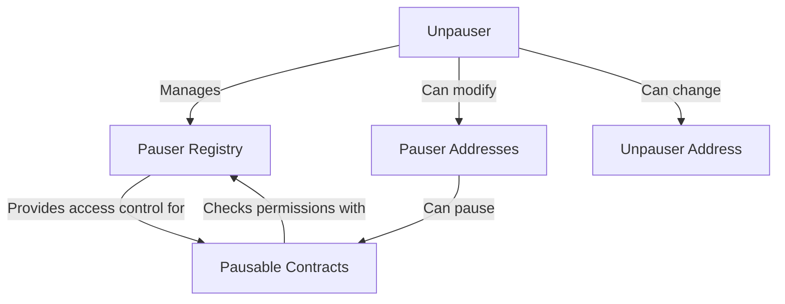

# IPauserRegistry

## Contract Overview

IPauserRegistry is an interface that defines the structure for a registry contract that manages pause functionality within a system. In blockchain applications, especially DeFi and other financial services, the ability to pause certain functions during emergencies is a critical safety feature. This interface establishes the blueprint for a contract that controls which addresses have the authority to pause the system and which singular address has the ability to unpause it.

This contract fits into the broader system architecture as a security mechanism that likely interacts with other contracts that implement pausable functionality. Based on its design, it appears to be part of a system with privileged roles where certain entities have special permissions to protect the protocol in emergency situations.

The key design pattern used is the role-based access control pattern, specifically implementing a two-tier authority structure with:
1. Multiple pausers who can trigger emergency stops
2. A single unpauser who has higher authority to both manage pausers and restore system operations

## Contract Interface

### Public/External Functions

- **isPauser(address pauser)**: A view function that returns a boolean indicating whether a specified address has the ability to pause the system. This would be called whenever the system needs to verify if an address has pauser privileges.

- **unpauser()**: A view function that returns the address of the current unpauser. This single address has the highest level of authority in this security system.

### Important Events

- **PauserStatusChanged**: Emitted when an address is granted or revoked pauser privileges. It includes two parameters:
  - `pauser`: The address whose status is being changed
  - `canPause`: Boolean indicating whether the address now has pausing rights

- **UnpauserChanged**: Emitted when the unpauser role is transferred from one address to another. It includes:
  - `previousUnpauser`: The address that previously held the unpauser role
  - `newUnpauser`: The address that now holds the unpauser role

### Key State Variables

While the interface doesn't define the implementation of state variables, it implies the existence of:

- A mapping that tracks which addresses have pauser privileges
- A variable that stores the address of the unpauser

### Custom Errors

- **OnlyUnpauser**: Thrown when a function restricted to the unpauser is called by another address
- **InputAddressZero**: Thrown when an operation involving an address receives the zero address as input, preventing potential security issues

## Logic Flow

The intended logic flow for this contract would be:

1. The contract is initialized with a designated unpauser address.
2. The unpauser can grant or revoke pauser status for any address.
3. Addresses with pauser status can trigger pause functionality in connected contracts.
4. Only the unpauser can unpause the system after it's been paused.
5. The unpauser can transfer their role to another address if needed.

Security is maintained through the clear separation of responsibilities - multiple entities can pause in an emergency, but only a single trusted entity can unpause or modify the registry itself.

## Visual Representation

## Dependencies and Interactions

While the interface itself doesn't have direct dependencies, the implementing contract would interact with:

1. **Pausable Contracts**: Any contract with pausable functionality would query the IPauserRegistry to determine if a caller has pause privileges.

2. **Access Control System**: This interface likely works alongside a broader access control system within the protocol.

3. **Governance Mechanisms**: The unpauser role might be controlled by or integrated with the protocol's governance system, particularly for decentralized protocols.

The clean separation between pauser and unpauser roles reflects a security-focused design choice. By allowing multiple pausers, the system ensures that emergency stops can be triggered quickly by various authorized entities when needed. By restricting unpause functionality to a single address, the system ensures that careful consideration must go into the decision to resume operations after an emergency pause.

This two-tier design balances the need for quick response in emergencies (multiple pausers) with the need for careful deliberation when resuming normal operations (single unpauser).