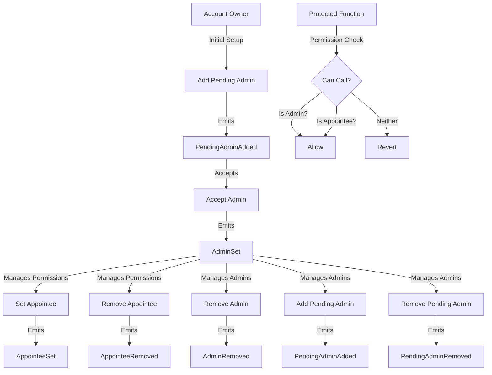

# IPermissionController

## Contract Overview

The `IPermissionController` is a smart contract interface that defines a robust permission management system for blockchain accounts. Its primary purpose is to provide a flexible, multi-layered authorization framework that enables accounts to delegate specific permissions to other addresses, allowing for sophisticated access control patterns.

This interface sits at the foundation of a permissions infrastructure, enabling accounts (which could be individual users, multi-signature wallets, or other smart contracts) to:

1. Designate multiple admin addresses that have full control over the account's permissions
2. Appoint specific addresses to execute particular functions on specific contracts
3. Manage the lifecycle of these permission relationships

The design follows the principle of least privilege, allowing precise control over which addresses can call which functions, rather than granting blanket permissions. It implements a two-step admin assignment pattern (pending admin → accepted admin) for security, ensuring that admin privileges can't be assigned to addresses without their explicit consent.

## Contract Interface

### Public/External Functions

#### Admin Management
- `addPendingAdmin(address account, address admin)`: Initiates the admin assignment process by setting an address as a pending admin
- `removePendingAdmin(address account, address admin)`: Cancels a pending admin assignment before it's accepted
- `acceptAdmin(address account)`: Allows a pending admin to accept their role, finalizing the admin assignment
- `removeAdmin(address account, address admin)`: Removes an active admin's permissions

#### Appointee Management
- `setAppointee(address account, address appointee, address target, bytes4 selector)`: Grants permission to an appointee to call a specific function on a specific contract
- `removeAppointee(address account, address appointee, address target, bytes4 selector)`: Revokes a previously granted permission

#### Permission Checks and Views
- `isAdmin(address account, address caller)`: Determines if an address is an admin for the account
- `isPendingAdmin(address account, address pendingAdmin)`: Checks if an address is a pending admin
- `canCall(address account, address caller, address target, bytes4 selector)`: Core permission check that determines if a caller can execute a specific function
- `getAdmins(address account)`: Returns all active admins for an account
- `getPendingAdmins(address account)`: Returns all pending admins for an account
- `getAppointeePermissions(address account, address appointee)`: Lists all permissions granted to a specific appointee
- `getAppointees(address account, address target, bytes4 selector)`: Retrieves all appointees for a specific function

### Important Events

- `AppointeeSet`: Triggered when a permission is granted to an appointee
- `AppointeeRemoved`: Emitted when an appointee's permission is revoked
- `PendingAdminAdded`: Fired when an address is designated as a pending admin
- `PendingAdminRemoved`: Logged when a pending admin assignment is cancelled
- `AdminSet`: Emitted when a pending admin accepts their role
- `AdminRemoved`: Triggered when an admin is removed

### Key Errors

The interface defines several custom errors for common failure scenarios:
- `NotAdmin`: When a non-admin attempts to perform an admin-only action
- `AdminNotSet`, `AdminAlreadySet`, `AdminNotPending`, `AdminAlreadyPending`: Various admin state validation errors
- `AppointeeAlreadySet`, `AppointeeNotSet`: Validation errors for appointee operations
- `CannotHaveZeroAdmins`: Prevents removing the last admin, ensuring accounts always have at least one admin

## Logic Flow

The permission management system operates through several key workflows:

### Admin Assignment Flow
1. An existing admin calls `addPendingAdmin` to initiate the admin assignment process
2. The system records the pending status and emits a `PendingAdminAdded` event
3. The designated address must actively call `acceptAdmin` to assume the role
4. Upon acceptance, the system records them as an active admin and emits an `AdminSet` event
5. An admin can be removed via `removeAdmin` (provided they're not the last admin)

### Permission Delegation Flow
1. An admin calls `setAppointee` to grant specific function-calling permissions
2. The system records the permission and emits an `AppointeeSet` event
3. The appointee can now call the specified function, which will be approved during permission checks
4. Permissions can be revoked via `removeAppointee`, emitting an `AppointeeRemoved` event

### Permission Verification Flow
When a function protected by this permission system is called:
1. The system calls `canCall` with the account, caller, target contract, and function selector
2. `canCall` checks if the caller is either:
   - An admin of the account, which grants universal access, or
   - An appointee specifically designated for that function on that contract
3. If either condition is true, the call is permitted; otherwise, it's rejected

## Visual Representation

## Dependencies and Interactions

`IPermissionController` inherits from:

1. **`IPermissionControllerErrors`**: Defines the custom error types for permission-related operations
2. **`IPermissionControllerEvents`**: Defines the events emitted by the permission controller
3. **`ISemVerMixin`**: Suggests this contract follows semantic versioning for upgrades, helping track compatibility between versions

This interface is likely implemented by a concrete `PermissionController` contract that manages the actual permission data structures. Other contracts in the system would consult this controller when access control decisions need to be made.

The design allows for flexible integration with various other systems:

- External contracts can verify permissions by calling `canCall`
- Accounts can be individual users, multisigs, or even other smart contracts
- The system can accommodate complex organizational structures with multiple layers of delegation

This permission controller provides a foundation for implementing sophisticated access control patterns in Web3 applications, particularly those requiring fine-grained permission management beyond simple owner-based controls.