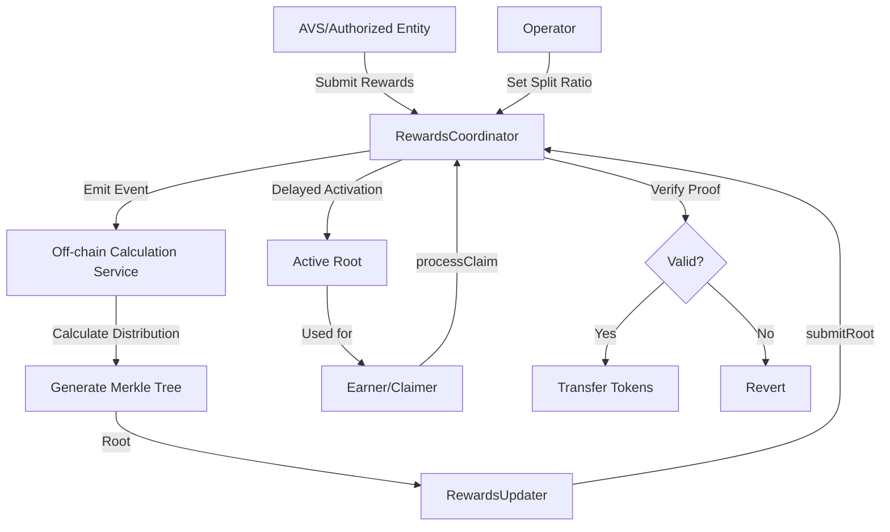

# IRewardsCoordinator

## Contract Overview

The `IRewardsCoordinator` interface defines a sophisticated rewards distribution system for Eigen Layer's Web3 middleware platform. This contract serves as the central hub for managing and distributing rewards across various participants in the ecosystem, including Active Validator Services (AVSs), operators, and stakers who delegate to operators.

The primary purpose of this contract is to enable controlled, verifiable, and efficient reward distributions through a system of submissions, calculations, and merkle-based claims. It allows different reward sources (AVSs, platform-wide incentives, operator-directed rewards) to flow through a unified framework while maintaining fairness and transparency.

Within the broader architecture, the RewardsCoordinator interfaces with core EigenLayer components like DelegationManager, StrategyManager, and AllocationManager to retrieve accurate staking and delegation data for calculations. It implements a delayed rewards calculation and claiming system using merkle trees, which allows for scalable verification of rewards without excessive on-chain computation.

Key design patterns used include:
- Merkle tree-based distribution and claiming
- Role-based access control for different submission types
- Cumulative record-keeping to minimize the need for historical claims
- Flexible operator/staker split ratios for customizing reward distributions
- Time-window based reward submissions and calculations

## Contract Interface

### Core Functions

**Rewards Submission Functions:**
- `createAVSRewardsSubmission`: Allows AVSs to create rewards submissions for their operators and delegators
- `createRewardsForAllSubmission`: Creates rewards for all stakers (permissioned)
- `createRewardsForAllEarners`: Creates rewards for all operators and their delegated stakers (permissioned)
- `createOperatorDirectedAVSRewardsSubmission`: Creates operator-specific rewards from an AVS
- `createOperatorDirectedOperatorSetRewardsSubmission`: Creates operator-specific rewards for a specific operator set

**Root Management Functions:**
- `submitRoot`: Submits a new distribution root (calculation result) for future claims
- `disableRoot`: Allows disabling an incorrect root before it becomes active

**Claiming Functions:**
- `processClaim`: Claims rewards against a specified distribution root
- `processClaims`: Batch claims rewards against a specified distribution root

**Configuration Functions:**
- `setClaimerFor`: Sets an address allowed to claim on behalf of an earner
- `setActivationDelay`: Sets the delay period before a root becomes active
- `setDefaultOperatorSplit`: Sets the default operator/staker split ratio
- `setOperatorAVSSplit`, `setOperatorPISplit`, `setOperatorSetSplit`: Sets specific operator split ratios
- `setRewardsUpdater`, `setRewardsForAllSubmitter`: Sets permissioned roles

### Key Events

- `AVSRewardsSubmissionCreated`, `RewardsSubmissionForAllCreated`, etc.: Emitted when new reward submissions are created
- `DistributionRootSubmitted`: Emitted when a new distribution root is submitted
- `RewardsClaimed`: Emitted when rewards are successfully claimed
- Various configuration events for transparency

### Important State Variables

- `activationDelay`: Delay period before a submitted root can be claimed against
- `currRewardsCalculationEndTimestamp`: Timestamp until which rewards have been calculated
- `defaultOperatorSplitBips`: Default ratio for operator/staker reward splitting
- `rewardsUpdater`: Address allowed to submit distribution roots
- Operator-specific split ratios for different contexts (AVS, PI, OperatorSet)
- `_distributionRoots`: Array of all historical distribution roots

## Logic Flow

### Rewards Submission Process:

1. An AVS or authorized entity creates a reward submission by calling one of the submission functions
2. The submission specifies token, amount, strategies/weights, and time window
3. Tokens are transferred to the RewardsCoordinator contract
4. The submission is recorded and emitted via an event
5. The submission is later processed off-chain by the rewards updater to calculate individual distributions

### Rewards Calculation and Root Submission:

1. Off-chain service calculates individual rewards based on submitted rewards and staking data
2. Calculations are organized into a merkle tree with rewards per earner and token
3. The root of this merkle tree is submitted on-chain via `submitRoot`
4. After the `activationDelay` period, the root becomes active for claims

### Claiming Process:

1. An earner (or their authorized claimer) calls `processClaim` with proof of their rewards
2. The claim includes the merkle proof verifying their earnings against the active root
3. The contract validates the proof and calculates unclaimed rewards (cumulativeEarnings - cumulativeClaimed)
4. Verified tokens are transferred to the recipient
5. The claimed amount is recorded to prevent double-claiming

### Split Ratio Mechanism:

1. Operators can set custom split ratios for different reward sources
2. When split ratios are set, they become active after an activation delay
3. These ratios determine what percentage of rewards go to the operator vs. delegated stakers
4. Different scenarios (AVS-specific, Programmatic Incentives, OperatorSet) can have different split ratios

## Visual Representation

## Dependencies and Interactions

The RewardsCoordinator interacts with several key components:

1. **DelegationManager**: Provides information about operator-staker delegation relationships
2. **StrategyManager**: Used to check staking amounts and strategies
3. **AllocationManager**: Verifies AVS registrations and operator sets
4. **PermissionController**: Handles access control for various functions
5. **ERC20 Tokens**: Used for reward distributions

External dependencies include:
- **Off-chain Reward Calculator**: Processes reward submissions and calculates individual distributions
- **RewardsUpdater**: Authorized entity that submits distribution roots
- **Active Validator Services (AVSs)**: Create reward submissions for their operators
- **Operators and Stakers**: End recipients of rewards

The contract also depends on a merkle tree generation and verification system for efficient proof-based claiming.

The interface is designed to be flexible and extensible, allowing for different reward distribution models while maintaining security and verifiability throughout the process.