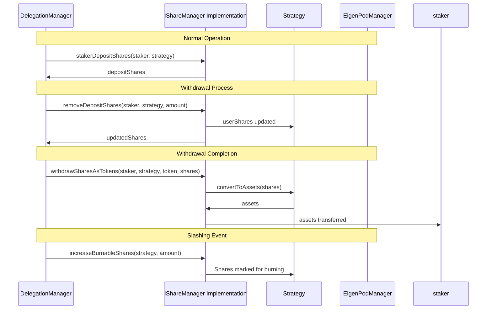

# IShareManager

## 1. Contract Overview

### Purpose and Main Functionality
`IShareManager` is an interface contract that defines a standardized way to manage shares within the EigenLayer protocol. It serves as an abstraction layer that enables the DelegationManager contract to interact with different types of staking mechanisms (such as the StrategyManager and EigenPodManager) through a unified interface.

### System Architecture Placement
In the broader EigenLayer system, the `IShareManager` sits between the DelegationManager and the different share management implementations (like the StrategyManager for liquid staking tokens and the EigenPodManager for native ETH staking). This interface allows the DelegationManager to handle the movement of shares between stakers and operators without needing to know the specifics of how each type of underlying asset is managed.

### Key Design Patterns
- **Interface Segregation**: The contract isolates share management responsibilities into a dedicated interface.
- **Facade Pattern**: Provides a simplified interface to a complex subsystem of share accounting.
- **Abstraction**: Allows the DelegationManager to interact with different types of staking mechanisms without knowing their implementation details.

## 2. Contract Interface

### Public/External Functions

- **`removeDepositShares`**: Removes a specified amount of shares from a staker's position in a specific strategy, typically when queuing a withdrawal.
- **`addShares`**: Awards shares to a staker, typically after a withdrawal has been processed and is ready to be returned to the staker.
- **`withdrawSharesAsTokens`**: Converts a staker's shares into the underlying token and transfers them directly to the staker.
- **`stakerDepositShares`**: A view function to check how many shares a staker has in a particular strategy.
- **`increaseBurnableShares`**: Increases the amount of shares that should be burned for a specific strategy, used during slashing events.

### Events
The interface does not define any events, but implementing contracts would typically emit events for the state changes described in these functions.

### Key State Variables
As an interface, `IShareManager` doesn't define state variables, but it implies the existence of:
- A mapping that tracks stakers' deposit shares in various strategies
- A mechanism to track burnable shares for slashing

## 3. Logic Flow

### Share Management Workflow
1. **Deposit**: Not directly handled by this interface but precedes the workflows defined here.
2. **Queuing Withdrawal**:
   - DelegationManager calls `removeDepositShares` to decrement a staker's shares.
   - The shares are placed in a withdrawal queue (in a different contract).
   - The function returns the updated number of shares after the removal.

3. **Completing Withdrawal**:
   - When a withdrawal is ready to be fulfilled, `withdrawSharesAsTokens` converts shares to tokens and sends them to the staker.
   - For beacon chain ETH, the token parameter is ignored as it deals with native ETH.

4. **Share Addition**:
   - In some cases, shares may be added back to a staker through `addShares`.
   - The function returns both the existing shares before addition and the amount of new shares added.

5. **Slashing Process**:
   - When an operator is slashed, `increaseBurnableShares` marks shares to be burned.
   - This function would be called by the DelegationManager during a slashing event.

### Security Mechanisms
- The interface specifies that only authorized contracts (like DelegationManager) should be able to call state-changing functions.
- The implementation would include access control to prevent unauthorized shares manipulation.
- Special handling is required for beaconChainETH, as noted in several function comments.

## 4. Visual Representation

## 5. Dependencies and Interactions

### Contract Dependencies
- **SlashingLib**: The interface imports the SlashingLib, which provides utilities for handling slashing calculations.
- **IStrategy**: Used to interact with the strategy contracts that manage the actual assets and share calculations.
- **IERC20**: Used for token interactions when converting shares to tokens.

### External Interactions
- **DelegationManager**: The main contract that calls this interface to manage stakers' shares based on delegation and withdrawal actions.
- **StrategyManager**: An implementation of this interface that manages shares for liquid staking tokens.
- **EigenPodManager**: An implementation that manages native ETH staking on the beacon chain.

### Special Considerations
- When interacting with the EigenPodManager, the strategy must be set to beaconChainETH.
- For beacon chain ETH withdrawals, the token parameter in `withdrawSharesAsTokens` is not validated as it deals with native ETH.
- The interface is designed with slashing in mind, allowing for the burning of shares when operators are slashed for malicious behavior.

This interface plays a critical role in EigenLayer by providing a standardized way to manage shares across different types of staked assets, enabling the delegation system to operate consistently regardless of the underlying staking mechanism.