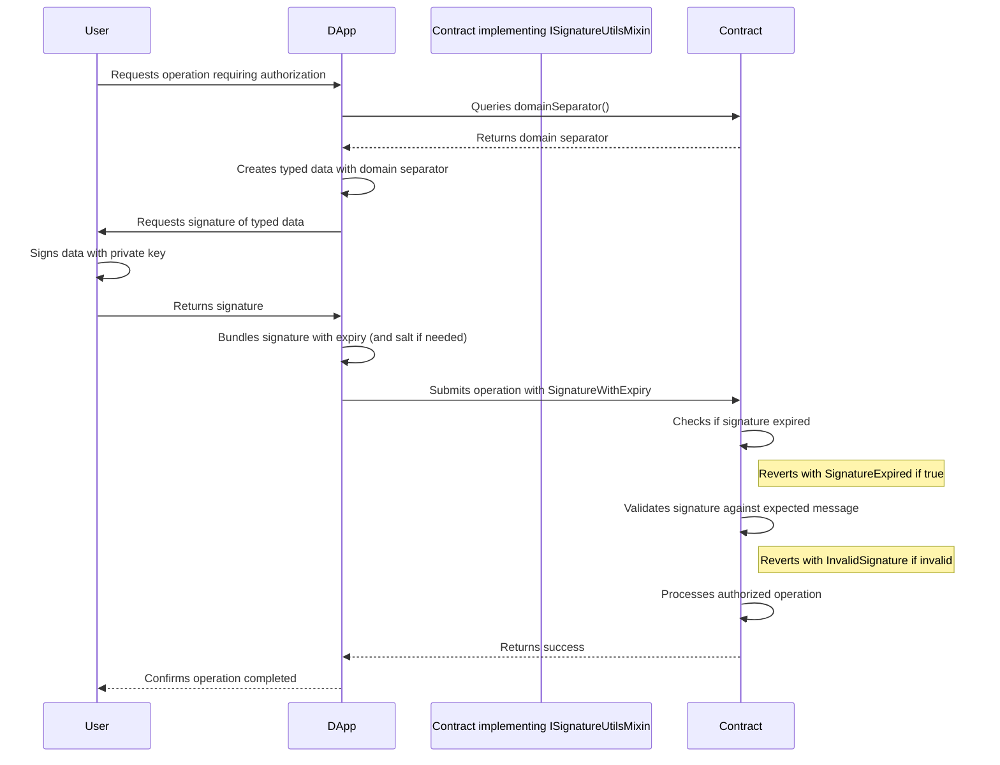

# ISignatureUtilsMixin

## Contract Overview

`ISignatureUtilsMixin` is an interface that defines a standardized way of handling digital signatures within smart contracts in the EigenLayer ecosystem. This interface provides a foundation for signature validation, verification, and management that can be implemented by various contracts in the system.

The primary purpose of this contract is to provide a consistent approach to handling EIP-712 typed signatures, which enable secure message signing and verification that is resistant to replay attacks and cross-contract signature misuse. EIP-712 is a standard that provides a way for users to sign typed data rather than just arbitrary binary messages, making the signing process more transparent and user-friendly.

Within the EigenLayer architecture, this interface is likely incorporated into contracts that require user authorization via signatures, such as delegation, staking operations, or governance actions. The design follows the interface segregation principle, breaking down signature utilities into manageable components that can be integrated where needed.

## Contract Interface

### Public/External Functions

1. **`domainSeparator()`**: 
   - Returns a bytes32 hash that represents the unique EIP-712 domain separator for the contract
   - Used to prevent signature replay attacks across different contracts or chains
   - The domain separator includes the name "EigenLayer", the contract's version, the current chain ID, and the contract's address

### Important Errors

1. **`InvalidSignature()`**:
   - Thrown when a submitted signature fails validation
   - Could be due to incorrect format, signer mismatch, or tampering

2. **`SignatureExpired()`**:
   - Thrown when a signature is presented after its expiration timestamp
   - Protects against delayed replay attacks

### Key Data Structures

1. **`SignatureWithExpiry`**:
   - Bundles a signature with its expiration time
   - Contains:
     - `signature`: The actual signature bytes
     - `expiry`: Timestamp after which the signature is no longer valid

2. **`SignatureWithSaltAndExpiry`**:
   - Extends the previous struct by adding a salt value
   - Contains:
     - `signature`: The actual signature bytes
     - `salt`: A unique bytes32 value to prevent replay attacks
     - `expiry`: Timestamp after which the signature is no longer valid

## Logic Flow

The interface establishes a pattern for signature handling that likely follows this general flow in implementing contracts:

1. A user creates a message they wish to authorize (e.g., delegation, staking)
2. The message is hashed according to EIP-712 standards using the contract's domain separator
3. The user signs this hash with their private key
4. The signature, possibly with expiration time and salt, is passed to the contract
5. The implementing contract verifies:
   - The signature hasn't expired
   - The signature is valid for the given message and expected signer
   - (If using salt) The signature with that salt hasn't been used before

The domain separator returned by `domainSeparator()` is crucial in this process as it uniquely identifies the contract's context, preventing signatures meant for one contract from being used in another.

## Visual Representation

## Dependencies and Interactions

This interface extends `ISemVerMixin`, which likely provides semantic versioning functionality. The version of the contract is an important component of the domain separator calculation, as it ensures that signatures cannot be replayed across different versions of the same contract.

The interface is designed to be implemented by various contracts within the EigenLayer ecosystem that need signature verification capabilities. Contracts implementing this interface would use it to standardize their approach to:

1. Validating user signatures for operations like delegations or withdrawals
2. Ensuring signatures haven't expired
3. Preventing signature replay attacks using the domain separator and optional salt

By standardizing signature utilities across the protocol, EigenLayer increases security and reduces the likelihood of implementation errors in the critical signature verification process. The EIP-712 approach also improves user experience, as it allows wallets to display human-readable signing requests rather than opaque message hashes.

The reference to the EigenLayer Terms of Service in the contract comments suggests that this is part of a regulated protocol where legal compliance is important, underscoring the need for secure and well-defined authorization mechanisms.