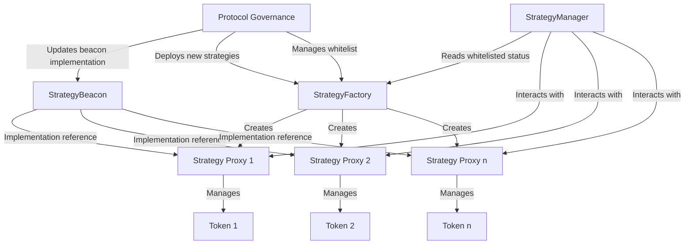

# IStrategyFactory

## Contract Overview

`IStrategyFactory` is an interface that defines the contract responsible for deploying and managing strategy contracts within the EigenLayer protocol. Its primary purpose is to create and track strategy contracts for different ERC20 tokens, allowing the protocol to standardize how these tokens are handled within the system.

This interface sits at a crucial junction in the EigenLayer architecture, acting as the factory that produces strategy contracts which manage how different tokens are staked, delegated, and utilized. It employs the factory pattern to create new strategy instances while maintaining a registry of deployed strategies, and leverages the beacon proxy pattern for upgradability of the strategy implementation.

The key design patterns evident in this interface are:
- Factory Pattern: For creating new strategy contracts
- Proxy Pattern: Using OpenZeppelin's beacon proxy for upgradability
- Registry Pattern: Maintaining a record of deployed strategies

## Contract Interface

### Public/External Functions

1. **strategyBeacon()** - Returns the beacon contract that all deployed strategies point to for their implementation. This enables upgrading all strategies at once by updating the beacon.

2. **deployedStrategies(IERC20 token)** - Returns the strategy contract associated with a specific ERC20 token, allowing other contracts to find the appropriate strategy for a given token.

3. **deployNewStrategy(IERC20 token)** - Deploys a new strategy contract for a specified ERC20 token. This function creates the strategy and registers it in the factory's records.

4. **whitelistStrategies(IStrategy[] calldata strategiesToWhitelist)** - Allows the owner to whitelist strategies in the StrategyManager. Whitelisted strategies are approved for deposits within the protocol.

5. **removeStrategiesFromWhitelist(IStrategy[] calldata strategiesToRemoveFromWhitelist)** - Allows the owner to remove strategies from the whitelist, preventing further deposits.

### Events

1. **TokenBlacklisted(IERC20 token)** - Emitted when a token is blacklisted, preventing strategy deployment for that token.

2. **StrategyBeaconModified(IBeacon previousBeacon, IBeacon newBeacon)** - Emitted when the strategy beacon is updated, indicating a change in the implementation for all deployed strategies.

3. **StrategySetForToken(IERC20 token, IStrategy strategy)** - Emitted when a strategy is associated with a specific token, either through deployment or manual configuration.

### Errors

1. **BlacklistedToken()** - Thrown when attempting to deploy a strategy for a token that has been blacklisted.

2. **StrategyAlreadyExists()** - Thrown when attempting to deploy a strategy for a token that already has an associated strategy.

3. **AlreadyBlacklisted()** - Thrown when attempting to blacklist a token that is already blacklisted.

## Logic Flow

The main workflow of the StrategyFactory revolves around the deployment and management of strategy contracts:

1. **Strategy Deployment Process**:
   - A request is made to deploy a new strategy for a specific ERC20 token
   - The factory checks if the token is blacklisted
   - The factory verifies that a strategy doesn't already exist for that token
   - A new strategy is deployed using the beacon proxy pattern
   - The strategy is registered in the `deployedStrategies` mapping
   - The new strategy is typically whitelisted in the StrategyManager for deposits

2. **Whitelist Management**:
   - The owner can whitelist strategies to allow deposits
   - The owner can remove strategies from the whitelist to prevent new deposits

3. **Security Mechanisms**:
   - Token blacklisting to prevent strategies for potentially dangerous tokens
   - Owner-restricted access to critical functions like whitelist management
   - Beacon proxy pattern for upgradability with centralized control
   - Warning about non-standard ERC20 tokens, particularly reentrant ones like ERC777

## Visual Representation

## Dependencies and Interactions

The `IStrategyFactory` interface relies on several external contracts and interfaces:

1. **OpenZeppelin's IBeacon** - Used for the upgradable beacon proxy pattern that all deployed strategies follow.

2. **OpenZeppelin's IERC20** - Used to interface with the ERC20 tokens that strategies are created for.

3. **IStrategy** - The interface that all deployed strategy contracts implement, defining the standard functions for token management within the protocol.

4. **ISemVerMixin** - Provides semantic versioning functionality, allowing the contract to track and report its version.

5. **StrategyManager** (implied) - While not directly imported, the interface includes functions to interact with the StrategyManager contract, particularly for whitelist management.

The StrategyFactory serves as a central registry and deployment mechanism for strategies within the EigenLayer ecosystem. When users or other contracts need to interact with a particular token, they can query the factory to find the appropriate strategy. The factory ensures standardization across all strategies while providing flexibility for different token characteristics through the individual strategy implementations.

The factory also plays a crucial security role by maintaining a blacklist of tokens that cannot have strategies deployed for them, protecting the system from potentially dangerous token contracts (like those with reentrancy capabilities that could exploit the protocol).