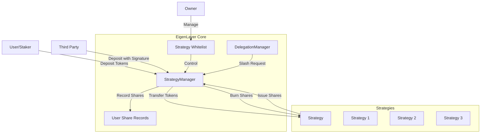

# IStrategyManager

## Contract Overview

IStrategyManager serves as the primary entrypoint for funds into the EigenLayer protocol. This interface defines the core functionality for depositing assets into various strategies within the EigenLayer ecosystem. EigenLayer is a restaking protocol that allows users to "restake" their ETH or other tokens to earn additional yield while still participating in Ethereum's consensus mechanism.

The contract primarily manages the relationship between users (stakers), their delegated operators, and the various strategies that handle different assets. It enables users to deposit tokens into whitelisted strategies, track their shares in each strategy, and provides mechanisms for slashing (penalizing) when necessary.

The interface uses a robust design pattern combining several smaller interfaces (errors, events, share management) to create a comprehensive contract that handles the critical fund management aspects of the EigenLayer protocol.

## Contract Interface

### Public/External Functions

1. **initialize(address initialOwner, address initialStrategyWhitelister, uint256 initialPausedStatus)**
   - Initializes the StrategyManager contract
   - Sets up ownership and whitelister controls
   - Sets initial pause status for emergency controls

2. **depositIntoStrategy(IStrategy strategy, IERC20 token, uint256 amount)**
   - Allows users to deposit tokens into a whitelisted strategy
   - Returns the number of shares issued to the staker

3. **depositIntoStrategyWithSignature(IStrategy strategy, IERC20 token, uint256 amount, address staker, uint256 expiry, bytes memory signature)**
   - Permits depositing on behalf of another user with their signature
   - Enables third-party deposits while maintaining security

4. **burnShares(IStrategy strategy)**
   - Burns strategy shares as part of the slashing mechanism
   - Used for protocol penalties

5. **setStrategyWhitelister(address newStrategyWhitelister)**
   - Owner-only function to update the strategy whitelister address

6. **addStrategiesToDepositWhitelist(IStrategy[] calldata strategiesToWhitelist)**
   - Owner-only function to approve new strategies for deposits

7. **removeStrategiesFromDepositWhitelist(IStrategy[] calldata strategiesToRemoveFromWhitelist)**
   - Owner-only function to remove strategies from the whitelist

8. **View Functions**
   - **strategyIsWhitelistedForDeposit(IStrategy strategy)** - Checks if strategy is approved
   - **getDeposits(address staker)** - Returns staker's strategies and shares
   - **getStakerStrategyList(address staker)** - Lists strategies a staker is using
   - **stakerStrategyListLength(address staker)** - Returns count of strategies used
   - **stakerDepositShares(address user, IStrategy strategy)** - Returns user's shares in a strategy
   - **delegation()** - Returns the central Delegation contract
   - **strategyWhitelister()** - Returns the address allowed to whitelist strategies
   - **getBurnableShares(IStrategy strategy)** - Returns burnable shares for a strategy
   - **getStrategiesWithBurnableShares()** - Returns all strategies with burnable shares
   - **calculateStrategyDepositDigestHash(...)** - Calculates hash for signature-based deposits

### Important Events

1. **Deposit(address staker, IStrategy strategy, uint256 shares)**
   - Emitted when a new deposit occurs for a staker
   - Tracks which strategy was used and how many shares were issued

2. **StrategyWhitelisterChanged(address previousAddress, address newAddress)**
   - Records changes to the strategy whitelister role

3. **StrategyAddedToDepositWhitelist(IStrategy strategy)**
   - Indicates when a new strategy is approved for deposits

4. **StrategyRemovedFromDepositWhitelist(IStrategy strategy)**
   - Shows when a strategy is removed from the whitelist

5. **BurnableSharesIncreased(IStrategy strategy, uint256 shares)**
   - Triggered when an operator is slashed and shares marked for burning

6. **BurnableSharesDecreased(IStrategy strategy, uint256 shares)**
   - Emitted when shares are burned

### Key State Variables
While state variables aren't explicitly defined in this interface, the function signatures imply several important state mappings:

- Mapping of stakers to their strategies
- Mapping of stakers to their share amounts per strategy
- Whitelist of approved strategies
- Registry of burnable shares per strategy
- Delegation manager contract reference

## Logic Flow

### Depositing Funds
1. A user approves the StrategyManager contract to spend their tokens
2. The user calls `depositIntoStrategy` with a whitelisted strategy, token, and amount
3. The contract verifies the strategy is whitelisted
4. Tokens are transferred from the user to the strategy
5. The strategy mints shares that represent the user's deposit
6. These shares are recorded in the StrategyManager and associated with the user
7. The Deposit event is emitted

### Delegated Deposits
1. A staker signs a message authorizing a deposit on their behalf
2. A third party calls `depositIntoStrategyWithSignature` with the staker's address and signature
3. The contract validates the signature against the calculated digest hash
4. If valid, the third party's tokens are transferred to the strategy
5. Shares are credited to the staker's account, not the caller
6. The staker gains shares without directly interacting with the contract

### Slashing Process
1. When a delegated operator violates protocol rules, slashing is initiated
2. The delegation contract marks certain shares as "burnable"
3. `BurnableSharesIncreased` event is emitted
4. Later, `burnShares` can be called to permanently remove these shares
5. When shares are burned, `BurnableSharesDecreased` event is emitted
6. This effectively penalizes the operator and their delegators

### Strategy Management
1. Owner or whitelister can add strategies to the whitelist
2. Whitelisted strategies can be removed when necessary
3. Users can only deposit into whitelisted strategies
4. The contract tracks which strategies each user has deposited into
5. Users can have deposits across multiple strategies simultaneously

## Visual Representation

## Dependencies and Interactions

The StrategyManager interacts with several key contracts in the EigenLayer ecosystem:

1. **IStrategy** - Each strategy represents a specific asset class or yield-generating mechanism. The StrategyManager deposits tokens into strategies and tracks the shares issued.

2. **IShareManager** - The StrategyManager inherits from IShareManager, suggesting it manages share accounting for all strategies and users.

3. **IDelegationManager** - The delegation contract manages the relationship between stakers and operators. The StrategyManager interacts with the delegation contract for slashing operations.

4. **IEigenPodManager** - Though not directly referenced in the interface functions, this is imported, suggesting interaction with Ethereum validators.

5. **ISemVerMixin** - Provides semantic versioning capabilities for contract upgrades and compatibility tracking.

The contract serves as a central hub within EigenLayer, connecting users with strategies while enforcing security rules. It allows for deposits, manages whitelist controls, and facilitates the slashing mechanism that's core to EigenLayer's security model.

This interface represents a carefully designed system for managing restaked assets with provisions for security, delegation, and proper accounting - all critical aspects of a successful restaking protocol.