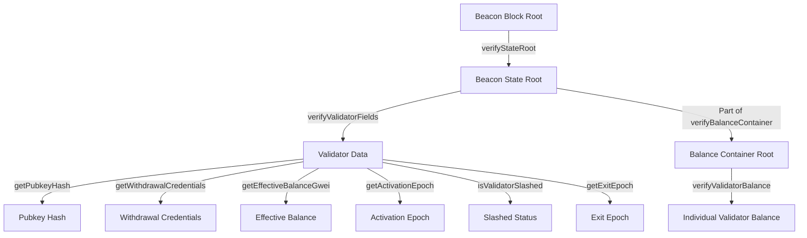

# BeaconChainProofs

## Contract Overview

BeaconChainProofs is a utility library designed to verify and parse data from Ethereum's beacon chain. Its primary purpose is to validate various proofs about validator states and balances within the beacon chain using Merkle proof verification. This library serves as a crucial connection between the Ethereum execution layer (where smart contracts run) and the consensus layer (beacon chain).

The library follows the Simple Serialize (SSZ) specification for Ethereum's consensus layer, particularly focusing on the Phase 0 beacon chain structures like BeaconBlockHeader and BeaconState. It implements complex Merkle proof verification logic to confirm the authenticity of data claimed to exist in the beacon chain without requiring direct access to it.

Key design patterns include:
- Use of Merkle tree verification for cryptographic proofs
- Structured data parsing for beacon chain objects
- Clear separation of proof verification for different beacon chain components
- Utility functions to extract specific validator data from verified proofs

## Contract Interface

### Key State Variables

- **Constants for Tree Heights**: Define the heights of various Merkle trees in the beacon chain (e.g., `BEACON_BLOCK_HEADER_TREE_HEIGHT`, `VALIDATOR_TREE_HEIGHT`)
- **Field Indices**: Constants defining the position of various fields within beacon chain data structures (e.g., `STATE_ROOT_INDEX`, `VALIDATOR_PUBKEY_INDEX`)
- **Timing Constants**: Define beacon chain time parameters (e.g., `SECONDS_PER_SLOT`, `SLOTS_PER_EPOCH`)
- **Special Values**: Constants like `FAR_FUTURE_EPOCH` that have specific meanings in the beacon chain protocol

### Struct Definitions

1. **StateRootProof**: Contains a beacon state root and proof of its inclusion in a beacon block
2. **ValidatorProof**: Contains a validator's fields and proof of their inclusion in a beacon state
3. **BalanceContainerProof**: Contains a balance container root and its proof under a beacon block root
4. **BalanceProof**: Contains validator balance information and proof of its inclusion in the balance container

### Public Functions

1. **verifyStateRoot**: Verifies that a beacon state root exists in a specified beacon block
2. **verifyValidatorFields**: Verifies a validator's data against a beacon state root
3. **verifyBalanceContainer**: Verifies the balance container root against a beacon block root
4. **verifyValidatorBalance**: Verifies a validator's balance against the balance container and returns the balance
5. **Getter functions**: Several utility functions to extract specific validator data:
   - getPubkeyHash
   - getWithdrawalCredentials
   - getEffectiveBalanceGwei
   - getActivationEpoch
   - isValidatorSlashed
   - getExitEpoch

### Custom Errors

- **InvalidProof**: Thrown when a proof verification fails
- **InvalidProofLength**: Thrown when a proof has an incorrect length
- **InvalidValidatorFieldsLength**: Thrown when validator fields don't match the expected count

## Logic Flow

The BeaconChainProofs library provides verification for a hierarchy of Merkle proofs that lead from individual validator data up to beacon block roots. The proof verification follows this logical flow:

### Beacon State Root Verification
1. Takes a beacon block root and a state root with its proof
2. Verifies that the state root is properly included in the block's header using Merkle verification
3. This establishes trust in the beacon state root for further proofs

### Validator Fields Verification
1. Takes a trusted beacon state root and validator data with proof
2. Merkleizes the validator fields to obtain a validator root
3. Calculates the appropriate index in the combined Merkle trees
4. Verifies the validator root is properly included in the beacon state
5. This confirms the validator's data (like withdrawal credentials or effective balance) is legitimate

### Balance Verification (Two-step process)
1. **Balance Container Verification**:
   - Takes a beacon block root and balance container proof
   - Verifies the balance container's inclusion in the beacon state
   - This establishes trust in the balance container root
   
2. **Individual Balance Verification**:
   - Takes a trusted balance container root and a specific validator index
   - Verifies the proof for a specific "balance root" (which contains 4 balances)
   - Extracts the individual validator's balance from the verified balance root
   - Returns the validator's balance in Gwei

The library handles complex bit manipulation and endian conversion to properly extract little-endian encoded values from the beacon chain data structures, ensuring accurate representation of numeric values.

## Visual Representation

## Dependencies and Interactions

The BeaconChainProofs library has two key dependencies:

1. **Merkle.sol**: Provides core Merkle tree verification functionality. The library heavily relies on `Merkle.verifyInclusionSha256()` to perform cryptographic verification of proofs and `Merkle.merkleizeSha256()` to create Merkle roots from validator data.

2. **Endian.sol**: Handles endian conversion, particularly for extracting little-endian encoded uint64 values from the beacon chain data structures. This is crucial for correctly parsing numeric fields like balances and epochs.

This library likely interfaces with other contracts in the broader system that need to verify data from the beacon chain, such as:
- Staking contracts that need to verify validator balances
- Withdrawal contracts that need to verify validator status and credentials
- Oracle or bridge contracts that relay information from the beacon chain to the execution layer

The library serves as a critical security layer, ensuring that any claimed data about the beacon chain can be cryptographically verified before being used in smart contract logic. Its meticulous implementation of Merkle proof verification creates a trust link between the consensus and execution layers of Ethereum.