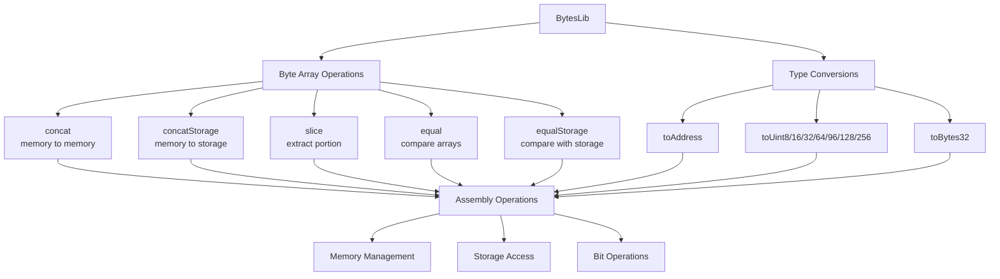

# BytesLib

## 1. Contract Overview

BytesLib is a utility library for Solidity smart contracts that provides advanced manipulation capabilities for byte arrays. Created by Gonçalo Sá, this library is designed to address common operations that aren't natively supported in Solidity but are frequently needed in smart contract development.

The primary purpose of BytesLib is to enable developers to manipulate bytes arrays more efficiently and safely, whether they're stored in memory or storage. The key operations provided include:

- Concatenating (joining) two byte arrays together
- Extracting portions (slicing) from a byte array
- Converting byte arrays to various data types (address, uint8, uint16, etc.)
- Comparing byte arrays for equality

The library primarily uses inline assembly (Yul) to achieve performance optimizations and direct memory manipulation that wouldn't be possible with standard Solidity. This approach makes the code more gas-efficient by avoiding unnecessary memory allocations and copying operations.

The design pattern used here is a pure utility library pattern, where all functions are internal and meant to be used by importing the library into other contracts rather than deploying it as a standalone contract.

## 2. Contract Interface

### Public/External Functions

BytesLib doesn't expose any public or external functions, as it's designed to be used as an imported library rather than directly interacted with. All functions are marked as `internal` and can be accessed by importing the library.

### Key Functions

1. **Byte Array Operations**:
   - `concat(bytes memory _preBytes, bytes memory _postBytes)`: Joins two byte arrays into one
   - `concatStorage(bytes storage _preBytes, bytes memory _postBytes)`: Appends memory bytes to storage bytes
   - `slice(bytes memory _bytes, uint256 _start, uint256 _length)`: Extracts a portion from a byte array
   - `equal(bytes memory _preBytes, bytes memory _postBytes)`: Compares two byte arrays in memory
   - `equalStorage(bytes storage _preBytes, bytes memory _postBytes)`: Compares storage bytes with memory bytes

2. **Type Conversion**:
   - `toAddress(bytes memory _bytes, uint256 _start)`: Converts bytes to an address
   - `toUint8/16/32/64/96/128/256(bytes memory _bytes, uint256 _start)`: Converts bytes to various unsigned integers
   - `toBytes32(bytes memory _bytes, uint256 _start)`: Converts bytes to bytes32

### Error Handling

The library defines two custom errors:
- `Overflow`: Triggered when arithmetic operations might overflow
- `OutOfBounds`: Thrown when attempting to access bytes outside the array boundaries

## 3. Logic Flow

### Concatenation Logic

The `concat` and `concatStorage` functions both join two byte arrays together but with different approaches:

1. **Memory Concatenation** (`concat`):
   - Allocates a new memory area to hold the combined arrays
   - Copies the first array into this new area
   - Appends the second array
   - Updates the free memory pointer
   
2. **Storage Concatenation** (`concatStorage`):
   - This is more complex due to Solidity's storage layout
   - The function handles three different cases based on the current and resulting array lengths:
     - Case 1: Both original and resulting arrays fit in a single storage slot (< 32 bytes)
     - Case 2: Original array fits in a slot but combined array doesn't
     - Default case: Original array already spans multiple slots

### Slicing Logic

The `slice` function extracts a section from a byte array:
1. Validates that the requested segment exists within the source array
2. Allocates a new memory area for the result
3. Copies the specified bytes from the source to the result
4. Special handling for zero-length slices

### Type Conversion Logic

All type conversion functions follow a similar pattern:
1. Check if the byte array has enough bytes to extract the desired type
2. Use assembly to extract the specific bytes and interpret them as the target type
3. Return the converted value

### Equality Comparison

The equality functions compare byte arrays:
1. First check if the lengths match (if not, arrays are not equal)
2. If lengths match, compare the contents word by word
3. Return true only if all words match

## 4. Visual Representation



## 5. Dependencies and Interactions

BytesLib is designed to be a standalone utility library with no external dependencies. It doesn't interact with other contracts directly but serves as a foundation that other contracts can build upon.

Contracts that need to handle raw byte data extensively would benefit from using this library, including:

- Cross-chain bridges that process serialized messages
- Smart contracts dealing with cryptographic operations
- Contracts that need to parse or construct encoded data formats
- Any system working with raw transaction data or RLP encoding

The primary interaction model is through Solidity's library linking system. Other contracts would import BytesLib using:

```solidity
import "./BytesLib.sol";

contract MyContract {
    using BytesLib for bytes;
    
    function myFunction(bytes memory data) public {
        bytes memory slice = data.slice(0, 32);
        address extracted = data.toAddress(32);
        // other operations...
    }
}
```

This linking allows the consuming contract to call BytesLib functions as if they were methods on the bytes arrays themselves.

The extensive use of inline assembly makes BytesLib highly efficient but requires careful usage to avoid unintended consequences. The library includes checks to prevent common issues like out-of-bounds access, but developers using it should understand the underlying memory model to use it effectively.