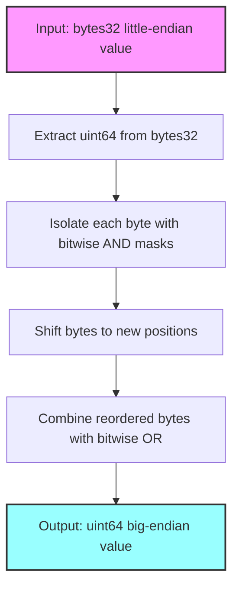

# Endian

## Contract Overview

The Endian library is a specialized utility smart contract for handling endianness conversions in blockchain applications. Endianness refers to the order in which bytes are arranged in computer memory - either with the most significant byte first (big-endian) or the least significant byte first (little-endian). 

This library specifically focuses on converting little-endian formatted integers to big-endian format, which is essential when integrating with systems or data formats that use different endianness conventions. Such conversions are particularly important in cross-platform communication, cryptographic operations, and when handling binary data from external sources.

The library follows a pure functional design pattern, containing only stateless utility functions that perform data transformations without modifying any state. This makes it highly reusable and gas-efficient, as it can be deployed once and used by multiple contracts.

## Contract Interface

### Functions

**`fromLittleEndianUint64(bytes32 lenum)`**
- **Purpose**: Converts a 64-bit unsigned integer from little-endian format to big-endian format
- **Input**: A bytes32 value containing the little-endian formatted number
- **Output**: A uint64 value in big-endian format
- **Visibility**: internal pure (can only be called from within the contract or from contracts that use this library)

### State Variables
The library does not contain any state variables, making it completely stateless and gas-efficient for endianness conversion operations.

## Logic Flow

The `fromLittleEndianUint64` function performs the conversion through several bitwise operations:

1. **Initial Extraction**: The function first extracts the relevant 64 bits from the 256-bit input by right-shifting the input by 192 bits (`lenum >> 192`) and casting the result to a uint64.

2. **Byte Swapping**: It then systematically swaps the positions of all 8 bytes of the uint64 value:
   - The most significant byte (bits 56-63) is moved to the least significant position
   - The second most significant byte (bits 48-55) is moved to the second least significant position
   - And so on, until all 8 bytes have been reordered

3. **Bit Manipulation**: This is accomplished through a series of bitwise AND (`&`) operations to isolate each byte, combined with shifts (`>>` and `<<`) to move each byte to its new position, and finally bitwise OR (`|`) operations to combine all the reordered bytes.

This process effectively reverses the byte order, converting from little-endian to big-endian format.

## Visual Representation

## Dependencies and Interactions

The Endian library is a standalone utility that doesn't depend on other smart contracts. It serves as a dependency for other contracts in the system that need to handle endianness conversions, particularly when:

1. **Interoperating with External Systems**: When the blockchain application needs to communicate with external systems that use a different endianness convention.

2. **Processing Raw Binary Data**: When handling binary data from external sources, especially in scenarios involving cryptographic operations, hashing functions, or low-level data manipulation.

3. **Cross-Chain Communication**: When data needs to be formatted consistently across different blockchain platforms that might utilize different endianness standards.

The library's focused functionality makes it a useful building block in more complex systems where data format conversions are necessary. By centralizing this utility function in a library, the system ensures consistent endianness handling throughout the application while minimizing code duplication and potential conversion errors.