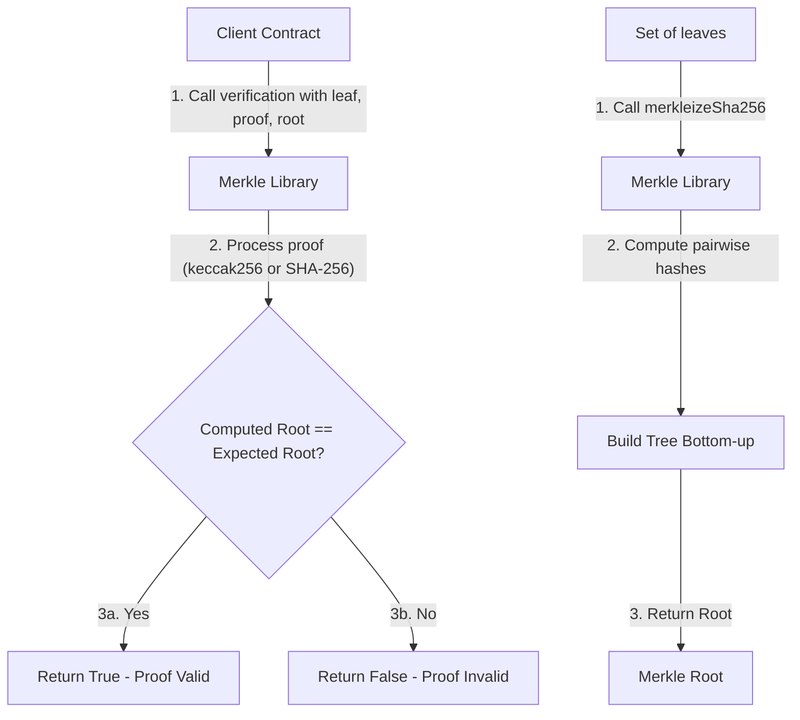
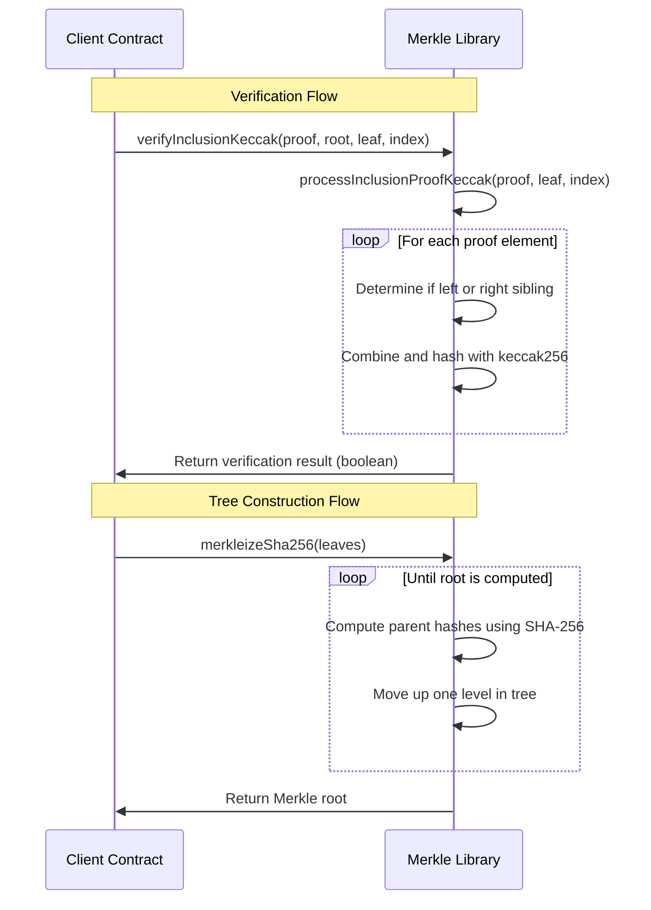

# Merkle

## Contract Overview

The Merkle library provides utility functions for working with Merkle trees in blockchain applications. Merkle trees are a fundamental data structure in blockchain technology that allow for efficient and secure verification of data integrity. This library, adapted from OpenZeppelin's MerkleProof contract, offers functionality for both verifying Merkle proofs and constructing Merkle trees.

The primary purpose of this library is to:
1. Verify that a piece of data (a leaf) is part of a dataset without requiring the entire dataset
2. Support both keccak256 (Ethereum's default hash function) and SHA-256 hash algorithms
3. Enable the construction of Merkle trees from a set of leaves

This library fits into blockchain systems that need to efficiently verify data without storing or transmitting complete datasets. Common use cases include:
- Whitelists for token sales or NFT minting
- Airdrops to specific addresses
- State verification in Layer 2 scaling solutions
- Efficient data verification across blockchain networks

The contract follows the library design pattern, which means it contains reusable code that can be imported and used by other contracts without deploying the Merkle contract itself to the blockchain.

## Contract Interface

### Public/External Functions

The library provides several key functions:

1. **verifyInclusionKeccak(bytes memory proof, bytes32 root, bytes32 leaf, uint256 index) → bool**
   - Verifies that a leaf is included in a Merkle tree with the given root using keccak256 hashing
   - Returns true if the proof is valid, false otherwise

2. **processInclusionProofKeccak(bytes memory proof, bytes32 leaf, uint256 index) → bytes32**
   - Computes the Merkle root from a leaf and proof using keccak256 hashing
   - Returns the computed root which can be compared to the expected root

3. **verifyInclusionSha256(bytes memory proof, bytes32 root, bytes32 leaf, uint256 index) → bool**
   - Verifies that a leaf is included in a Merkle tree with the given root using SHA-256 hashing
   - Returns true if the proof is valid, false otherwise

4. **processInclusionProofSha256(bytes memory proof, bytes32 leaf, uint256 index) → bytes32**
   - Computes the Merkle root from a leaf and proof using SHA-256 hashing
   - Returns the computed root which can be compared to the expected root

5. **merkleizeSha256(bytes32[] memory leaves) → bytes32**
   - Constructs a Merkle tree from a set of leaves using SHA-256 hashing
   - Returns the Merkle root of the tree

### Key Errors

- **InvalidProofLength()** - Custom error thrown when a provided Merkle proof has an invalid length

### Notable State Variables

As a library, Merkle does not maintain state variables itself but operates on the data provided in function parameters.

## Logic Flow

### Merkle Proof Verification

The Merkle proof verification process follows these steps:

1. Start with a leaf node and its index in the tree
2. For each node in the proof:
   - Determine if the current computed hash is a left or right sibling based on the current bit of the index
   - If the current bit is 0, the computed hash is a left sibling
   - If the current bit is 1, the computed hash is a right sibling
   - Combine the computed hash with the current proof element in the correct order
   - Hash the combined data using either keccak256 or SHA-256
   - Update the index by dividing it by 2 (moving up one level in the tree)
3. The final computed hash should match the Merkle root if the proof is valid

Both keccak256 and SHA-256 implementations follow the same logical steps, but they differ in how the hash function is called. The keccak256 implementation uses Solidity's built-in hash function, while the SHA-256 implementation uses an assembly call to the SHA-256 precompiled contract (precompile address 2).

### Merkle Tree Construction

The `merkleizeSha256` function constructs a Merkle tree from a set of leaves using these steps:

1. Start with an array of leaf nodes
2. Compute the parent nodes by hashing adjacent pairs of nodes
3. Create a new layer with the parent nodes
4. Repeat until only one node remains (the root)
5. Return the root node

An important precondition for this function is that the number of leaves must be a power of two. If this condition is not met, the function will still execute but may produce an incorrect Merkle root.

## Visual Representation

## Dependencies and Interactions

The Merkle library has minimal external dependencies:

1. **Solidity Compiler (^0.8.0)**: The library requires Solidity version 0.8.0 or higher due to its use of custom errors and other language features.

2. **SHA-256 Precompiled Contract**: The SHA-256 functions rely on the Ethereum precompiled contract at address 2, which provides an efficient implementation of the SHA-256 hash function.

The library is designed to be used by other contracts in a system. Typical integrations might include:

- **Token Distribution Contracts**: To verify claims against a whitelist
- **Bridge Contracts**: To verify state transitions between chains
- **Governance Contracts**: To efficiently verify voting rights
- **Layer 2 Solutions**: For compact state verification

The library's functions are marked as `internal`, meaning they can only be called from contracts that include this library. This is a common pattern for utility libraries in Solidity, as it allows the compiler to inline the code for efficiency rather than making external calls.

It's worth noting that the library includes a specific warning about avoiding 64-byte leaf values prior to hashing with keccak256, as this could lead to potential vulnerabilities where the concatenation of sorted internal nodes could be reinterpreted as a leaf value. The library recommends using OpenZeppelin's JavaScript library for generating Merkle trees that are safe against this attack.