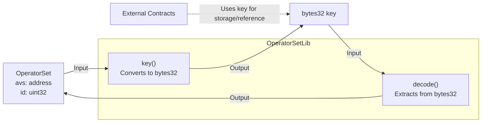

# OperatorSetLib

## Contract Overview

OperatorSetLib is a utility library designed to manage the identification and encoding of operator sets in a blockchain system. An operator set represents a group of operators associated with an Active Validator Set (AVS) service, identified by a unique combination of the AVS address and a numeric identifier.

The primary purpose of this contract is to provide standardized methods for:
1. Converting an operator set structure into a unique key for storage and reference
2. Decoding such keys back into their constituent parts

This library appears to be part of a broader validator management system, likely supporting a Proof-of-Stake blockchain network or a similar consensus mechanism where validators (operators) are organized into sets for particular services.

The design follows the library pattern in Solidity, which allows for reusable code that can be attached to specific data types. In this case, the library functions are attached to the OperatorSet struct globally, meaning any contract in the system can use these utility functions.

## Contract Interface

### Structs

```solidity
struct OperatorSet {
    address avs;    // The address of the AVS this operator set belongs to
    uint32 id;      // The unique identifier for the operator set
}
```

### Public Functions

- **key(OperatorSet memory os) → bytes32**
  - Converts an OperatorSet structure into a unique 32-byte identifier
  - This key can be used as a mapping key for storage or for cross-contract communication
  - Pure function that doesn't modify state

- **decode(bytes32 _key) → OperatorSet memory**
  - Extracts the original AVS address and ID from an encoded key
  - Returns the reconstructed OperatorSet structure
  - Pure function that doesn't modify state

### State Variables

This contract is a library and does not maintain any state variables itself. It operates purely on the data provided to it.

## Logic Flow

### Key Generation Process
1. The `key()` function takes an OperatorSet structure as input
2. It uses `abi.encodePacked()` to tightly pack the AVS address and ID together
3. The packed data is cast to bytes32, creating a standardized format for the key
4. This key uniquely represents the specific operator set in the system

### Decoding Process
1. The `decode()` function takes a bytes32 key as input
2. It extracts the AVS address by:
   - Interpreting the key as a uint256
   - Shifting right by 96 bits to isolate the address portion
   - Converting to an address (uint160)
3. It extracts the ID by:
   - Applying a bitwise AND with the maximum uint96 value to isolate the ID portion
   - Converting to uint32
4. It constructs and returns a new OperatorSet structure with these extracted values

This approach efficiently packs two pieces of information (address and ID) into a single storage slot, optimizing for gas efficiency.

## Visual Representation



## Dependencies and Interactions

The library is designed to be used by other contracts in the system through the global directive:

```solidity
using OperatorSetLib for OperatorSet global;
```

This means any contract in the system can call these utility functions directly on OperatorSet instances.

While this library itself has minimal dependencies (only using basic Solidity functionality), it likely serves as a foundation for other contracts in the system that:

1. Manage validator registrations
2. Handle staking and delegation
3. Coordinate operator responsibilities
4. Track performance and rewards

The compact key representation is particularly useful for:
- Gas-efficient storage in mappings
- Cross-contract communication where a compact identifier is beneficial
- Event emissions where a single parameter can represent the full operator set identity

The choice to separate this functionality into a library demonstrates good software engineering practices, keeping the code modular and promoting reuse across the broader system.