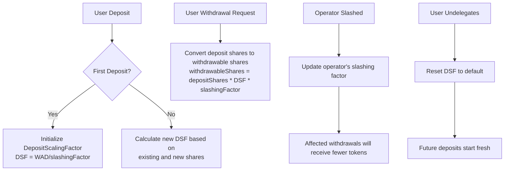

# SlashingLib

## 1. Contract Overview

SlashingLib is a utility library designed to handle the conversion and scaling of shares in a staking system that supports slashing penalties. This library is a critical component of a delegated staking protocol where:

1. Stakers can deposit tokens into strategies
2. Operators can have delegated stakes from multiple stakers
3. The protocol needs to enforce slashing penalties for misbehaving operators

The primary purpose of this library is to maintain proper accounting of shares when slashing occurs, ensuring that penalties are applied fairly and accurately across all affected stakeholders.

The library uses a "deposit scaling factor" mechanism to differentiate between deposit shares (what users actually deposit) and withdrawable shares (what users can actually withdraw after accounting for slashing). This design pattern allows the protocol to maintain proper accounting of shares even when operators suffer slashing penalties, without having to modify everyone's deposit records.

Key design patterns employed include:
- Fixed-point arithmetic (WAD) for precise calculations
- Storage structures that track scaling factors instead of repeatedly calculating values
- Pure mathematical functions that handle the complex scaling logic

## 2. Contract Interface

### State Variables
- `WAD` (constant): Represents the scaling base of 10^18, used for fixed-point arithmetic to maintain precision.

### Structs
- `DepositScalingFactor`: Contains a single field `_scalingFactor` that tracks the conversion rate between deposit shares and withdrawable shares.

### Key Functions

#### Getters
- `scalingFactor(DepositScalingFactor)`: Returns the current scaling factor, defaulting to WAD (1e18) if not set.
- `scaleForQueueWithdrawal(DepositScalingFactor, uint256)`: Scales deposit shares for the withdrawal queue.
- `scaleForCompleteWithdrawal(uint256, uint256)`: Scales shares for completing a withdrawal, applying the slashing factor.
- `scaleForBurning(uint256, uint64, uint64)`: Calculates shares to burn based on magnitude changes.

#### State-Changing Functions
- `update(DepositScalingFactor, uint256, uint256, uint256)`: Updates the deposit scaling factor when adding shares.
- `reset(DepositScalingFactor)`: Resets the scaling factor to the default value.

#### Conversion Functions
- `calcWithdrawable(DepositScalingFactor, uint256, uint256)`: Calculates withdrawable shares from deposit shares.
- `calcDepositShares(DepositScalingFactor, uint256, uint256)`: Calculates deposit shares from withdrawable shares.
- `calcSlashedAmount(uint256, uint256, uint256)`: Calculates the amount of shares to slash.

#### WAD Math Utilities
- `mulWad(uint256, uint256)`: Multiplies two numbers and divides by WAD.
- `divWad(uint256, uint256)`: Divides a number by another and multiplies by WAD.
- `mulWadRoundUp(uint256, uint256)`: Like mulWad but rounds up to prevent zero-slashing.

## 3. Logic Flow

### Share Conversion Flow

1. **Initial Deposit**
   - When a staker first deposits or delegates to an operator, the deposit scaling factor is initialized based on the current slashing factor.
   - This scaling factor will be used for all conversions between deposit shares and withdrawable shares.

2. **Subsequent Deposits**
   - For additional deposits, the deposit scaling factor is recalculated to account for both existing shares and the new shares.
   - The calculation ensures that the staker's share of any past slashing penalties is maintained proportionally.

3. **Withdrawal Process**
   - When a user wants to withdraw:
     - First, deposit shares are converted to withdrawable shares using the deposit scaling factor
     - Then, withdrawable shares are converted back to underlying tokens (this happens outside this library)

4. **Slashing Event**
   - When an operator is slashed:
     - The protocol updates the slashing factor for that operator
     - All stakers delegated to that operator will have their withdrawable shares reduced when they try to withdraw
     - The deposit scaling factor ensures that slashing is applied proportionally

### Key Algorithms

The core mathematical relationship maintained by this library is:
```
withdrawableShares = depositShares * depositScalingFactor * slashingFactor
```

This formula is crucial for allowing the system to:
1. Track what a user originally deposited
2. Apply cumulative slashing penalties
3. Calculate the correct amount that can be withdrawn

The `update` function uses a complex calculation to ensure that when users add more shares to an existing deposit, the deposit scaling factor is adjusted correctly to maintain the proper proportion of withdrawable shares.

## 4. Visual Representation



## 5. Dependencies and Interactions

The library imports and depends on:
- `@openzeppelin/contracts/utils/math/Math.sol` - For precise mathematical operations
- `@openzeppelin-upgrades/contracts/utils/math/SafeCastUpgradeable.sol` - For safe type conversions

This library is designed to be used by multiple other contracts in the system, specifically:
1. **Strategy Manager** - For tracking deposit shares in different strategies
2. **EigenPodManager** - For handling delegation of staked ETH
3. **Withdrawal Queue** - For processing withdrawal requests with appropriate slashing applied

While the library itself doesn't directly interact with these contracts, it provides the mathematical foundation for maintaining the relationship between deposit shares and withdrawable shares throughout the system, especially when slashing penalties are applied.

The library handles the complex mathematical calculations related to slashing, so that other contracts in the system can focus on their specific responsibilities, making the overall architecture more modular and easier to maintain.