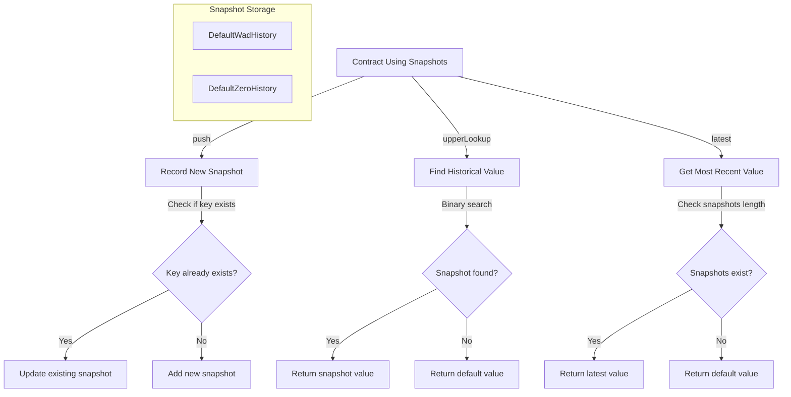

# Snapshots

## Contract Overview

The `Snapshots.sol` contract is a specialized library designed to record and retrieve historical values at different points in time. It serves as a mechanism for creating checkpoints of data values, allowing contracts to track how values change over time and query past values based on block numbers.

### Purpose and Main Functionality
This library is primarily used for maintaining historical records of values that change throughout the lifecycle of a contract. It enables:
- Recording new values at specific points in time (blocks)
- Looking up historical values based on a specific point in time
- Retrieving the most recent recorded value

### Architectural Role
Based on the context provided, this library appears to be a core component in a governance or staking system. It's particularly used for:
1. Tracking allocation values in an `AllocationManager` contract
2. Managing delegation shares in a `DelegationManager` contract

The library supports two default value behaviors through separate data structures:
1. `DefaultWadHistory`: Uses WAD (10^18) as the default value when no snapshots exist
2. `DefaultZeroHistory`: Uses 0 as the default value when no snapshots exist

### Key Design Patterns
1. **Library Pattern**: Implemented as a reusable library that can be imported by other contracts
2. **Snapshot Pattern**: Records historical values with associated keys (typically block numbers)
3. **Binary Search Algorithm**: Uses binary search for efficient lookups in the historical data
4. **Type Safety**: Provides separate structs for different default value behaviors
5. **Gas Optimization**: Uses assembly for direct storage access in critical functions

## Contract Interface

### Key State Variables

The library defines structured types to store historical data:

1. **DefaultWadHistory and DefaultZeroHistory**:
   ```solidity
   struct DefaultWadHistory {
       Snapshot[] _snapshots;
   }
   
   struct DefaultZeroHistory {
       Snapshot[] _snapshots;
   }
   ```
   These are the main data structures that store an array of snapshots with different default values.

2. **Snapshot**:
   ```solidity
   struct Snapshot {
       uint32 _key;
       uint224 _value;
   }
   ```
   Each snapshot contains a key (typically a block number) and a value representing the state at that point in time.

### Public/External Functions

1. **`push`**:
   - Records a new snapshot with the provided key and value
   - Overloaded to work with both `DefaultWadHistory` and `DefaultZeroHistory`
   - If a snapshot with the same key already exists, it updates the value instead

2. **`upperLookup`**:
   - Retrieves the value from the most recent snapshot with a key less than or equal to the provided key
   - Returns the appropriate default value (WAD or 0) if no such snapshot exists

3. **`latest`**:
   - Returns the value from the most recent snapshot
   - Returns the appropriate default value (WAD or 0) if no snapshots exist

4. **`length`**:
   - Returns the number of snapshots in the history

### Important Events
The library does not emit any events directly, which is typical for library contracts in Solidity.

## Logic Flow

### Recording a New Snapshot

1. When `push` is called with a key and value:
   - The library first checks if the snapshots array already contains entries
   - If entries exist, it verifies that the new key is greater than or equal to the last recorded key
   - If the key matches the most recent snapshot, it updates the value of that snapshot
   - Otherwise, it adds a new snapshot to the array with the provided key and value

### Looking Up Historical Values

1. When `upperLookup` is called with a key:
   - The library performs a binary search to find the snapshot with the highest key that is less than or equal to the provided key
   - If no such snapshot exists, it returns the default value (WAD or 0, depending on the history type)
   - Otherwise, it returns the value from the found snapshot

### Retrieving the Latest Value

1. When `latest` is called:
   - The library checks if any snapshots exist
   - If none exist, it returns the default value (WAD or 0, depending on the history type)
   - Otherwise, it returns the value from the most recent snapshot

### Security Mechanisms

1. **Input Validation**:
   - The library ensures that keys are added in a non-decreasing order to maintain the integrity of the binary search
   - It uses a custom error `InvalidSnapshotOrdering` to revert if this condition is violated

2. **Type Safety**:
   - The library uses separate structs to distinguish between different default behaviors
   - It handles type conversion explicitly, though it notes that responsibility for safe conversions falls outside the library

3. **Gas Optimization**:
   - Uses assembly for direct storage access to reduce gas costs
   - Implements binary search for efficient lookups in potentially large snapshot arrays

## Visual Representation



## Dependencies and Interactions

### External Dependencies

1. **OpenZeppelin's MathUpgradeable**:
   - Imported from `@openzeppelin-upgrades/contracts/utils/math/MathUpgradeable.sol`
   - Used for safe mathematical operations, specifically the `average` function in binary search

2. **SlashingLib**:
   - Imported from `./SlashingLib.sol`
   - Though imported, it doesn't appear to be directly used within this file, suggesting this library is part of a broader slashing mechanism

### Contract Interactions

Based on the provided comments and function names, this library interacts with:

1. **AllocationManager**:
   - Uses `DefaultWadHistory` for tracking maximum magnitudes
   - Default value is WAD (10^18)

2. **DelegationManager**:
   - Uses `DefaultZeroHistory` for tracking cumulative scaled shares
   - Default value is 0

The library is designed as a flexible component that can be used by any contract needing to track historical values, particularly in staking, delegation, or governance systems where historical state is important for calculations like rewards, voting power, or slashing penalties.

Overall, the `Snapshots` library provides an efficient and flexible mechanism for recording and retrieving historical data, which is crucial for many complex DeFi and governance protocols that need to reference past states for current calculations.