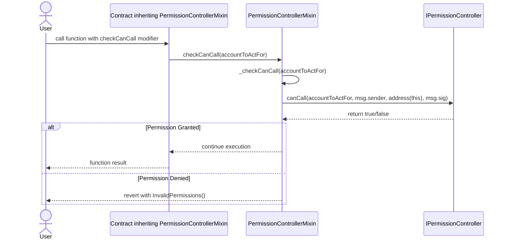

# PermissionControllerMixin

## Contract Overview

The `PermissionControllerMixin` is an abstract contract that provides permission management functionality to contracts that inherit from it. Its primary purpose is to provide a standardized way to verify whether a caller has the necessary permissions to execute functions on behalf of another account. 

This contract serves as a reusable component in a permission management architecture, allowing inheriting contracts to delegate permission checks to a central permission controller. It implements a pattern similar to the proxy authorization pattern, where one address can be authorized to act on behalf of another.

The contract follows the "mixin" design pattern, which provides modular functionality that can be easily incorporated into other contracts through inheritance. This approach promotes code reusability and separation of concerns across the system.

## Contract Interface

### State Variables
- **permissionController**: An immutable public variable that references the `IPermissionController` interface implementation. This central contract handles all permission validations.

### Functions
- **_checkCanCall(address account)**: An internal function that determines whether the current message sender (`msg.sender`) is authorized to call a function on behalf of the specified account. Returns a boolean result rather than reverting on failure.

### Modifiers
- **checkCanCall(address account)**: A modifier that uses `_checkCanCall` to verify permissions and reverts with `InvalidPermissions()` error if the check fails.

### Events
- The contract does not emit any events itself, though the referenced permission controller might.

### Errors
- **InvalidPermissions()**: Custom error thrown when the caller does not have the required permissions to act on behalf of an account.

## Logic Flow

The permission validation flow works as follows:

1. A contract that inherits from `PermissionControllerMixin` applies the `checkCanCall` modifier to functions that require permission checks.
2. When such a function is called, the modifier executes before the function body.
3. The modifier calls the `_checkCanCall` internal function, passing the account address for which the caller claims to act.
4. `_checkCanCall` forwards this request to the external permission controller by calling `canCall` on the `permissionController` interface.
5. It passes four parameters to the permission controller:
   - The account being acted on behalf of
   - The actual caller (`msg.sender`)
   - The address of the current contract (`address(this)`)
   - The function signature (`msg.sig`)
6. The permission controller evaluates these parameters according to its rules and returns a boolean result.
7. If the result is `true`, the function execution continues; if `false`, the transaction reverts with the `InvalidPermissions()` error.

This design allows for flexible and centralized permission management since the actual rules for determining permissions are implemented in the separate permission controller contract.

## Visual Representation

## Dependencies and Interactions

The contract has one critical external dependency:

- **IPermissionController**: An interface that defines the contract responsible for determining permissions. The actual implementation of this interface is passed to the constructor during initialization, establishing a permanent connection to the permission management system.

The interaction between `PermissionControllerMixin` and the permission controller is one-way: the mixin queries the controller, but the controller does not call back to the mixin. This creates a clean separation where permission logic can evolve independently from the contracts that use it.

The contract is designed to be inherited by other contracts that need permission management functionality. By inheriting this mixin, contracts gain access to standardized permission checks without having to implement the logic themselves. This approach ensures consistent permission handling across the system while maintaining modularity.

The actual permission rules and logic are implemented in the permission controller contract, which is not shown in this code. This separation allows the permission system to be updated or replaced without changing the contracts that rely on it, as long as the interface remains consistent.