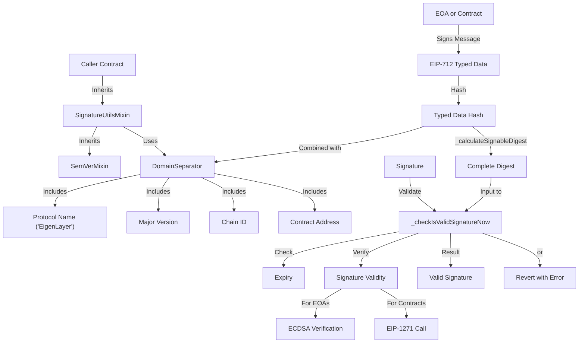

# SignatureUtilsMixin

## Contract Overview

The `SignatureUtilsMixin` contract is a foundational utility component designed to standardize and simplify signature validation across the EigenLayer protocol. It implements the EIP-712 and EIP-1271 signature standards, providing a secure and consistent way to validate signatures from both Externally Owned Accounts (EOAs) and smart contracts.

This contract serves as a mixin, meaning it's meant to be inherited by other contracts within the EigenLayer ecosystem that require signature validation capabilities. By centralizing signature validation logic, it ensures consistent security practices and reduces code duplication across the protocol.

The contract leverages the semantic versioning pattern through its integration with `SemVerMixin`, enabling version-aware signature validation that maintains compatibility across minor updates while providing clear boundaries for breaking changes.

## Contract Interface

### Public/External Functions

- **`domainSeparator()`** - Returns the EIP-712 domain separator used for creating typed data signatures. The domain separator includes the protocol name ("EigenLayer"), the major version, chain ID, and contract address to create a unique identifier for signatures in this domain.

### Key State Variables

While the contract doesn't explicitly declare state variables, it inherits version information from `SemVerMixin` that influences the domain separator calculation.

### Internal Helper Functions

- **`_calculateSignableDigest(bytes32 hash)`** - Creates a complete EIP-712 compliant digest by combining the domain separator with a structured data hash.
- **`_checkIsValidSignatureNow(address signer, bytes32 signableDigest, bytes memory signature, uint256 expiry)`** - Validates a signature against a specific signer, checking both validity and expiration.

### Error Conditions

- **`SignatureExpired()`** - Thrown when attempting to verify a signature that has passed its expiration timestamp.
- **`InvalidSignature()`** - Thrown when a signature doesn't match the expected signer or fails validation.

## Logic Flow

The signature validation process in this contract follows a well-defined flow:

1. **Domain Separator Creation**: The contract establishes a unique domain identifier using the protocol name, major version, chain ID, and contract address as specified in EIP-712.

2. **Digest Creation**: When preparing a message for signature verification, the contract creates a signable digest by combining:
   - The EIP-712 prefix (`\x19\x01`)
   - The domain separator
   - The hash of the typed data being signed

3. **Signature Validation**: When validating a signature, the contract:
   - First checks if the signature has expired by comparing the provided expiry timestamp with the current block time
   - Then validates the signature using OpenZeppelin's `isValidSignatureNow` function which:
     - For EOAs, performs standard ECDSA signature recovery and verification
     - For smart contract signers, calls the EIP-1271 `isValidSignature` method on the signing contract

4. **Version Handling**: The contract uses only the major version component (e.g., "v1" from "v1.2.3") for the domain separator, ensuring signature compatibility across minor and patch updates.

## Visual Representation

## Dependencies and Interactions

The `SignatureUtilsMixin` relies on several key dependencies:

1. **OpenZeppelin Libraries**:
   - `ShortStringsUpgradeable` - Provides utilities for working with compact string representations
   - `SignatureCheckerUpgradeable` - Implements signature verification logic for both EOAs and contracts (EIP-1271)

2. **Interface Implementation**:
   - `ISignatureUtilsMixin` - The interface that defines the contract's public functionality

3. **Inherited Contracts**:
   - `SemVerMixin` - Provides semantic versioning capabilities, allowing the contract to maintain version awareness

This contract serves as a building block for other EigenLayer contracts that need signature validation. As a mixin, it's designed to be inherited rather than interacted with directly. Contracts inheriting from `SignatureUtilsMixin` gain access to robust signature validation tools while maintaining consistent security practices across the protocol.

The primary design choice of using the major version component for the domain separator is particularly noteworthy, as it allows the protocol to make non-breaking changes (minor and patch updates) without invalidating existing signatures, while still providing a clean break for major version changes that might alter the signature scheme.