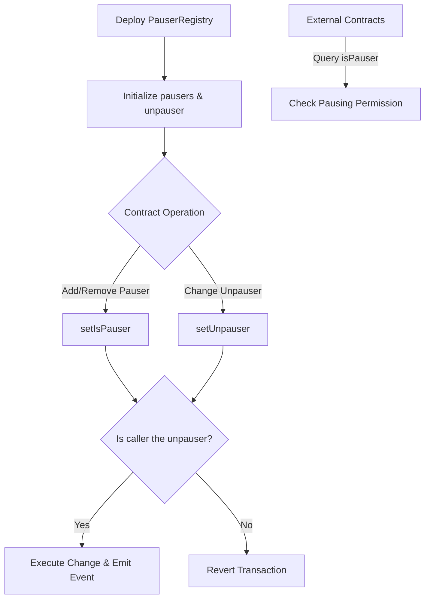

# PauserRegistry

## Contract Overview

PauserRegistry is a smart contract designed to manage permission controls for pausing functionality within the EigenLayer protocol. The contract establishes a security hierarchy with two distinct roles: pausers and a single unpauser. This architecture implements a governance pattern that enables emergency response capabilities while maintaining administrative security.

The contract serves as a central registry for pausing permissions, which other contracts in the EigenLayer ecosystem can query to determine if an address has the authority to pause critical protocol operations. This pattern decouples the permission logic from the functional contracts, creating a more modular and maintainable system architecture.

Key design patterns employed include:
- Role-based access control (RBAC) for managing permissions
- Single responsibility principle by focusing solely on pause/unpause permissions
- Event-driven design for transparency and off-chain monitoring
- Hierarchical permission structure with the unpauser at the highest level

## Contract Interface

### State Variables
- `isPauser`: A mapping that tracks which addresses have permission to pause functionality in dependent contracts
- `unpauser`: A single address with the highest privileges, capable of managing both pausers and appointing a new unpauser

### Modifiers
- `onlyUnpauser`: Restricts function access to only the designated unpauser address

### Public/External Functions
- `setIsPauser(address newPauser, bool canPause)`: Enables the unpauser to grant or revoke pauser privileges for a specific address
- `setUnpauser(address newUnpauser)`: Allows the current unpauser to transfer their role to a new address

### Events
- `PauserStatusChanged(address pauser, bool canPause)`: Emitted when an address is granted or revoked pauser privileges
- `UnpauserChanged(address previousUnpauser, address newUnpauser)`: Emitted when the unpauser role is transferred

### Constructor
Initializes the contract by setting up the initial set of pausers and the unpauser address.

## Logic Flow

The PauserRegistry follows a straightforward but effective permission management flow:

1. **Initialization**: During contract deployment, the constructor accepts arrays of pauser addresses and a single unpauser address, establishing the initial permission structure.

2. **Permission Checks**: External contracts query the `isPauser` mapping to verify if an address has pausing privileges.

3. **Pauser Management**:
   - Only the unpauser can add or remove addresses from the pauser role
   - Changes to pauser status are recorded through events for transparency
   - Pauser addresses cannot be set to the zero address (0x0)

4. **Unpauser Transfer**:
   - The unpauser can transfer their role to a new address
   - This provides flexibility to update governance as needed
   - The unpauser address cannot be set to the zero address (0x0)
   - Each change emits an event recording the previous and new unpauser

The security hierarchy is intentionally designed with the unpauser at the top. The documentation suggests the unpauser should be a high-security entity, potentially a multisig wallet with a higher threshold of required signatures. This approach balances the need for emergency action capability (through pausers) with strong governance controls (through the more secure unpauser role).

## Visual Representation

## Dependencies and Interactions

PauserRegistry implements the `IPauserRegistry` interface, which defines the contract's essential functions and events. This interface likely serves as a connection point for other contracts in the EigenLayer ecosystem that need to verify pausing permissions.

While the contract itself doesn't directly interact with other contracts, it's designed to be queried by them. Any contract that needs pausing functionality would:

1. Reference the PauserRegistry address
2. Call `isPauser(address)` to check if a specific address has pausing privileges
3. Implement pausing logic based on the result

This pattern allows for centralized permission management while enabling decentralized implementation across the protocol. If the protocol needs to update who can pause operations, they only need to update the PauserRegistry rather than each individual contract.

The design also suggests that the unpauser role is intended for a highly secure multisig wallet, providing an additional layer of security for this critical administrative function. This reflects a thoughtful approach to balancing operational flexibility with robust security measures.