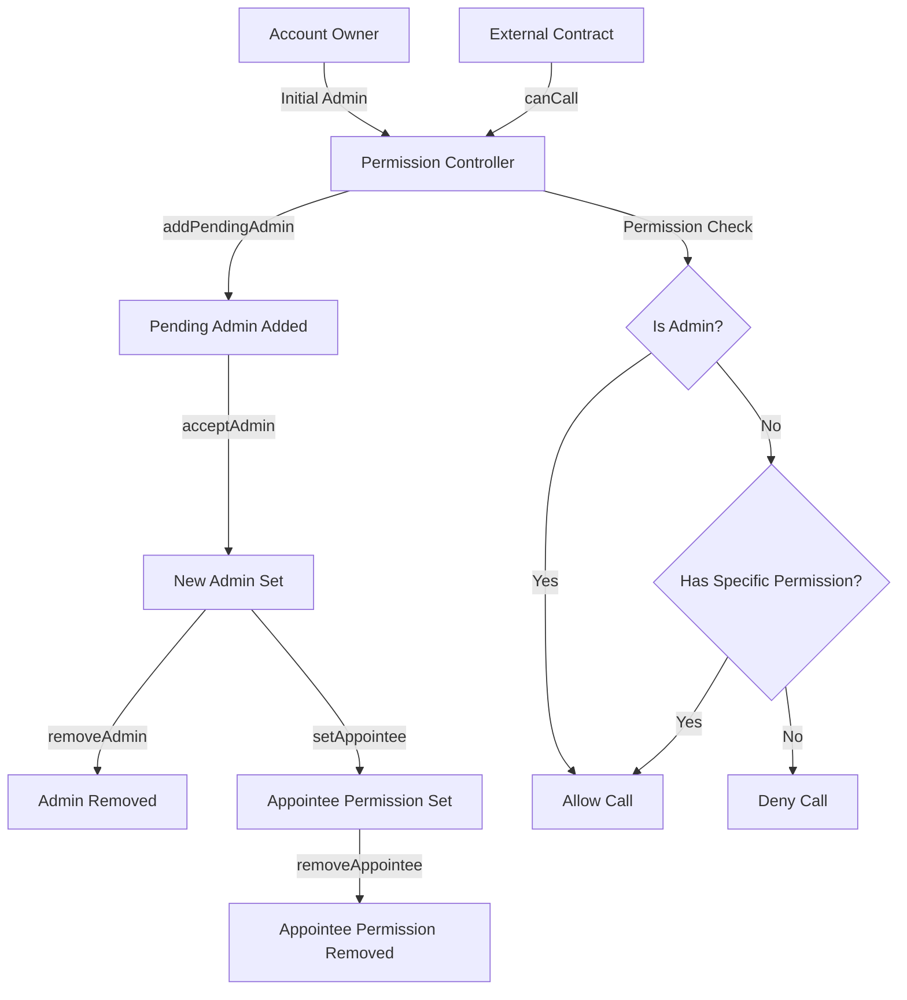

# PermissionController

## Contract Overview

The `PermissionController` is a smart contract designed to manage permissions and access control within a Web3 system. Its primary purpose is to provide a flexible and secure way to delegate administrative rights and specific function permissions to different Ethereum addresses.

This contract implements a sophisticated permission management system with two key concepts:
1. **Admins**: Addresses with full administrative rights over an account
2. **Appointees**: Addresses granted permission to call specific functions on specific target contracts on behalf of an account

The contract utilizes the proxy pattern (as seen from the Initializable import) for upgradability, allowing the contract logic to be updated while preserving state. It also implements version control through the SemVerMixin, making it easier to track contract iterations.

The PermissionController sits at the core of the platform's access control architecture, providing the infrastructure needed for secure multi-user account management and function-specific permission delegation.

## Contract Interface

### Public/External Functions

#### Admin Management
- **addPendingAdmin(address account, address admin)**: Allows an existing admin to nominate a new admin (requires approval)
- **removePendingAdmin(address account, address admin)**: Removes a pending admin nomination
- **acceptAdmin(address account)**: Called by a pending admin to accept the admin role
- **removeAdmin(address account, address admin)**: Removes an existing admin (requires at least one admin to remain)

#### Appointee Management
- **setAppointee(address account, address appointee, address target, bytes4 selector)**: Grants an appointee permission to call a specific function on a target contract
- **removeAppointee(address account, address appointee, address target, bytes4 selector)**: Removes a previously granted permission

#### View Functions
- **isAdmin(address account, address caller)**: Checks if a caller is an admin for an account
- **isPendingAdmin(address account, address pendingAdmin)**: Checks if an address is a pending admin
- **getAdmins(address account)**: Returns all admins for an account
- **getPendingAdmins(address account)**: Returns all pending admins for an account
- **canCall(address account, address caller, address target, bytes4 selector)**: Checks if a caller can execute a specific function
- **getAppointeePermissions(address account, address appointee)**: Lists all permissions granted to an appointee
- **getAppointees(address account, address target, bytes4 selector)**: Lists all appointees for a specific function

### Important Events

- **PendingAdminAdded(address account, address admin)**: Emitted when a new admin is nominated
- **PendingAdminRemoved(address account, address admin)**: Emitted when a pending admin nomination is removed
- **AdminSet(address account, address admin)**: Emitted when a pending admin accepts the role
- **AdminRemoved(address account, address admin)**: Emitted when an admin is removed
- **AppointeeSet(address account, address appointee, address target, bytes4 selector)**: Emitted when a new appointee permission is granted
- **AppointeeRemoved(address account, address appointee, address target, bytes4 selector)**: Emitted when an appointee permission is removed

### Key State Variables

The core state is stored in the `_permissions` mapping inherited from `PermissionControllerStorage`, which associates each account with:
- A set of admin addresses
- A set of pending admin addresses
- Mappings for appointee permissions to specific function selectors on target contracts

## Logic Flow

### Admin Management Flow

1. **Admin Nomination Process**:
   - An existing admin calls `addPendingAdmin` to nominate a new admin
   - The nominated admin is added to the account's `pendingAdmins` set
   - The pending admin must then call `acceptAdmin` to assume the admin role
   - Once accepted, the admin is moved from `pendingAdmins` to `admins`

2. **Default Admin Behavior**:
   - If an account has no admins set, the account address itself is considered the admin
   - Once explicit admins are set, only those addresses have admin permissions

3. **Admin Removal**:
   - An admin can be removed via `removeAdmin`
   - The system enforces a minimum of one admin at all times for security reasons

### Appointee Permission Management

1. **Granting Specific Permissions**:
   - Admins can call `setAppointee` to grant an appointee permission to call specific functions
   - The permission is encoded by combining the target contract address and function selector
   - This encoded permission is stored in the appointee's permission set

2. **Permission Verification**:
   - When checking if a caller can execute a function via `canCall`, the system:
     - First checks if the caller is an admin (full access)
     - If not, checks if the caller has a specific appointee permission for the target function

3. **Permission Removal**:
   - Admins can revoke appointee permissions via `removeAppointee`
   - This removes the encoded permission from the appointee's permission set

### Target-Selector Encoding Mechanism

The contract uses a compact encoding mechanism to store target addresses and function selectors efficiently:
- `_encodeTargetSelector`: Combines a target address and function selector into a single bytes32 value
- `_decodeTargetSelector`: Extracts the original target address and function selector from the encoded value

This encoding follows the format: [160 bits target][32 bits selector][64 bits padding]

## Visual Representation

## Dependencies and Interactions

### Contract Dependencies
- **OpenZeppelin's Initializable**: Provides initialization pattern for upgradeable contracts
- **SemVerMixin**: Implements semantic versioning for the contract
- **PermissionControllerStorage**: Contains the storage structure for permissions

### Storage Structure
The contract doesn't directly define storage variables but instead inherits them from `PermissionControllerStorage`, which likely defines:
- Mapping of accounts to their permission configurations
- EnumerableSet data structures for efficient storage and retrieval of admins, pending admins, and appointee permissions

### System Interactions
This contract serves as a central authority for permission management in the platform. Other contracts in the system likely:
1. Query this contract to check if operations are permitted
2. Defer access control decisions to this contract's `canCall` function
3. Rely on this contract to enforce a proper chain of administrative control

The design prioritizes security and flexibility, allowing for fine-grained permission control while maintaining a clear administrative hierarchy.