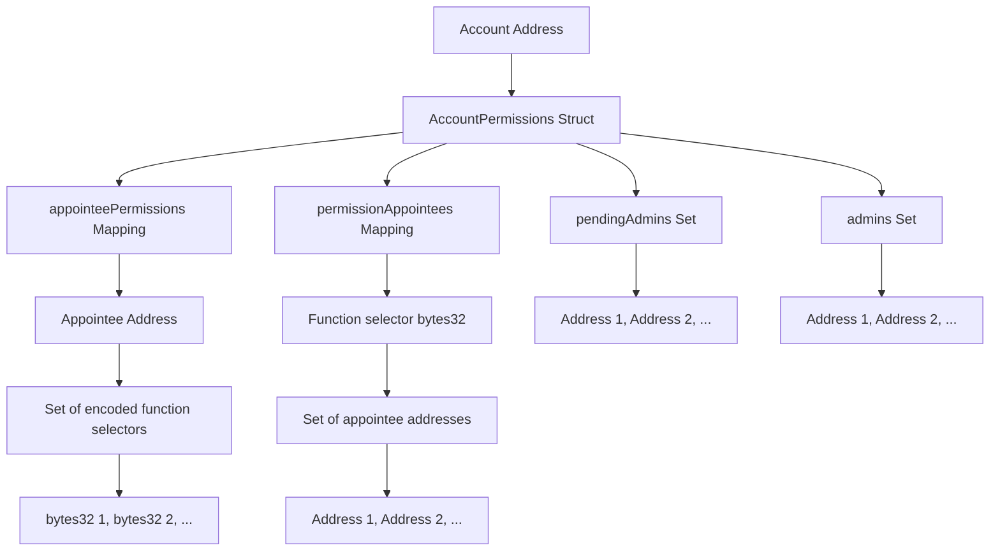

# PermissionControllerStorage

## Contract Overview

PermissionControllerStorage is an abstract smart contract serving as a foundational storage component for implementing granular permission management systems in blockchain applications. It defines the data structures needed to track and manage permissions across different accounts, enabling a hierarchical access control system with admin and appointee roles. 

The contract is designed as a storage layer meant to be inherited by other contracts (likely a PermissionController implementation contract) that will provide the actual logic to manipulate these permission structures. By separating storage from logic, the system follows the proxy pattern, which is a common practice in upgradeable smart contract architectures.

The contract specifically focuses on providing a flexible data structure for:
- Managing admin users for accounts
- Tracking pending admin appointments
- Managing granular function-level permissions for appointees
- Creating a relationship between specific contract functions and appointed users

## Contract Interface

### Key State Variables

- `_permissions`: A mapping from each account address to its `AccountPermissions` struct, which contains:
  - `pendingAdmins`: A set of addresses that have been nominated as admins but haven't accepted yet
  - `admins`: A set of addresses that have admin privileges for the account
  - `appointeePermissions`: Maps appointee addresses to their permitted contract functions (encoded as bytes32)
  - `permissionAppointees`: Reverse mapping that maps functions (encoded as bytes32) to the addresses permitted to call them

### Imports and Libraries

- `EnumerableSet`: From OpenZeppelin, used to store unique collections of values and efficiently check for membership
- `IPermissionController`: An interface that this contract implements, defining the expected API for permission management

## Logic Flow

The PermissionControllerStorage contract doesn't implement any logic itself; rather, it defines the data structure that will be used by implementing contracts. The primary data structure flow is:

1. Each account in the system has its own permission management system (via the `_permissions` mapping)
2. For each account, there are two key user roles:
   - Admins: Users with broad control over the account's settings and permissions
   - Appointees: Users granted specific permissions to interact with certain functions
3. Admin management includes a pending state, suggesting a two-step process where admin appointments must be accepted
4. Permissions are tracked bidirectionally:
   - From appointees to their permitted functions
   - From functions to the appointees allowed to call them

This bidirectional tracking allows for efficient lookups in either direction, whether checking if a user has permissions for a function or finding all users with permissions for a particular function.

## Visual Representation

## Dependencies and Interactions

This contract has the following dependencies:

1. **OpenZeppelin's EnumerableSet**: Used to efficiently manage unique collections of admins, appointees, and function selectors. The library provides functionality for adding, removing, and checking membership in sets.

2. **IPermissionController**: An interface that defines the contract's API. While the storage contract doesn't implement these functions, it inherits the interface, indicating that any contract extending PermissionControllerStorage must implement the methods defined in the interface.

As an abstract storage contract, PermissionControllerStorage is designed to be extended by an implementation contract that will provide the actual logic to:
- Add and remove admins
- Manage the pending admin acceptance flow
- Grant and revoke specific permissions to appointees
- Check permissions during function execution

The contract also includes a storage gap (`__gap`), which is a common pattern in upgradeable contracts. This reserved space in storage allows future versions to add new variables without causing storage collisions with contracts that might inherit from this one.

## Security Considerations

The contract implements several security best practices:
1. **Separation of concerns**: By isolating storage structures from logic, the contract follows a modular design that enhances security and upgradability
2. **Bidirectional permission tracking**: Makes it harder for permissions to get out of sync
3. **Storage gap**: Provides protection against storage collisions during upgrades
4. **Two-step admin appointment**: The pendingAdmins structure suggests a more secure admin management flow that requires acceptance

This carefully designed storage structure provides the foundation for a robust permission system that can manage complex access control requirements in decentralized applications.