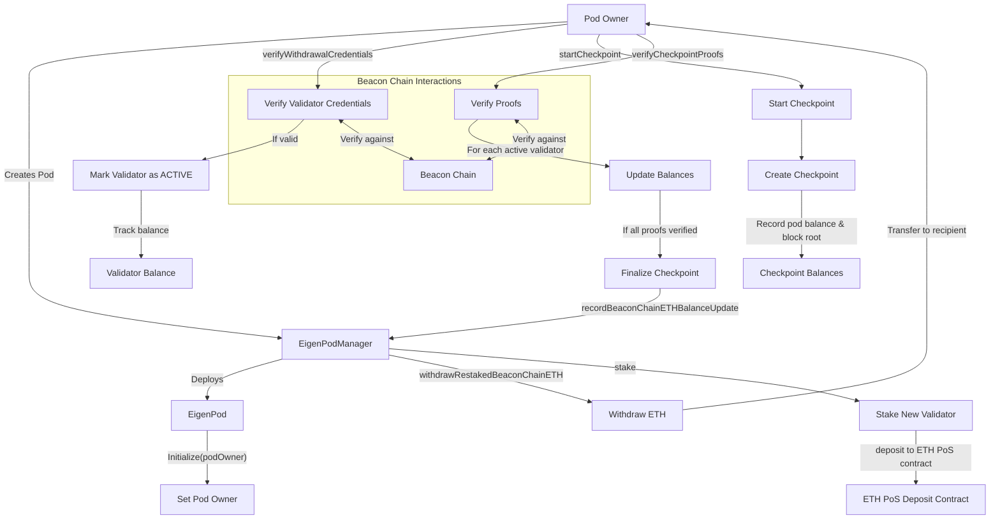

# EigenPod

## Contract Overview

EigenPod is a critical component of the EigenLayer restaking ecosystem, designed to enable users to restake their ETH that is staked in Ethereum's Proof of Stake (PoS) consensus mechanism. It serves as a personal vault that allows Ethereum validators to prove their balances on the beacon chain and have them "recognized" by EigenLayer without moving the actual funds.

The contract's primary purpose is to:
1. Verify validator withdrawal credentials pointing to itself
2. Track validator balances through periodic checkpoints
3. Handle validator exits and withdrawals
4. Make these beacon chain balances available for restaking on EigenLayer

Within the EigenLayer system architecture, each user who wants to restake their ETH validators will have their own EigenPod contract. These pods interact with the EigenPodManager, which coordinates with the broader EigenLayer system. The contract follows the beacon proxy pattern, which allows all EigenPods to share the same implementation while maintaining individual state.

Key design patterns used include:
- Upgradeable proxy pattern
- Modular verification system for beacon chain proofs
- Role-based access control (pod owner, proof submitter)
- Pausable functionality (inherited from EigenPodManager)
- Checkpoint-based accounting system

## Contract Interface

### Key State Variables

- `podOwner`: The address of the pod's owner who can control pod operations
- `proofSubmitter`: Optional designated address allowed to submit proofs on behalf of the owner
- `activeValidatorCount`: Number of active validators whose withdrawals are directed to this pod
- `restakedExecutionLayerGwei`: Total ETH (in Gwei) that has been restaked and is withdrawable
- `_validatorPubkeyHashToInfo`: Mapping from validator public key hash to validator information
- `_currentCheckpoint`: The currently active checkpoint, if any
- `currentCheckpointTimestamp`: Timestamp of the current checkpoint, or 0 if no active checkpoint
- `lastCheckpointTimestamp`: Timestamp of the last completed checkpoint

### External Functions

- `initialize(address _podOwner)`: Sets up the pod with its owner (called by EigenPodManager on creation)
- `startCheckpoint(bool revertIfNoBalance)`: Begins a new checkpoint process to update balances
- `verifyCheckpointProofs(...)`: Submits proofs of validators' current balances to update the checkpoint
- `verifyWithdrawalCredentials(...)`: Verifies validators have withdrawal credentials pointing to this pod
- `verifyStaleBalance(...)`: Allows initiating a checkpoint when a validator has been slashed
- `recoverTokens(...)`: Allows pod owner to withdraw any ERC20 tokens from the pod
- `setProofSubmitter(address newProofSubmitter)`: Updates who can submit proofs for the pod
- `stake(...)`: Called by EigenPodManager to create a new validator through the Eth deposit contract
- `withdrawRestakedBeaconChainETH(address recipient, uint256 amountWei)`: Transfers ETH to recipient

### Important Events

- `CheckpointCreated`: Emitted when a new checkpoint is started
- `CheckpointFinalized`: Emitted when a checkpoint is completed
- `ValidatorRestaked`: Emitted when a validator's withdrawal credentials are verified
- `ValidatorCheckpointed`: Emitted when a validator's balance is updated in a checkpoint
- `ValidatorWithdrawn`: Emitted when a validator is marked as withdrawn
- `ValidatorBalanceUpdated`: Emitted when a validator's balance changes
- `ProofSubmitterUpdated`: Emitted when the proof submitter address is changed
- `EigenPodStaked`: Emitted when the pod stakes a new validator
- `RestakedBeaconChainETHWithdrawn`: Emitted when restaked ETH is withdrawn
- `NonBeaconChainETHReceived`: Emitted when the pod receives ETH outside of withdrawal proofs

## Logic Flow

### Restaking Workflow

1. **Pod Creation**: A user deploys an EigenPod through the EigenPodManager.
2. **Validator Credential Verification**:
   - User or their proof submitter calls `verifyWithdrawalCredentials` with proofs from the beacon chain.
   - Contract verifies withdrawal credentials point to the pod address.
   - Valid validators are marked as ACTIVE and their balances are tracked.

3. **Checkpoint Process**:
   - Periodically, `startCheckpoint` is called to initialize a checkpoint.
   - The current pod balance and Ethereum block root are recorded.
   - For each active validator, proofs are submitted via `verifyCheckpointProofs`.
   - When all required proofs are submitted, the checkpoint finalizes.
   - The pod's balances are updated and the EigenPodManager is notified.

4. **Withdrawals**:
   - When validators exit the beacon chain, their balances are updated in checkpoints.
   - The EigenPodManager can call `withdrawRestakedBeaconChainETH` to transfer ETH to a recipient.

### Balance Tracking Mechanism

The contract carefully tracks three types of balances:
1. **Validator Balances**: Individual balances of each active validator.
2. **Pod ETH Balance**: Native ETH held by the pod contract.
3. **Restaked Execution Layer Balance**: The portion of pod balance that has been "checkpointed" and is eligible for withdrawal.

During checkpoints, the contract:
- Tracks changes in active validator balances on the beacon chain
- Incorporates the pod's native ETH balance into the restaked amount
- Identifies validators that have exited (balance = 0)
- Updates the restaked balance that the broader EigenLayer system can recognize

### Security Mechanisms

1. **Access Controls**:
   - `onlyEigenPodOwner` modifier restricts functions to the pod owner
   - `onlyEigenPodManager` limits certain functions to the EigenPodManager contract
   - `onlyOwnerOrProofSubmitter` allows designated proof submitters to help manage the pod

2. **Checkpoint Integrity**:
   - Only one checkpoint can be active at a time
   - Validators cannot be proven twice in the same checkpoint
   - Timestamp constraints ensure proofs are chronologically valid

3. **Withdrawal Security**:
   - Clear accounting of withdrawable amounts
   - Verification of beacon chain proofs
   - Integration with EigenLayer's slashing management

4. **Pause Functionality**:
   - Critical functions can be paused by the EigenPodManager
   - Different pause switches for different functionalities

## Visual Representation

## Dependencies and Interactions

### Contract Dependencies

1. **EigenPodManager**: Coordinates all EigenPods and integrates with DelegationManager
   - Deploys new EigenPods
   - Records balance updates
   - Facilitates withdrawals

2. **ETH PoS Deposit Contract**: Used when staking new validators
   - Receives 32 ETH deposits for new validators
   - Registers validator credentials with the beacon chain

3. **EIP-4788 Beacon Block Root Oracle**: Provides access to historical beacon chain block roots
   - Used to verify proofs against specific beacon chain blocks
   - Located at a predefined address (`0x000F3df6D732807Ef1319fB7B8bB8522d0Beac02`)

4. **BeaconChainProofs Library**: Handles verification of beacon chain proofs
   - Validates withdrawal credentials
   - Verifies validator balances and states

### External Contract Interactions

1. **EigenPod ↔ EigenPodManager**:
   - EigenPod calls `recordBeaconChainETHBalanceUpdate` to update balances after checkpoints
   - EigenPodManager calls `withdrawRestakedBeaconChainETH` to withdraw funds
   - EigenPodManager calls `stake` to create new validators

2. **EigenPod ↔ ETH PoS Deposit Contract**:
   - EigenPod calls `deposit` to create new validators

3. **EigenPod ↔ EIP-4788 Oracle**:
   - EigenPod static calls the oracle to get historical beacon chain block roots

### System Data Flow

1. Withdrawal credentials are verified from beacon chain to EigenPod
2. Checkpoint proofs flow from the beacon chain through the EigenPod 
3. Balance updates flow from EigenPod to EigenPodManager
4. ETH withdrawals flow from EigenPod to users through the EigenPodManager and DelegationManager

The EigenPod serves as the critical bridge between a user's ETH staked on the beacon chain and the EigenLayer protocol, allowing ETH to be dual-purposed for both consensus security and restaking applications without requiring it to leave the beacon chain.