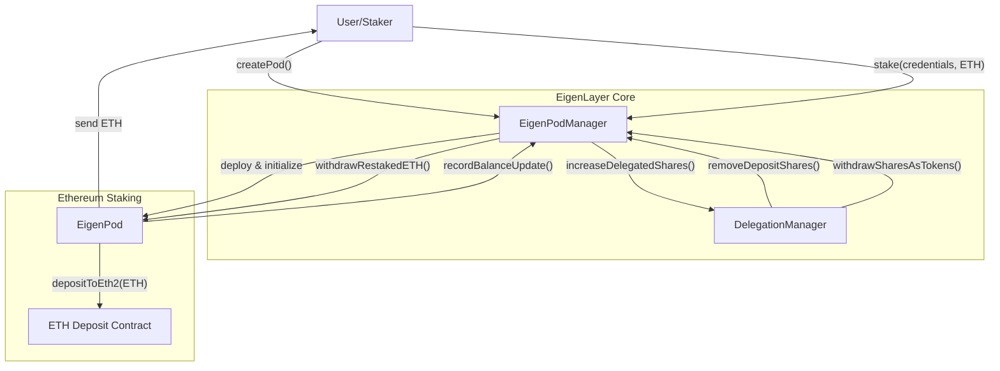

# EigenPodManager

## Contract Overview

EigenPodManager is a central contract in the EigenLayer protocol that manages the creation and operation of EigenPods. These EigenPods are the mechanism through which users can restake their Ethereum validator deposits into EigenLayer, enabling them to participate in the EigenLayer protocol while maintaining their validator role on Ethereum's beacon chain.

The contract serves as a coordination layer between individual EigenPods and the broader EigenLayer system. It keeps track of each user's restaked ETH balances, handles the deployment of new EigenPods, facilitates staking operations, and manages the accounting of ETH shares that represent a user's restaked ETH.

The design follows a hub-and-spoke architecture where the EigenPodManager is the hub that coordinates with individual EigenPods (the spokes) and other core components of the EigenLayer protocol like the DelegationManager. It uses the proxy pattern, enabling upgradability, and implements various security mechanisms including reentrancy protection, pausing functionality, and access control modifiers.

## Contract Interface

### Key State Variables
- `ownerToPod`: Maps addresses to their corresponding EigenPod contracts
- `podOwnerDepositShares`: Tracks how many beacon chain ETH shares each pod owner has delegated
- `eigenPodBeacon`: The beacon contract for EigenPod proxy deployment
- `delegationManager`: Reference to the DelegationManager contract that handles delegation relationships
- `beaconChainETHStrategy`: The strategy contract representing beacon chain ETH deposits
- `numPods`: Counter of how many pods have been deployed
- `burnableETHShares`: Total amount of ETH shares that can be burned (used for protocol fee accounting)

### Public/External Functions

**Pod Creation and Management:**
- `createPod()`: Deploys a new EigenPod for the caller
- `stake(bytes pubkey, bytes signature, bytes32 depositDataRoot)`: Stakes ETH for a new validator on an EigenPod
- `getPod(address podOwner)`: Returns the EigenPod for a given owner
- `hasPod(address podOwner)`: Checks if an address has an EigenPod already

**Balance and Share Management:**
- `recordBeaconChainETHBalanceUpdate(address podOwner, uint256 prevRestakedBalanceWei, int256 balanceDeltaWei)`: Records updates to a pod owner's beacon chain balance
- `removeDepositShares(address staker, IStrategy strategy, uint256 depositSharesToRemove)`: Removes shares when a staker queues a withdrawal
- `addShares(address staker, IStrategy strategy, uint256 shares)`: Adds shares to a staker's balance
- `withdrawSharesAsTokens(address staker, IStrategy strategy, IERC20, uint256 shares)`: Completes a withdrawal by sending tokens to the staker
- `increaseBurnableShares(IStrategy, uint256 addedSharesToBurn)`: Increases the count of burnable shares

**View Functions:**
- `stakerDepositShares(address user, IStrategy strategy)`: Returns a staker's deposit shares
- `beaconChainSlashingFactor(address podOwner)`: Returns a pod owner's beacon chain slashing factor

### Key Events
- `PodDeployed(address pod, address owner)`: Emitted when a new pod is deployed
- `PodSharesUpdated(address podOwner, int256 sharesDelta)`: Emitted when a pod owner's shares change
- `NewTotalShares(address podOwner, int256 totalShares)`: Emitted when total shares are updated
- `BeaconChainSlashingFactorDecreased(address podOwner, uint64 prevFactor, uint64 newFactor)`: Emitted when a slashing factor is decreased
- `BurnableETHSharesIncreased(uint256 addedSharesToBurn)`: Emitted when burnable shares increase

## Logic Flow

### EigenPod Creation Process
1. A user calls `createPod()` or `stake()` without having a pod
2. The contract verifies the user doesn't already have a pod
3. `_deployPod()` is called, which:
   - Increments the pod counter
   - Computes a deterministic address using Create2 with the user's address as salt
   - Deploys a new EigenPod proxy at that address
   - Initializes the pod with the user as the owner
   - Stores the pod-owner relationship
   - Emits a `PodDeployed` event

### Staking Process
1. User calls `stake()` with validator credentials and ETH value
2. If the user doesn't have a pod, one is deployed
3. The contract forwards the credentials and ETH to the user's pod
4. The pod handles the actual staking by calling the ETH deposit contract

### Balance Update Mechanism
1. An EigenPod calls `recordBeaconChainETHBalanceUpdate` when a validator's balance changes
2. If the balance delta is positive:
   - Shares are added to the pod owner's account using `_addShares`
   - The DelegationManager is notified to increase delegated shares
3. If the balance delta is negative:
   - The pod owner's slashing factor is reduced proportionally using `_reduceSlashingFactor`
   - The DelegationManager is notified to decrease delegated shares

### Withdrawal Process
1. When a user wants to withdraw, the DelegationManager first calls `removeDepositShares`
2. Later, to complete the withdrawal, it calls `withdrawSharesAsTokens`
3. If the user has a negative share balance (legacy condition), these shares are first paid off
4. Any remaining shares are withdrawn as ETH from the user's EigenPod

### Share Accounting
The contract uses a sophisticated share accounting system to track user deposits:
- Positive shares represent real restaked ETH
- Historically, negative shares could exist (legacy cases), representing a share deficit
- The contract handles both cases, prioritizing paying off share deficits

## Visual Representation

## Dependencies and Interactions

### External Dependencies
- **OpenZeppelin Contracts**: For secure implementations of standard patterns such as `Create2`, upgradeable contracts, and reentrancy guards
- **ETH2 Deposit Contract**: Interfaced through `IETHPOSDeposit` to stake ETH on the beacon chain
- **BeaconProxy Pattern**: Used for creating upgradeable EigenPods

### Internal Contract Interactions
- **EigenPod**: Individual user pods that interface directly with the ETH2 deposit contract and manage validator operations
- **DelegationManager**: Manages delegation relationships between stakers and operators
- **BeaconChainETHStrategy**: Represents the strategy for beacon chain ETH in the EigenLayer system

The EigenPodManager acts as a crucial bridge between individual EigenPods (which handle direct beacon chain interactions) and the broader EigenLayer system (represented by the DelegationManager). It coordinates share accounting, deployment of new pods, and ensures that all restaked ETH is properly tracked and represented within the EigenLayer protocol.

The contract implements a sophisticated slashing mechanism that allows for partial slashings by tracking a slashing factor for each pod owner. When a negative balance delta is reported (indicating a reduction in a validator's balance), the pod owner's slashing factor is decreased proportionally, devaluing their shares instead of directly removing them.

Overall, the EigenPodManager serves as the central coordination point for Ethereum validators who want to participate in EigenLayer while maintaining their validator operations.