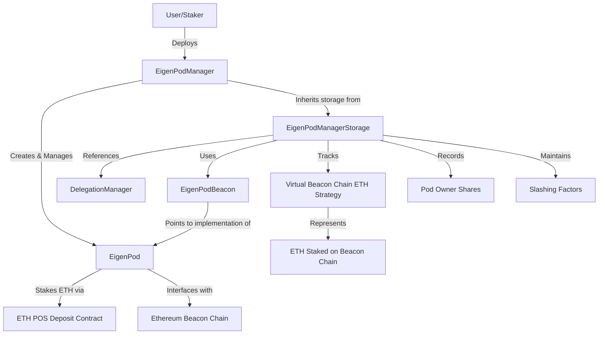

# EigenPodManagerStorage

## 1. Contract Overview

The `EigenPodManagerStorage` is a foundational abstract storage contract for EigenLayer's pod management system. It serves as the base storage layer for the EigenPodManager contract, which is responsible for managing individual EigenPods - smart contracts that interface with Ethereum's consensus layer staking system.

### Purpose and Main Functionality
This contract defines the essential storage variables and constants that are required for managing EigenPods across the EigenLayer protocol. In the EigenLayer ecosystem, EigenPods enable users to "restake" their Ethereum validator deposits, allowing them to participate in both Ethereum consensus and EigenLayer's security provision without moving their ETH from the beacon chain.

### System Architecture Context
The `EigenPodManagerStorage` sits at a crucial position in the EigenLayer architecture:
- It forms the storage foundation for EigenPodManager
- It maintains references to individual EigenPods (one per staker)
- It interacts with core EigenLayer contracts like DelegationManager
- It connects to Ethereum's consensus layer via the ETH2 deposit contract

### Key Design Patterns
1. **Proxy Pattern** - Uses a beacon proxy pattern for upgradeability
2. **Storage Inheritance** - Serves as a storage base for derived contracts
3. **Immutability where possible** - Critical addresses and bytecode are immutable
4. **Storage Gap** - Implements the OpenZeppelin storage gap pattern to enable safe upgrades

## 2. Contract Interface

### Key State Variables

1. **ethPOS** (immutable): Interface to the ETH2 deposit contract, allowing stakers to deposit ETH to become validators
2. **eigenPodBeacon** (immutable): The beacon contract that points to the current implementation of EigenPod
3. **delegationManager** (immutable): EigenLayer's delegation management contract
4. **beaconProxyBytecode** (constant): Pre-stored bytecode for creating beacon proxies, ensuring address consistency
5. **beaconChainETHStrategy** (constant): Virtual strategy representing ETH staked in the beacon chain
6. **ownerToPod**: Mapping from an owner's address to their deployed EigenPod
7. **numPods**: Counter for the total number of deployed EigenPods
8. **podOwnerDepositShares**: Tracks each pod owner's shares in the virtual beacon chain ETH strategy
9. **_beaconChainSlashingFactor**: Records slashing factors applied to stakers for the beacon chain ETH strategy
10. **burnableETHShares**: Tracks the amount of shares slashed but not yet burned

### Important Events
The contract inherits from `IEigenPodManager` which would define related events, though none are directly implemented in this storage contract.

## 3. Logic Flow

The `EigenPodManagerStorage` contract primarily serves as a storage layer, so it doesn't implement extensive logic beyond its constructor. However, it establishes the key structures that will drive these main workflows:

### EigenPod Deployment and Management
1. The contract tracks mappings from pod owners to their respective EigenPods
2. It maintains a count of deployed pods through the `numPods` variable

### Deposit Share Management
1. The contract stores deposit shares for pod owners via `podOwnerDepositShares`
2. These shares represent a staker's portion of the virtual beacon chain ETH strategy
3. Importantly, shares increase when a balance increases, but do not decrease on balance decreases
4. Instead, a slashing factor is recorded when balances decrease, impacting future withdrawals

### Slashing Mechanism
1. The contract tracks slashing factors per staker in `_beaconChainSlashingFactor`
2. It maintains a count of burnable ETH shares through `burnableETHShares`
3. When validators are slashed on Ethereum, this system allows EigenLayer to enforce corresponding penalties

### Historical Context
The contract includes several deprecated variables (marked with `__deprecated_` prefix), showing its evolution over time:
- The beacon chain oracle was replaced with direct EIP-4788 integration
- Maximum pod limitations were removed
- The Deneb fork timestamp is no longer directly tracked here

## 4. Visual Representation

## 5. Dependencies and Interactions

### External Contracts

1. **IETHPOSDeposit** (ethPOS)
   - Official Ethereum Deposit Contract interface
   - Enables deposits of 32 ETH to create validators on Ethereum's consensus layer
   - Critical for allowing EigenPods to register with the beacon chain

2. **IBeacon** (eigenPodBeacon)
   - OpenZeppelin's beacon contract interface
   - Points to the current implementation of EigenPod
   - Enables upgradeability of EigenPods without changing their addresses

3. **IDelegationManager** (delegationManager)
   - Core EigenLayer contract for managing delegations
   - Handles the accounting logic for deposits, withdrawals, and delegations
   - Essential for coordinating between stakers and operators

### Other EigenLayer Interfaces
The contract imports several other interfaces:
- **IStrategy**: Interface for EigenLayer strategy contracts
- **IEigenPodManager**: Interface for the EigenPodManager contract
- **IStrategyManager**: Interface for managing strategies in EigenLayer
- **IEigenPod**: Interface for individual EigenPod instances

### Key Interactions
- EigenPodManager creates EigenPods for stakers using the beacon proxy pattern
- Each EigenPod interacts with ETH2 deposit contract to manage validator stakes
- DelegationManager coordinates with EigenPodManager for delegation accounting
- EigenPods report balance changes back to EigenPodManager, which updates shares and slashing factors

The `EigenPodManagerStorage` contract establishes a critical foundation for EigenLayer's restaking functionality, enabling Ethereum validators to provide security to multiple networks simultaneously without moving their staked ETH from the beacon chain. This represents a significant innovation in the "restaking" concept at the heart of EigenLayer's design.