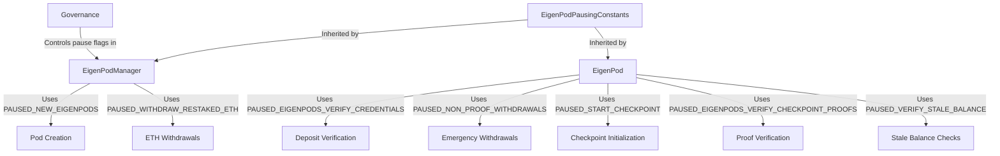

# EigenPodPausingConstants

## Contract Overview

`EigenPodPausingConstants` is a foundational abstract contract that defines a set of standardized constants used to control various pausing mechanisms throughout the EigenLayer protocol's pod system. Its primary purpose is to centralize the definition of pause flags that control the operational states of EigenPods and the EigenPodManager.

This contract fits into the EigenLayer architecture as a base component that enables consistent governance-controlled pause functionality across the pod system. EigenLayer is a protocol that allows ETH stakers to restake their assets and provide security to other applications, and the pausing mechanisms defined here are critical for managing risk in this system.

The contract employs a simple but effective design pattern for pausing functionality using uint8 constants as bit flags. This approach allows for granular control over different aspects of the system, enabling selective pausing of specific functions rather than shutting down the entire protocol during maintenance or emergencies.

## Contract Interface

### Key State Variables

The contract contains no state variables, only constants. These constants are integer indices representing different pause flags:

- `PAUSED_NEW_EIGENPODS (0)`: Controls the creation of new EigenPods
- `PAUSED_WITHDRAW_RESTAKED_ETH (1)`: Controls withdrawal functionality in EigenPodManager
- `PAUSED_EIGENPODS_VERIFY_CREDENTIALS (2)`: Controls deposit-related functions in EigenPods
- `PAUSED_NON_PROOF_WITHDRAWALS (5)`: Controls "accidental transfer" withdrawal methods
- `PAUSED_START_CHECKPOINT (6)`: Controls checkpoint initialization
- `PAUSED_EIGENPODS_VERIFY_CHECKPOINT_PROOFS (7)`: Controls the verification of checkpoint proofs
- `PAUSED_VERIFY_STALE_BALANCE (8)`: Controls stale balance verification

There are also deprecated flags (indices 3 and 4) that were previously used but have been removed from active use.

The contract contains no functions or events as it serves purely as a constants repository.

## Logic Flow

This contract doesn't implement any logic flows directly. Instead, it provides a standardized set of constants that are used by other contracts (EigenPod and EigenPodManager) to implement their pausing logic. 

The pausing mechanism likely works as follows:

1. The system maintains a bitmap where each bit position corresponds to one of these constants
2. When a specific bit is set to 1, the corresponding functionality is paused
3. Before executing sensitive operations, the inheriting contracts check these flags
4. If the relevant flag is set, the operation is rejected

This approach allows for precise control over system functionality, enabling administrators to pause specific features without disrupting the entire system, which is crucial for a protocol managing staked ETH.

## Visual Representation

## Dependencies and Interactions

`EigenPodPausingConstants` does not interact directly with other contracts. Instead, it is designed to be inherited by both the EigenPod and EigenPodManager contracts, which then use these constants to implement consistent pausing behavior.

The inheriting contracts would typically:

1. Maintain a bitmap of currently active pause flags
2. Provide administrative functions to set or clear specific flags
3. Include modifiers that check these flags before executing sensitive operations
4. Revert transactions that attempt to execute paused functionality

The pausing system appears to be particularly focused on risk management for ETH staking operations, including deposit verification, withdrawal processes, and proof verification - all critical aspects of a secure staking system.

This contract represents an elegant solution for centralizing pause constants, ensuring that both the pod manager and individual pods operate with consistent understanding of what each pause flag means, which is essential for maintaining system integrity during upgrades or when responding to potential security incidents.