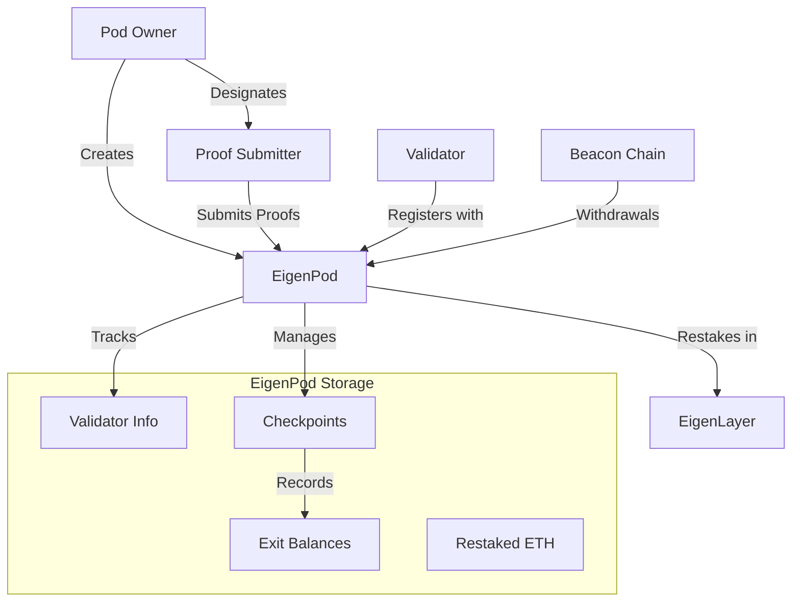

# EigenPodStorage

## Contract Overview

EigenPodStorage is an abstract smart contract that serves as the foundational storage layer for EigenPods in the EigenLayer protocol. An EigenPod is a specialized contract that enables Ethereum validators to restake their ETH into EigenLayer while maintaining their validator operations on the Beacon Chain. This contract specifically handles the storage aspects of an EigenPod without implementing the logic functions.

The primary purpose of this storage contract is to maintain the state of a validator's participation in EigenLayer, tracking information such as the pod owner, active validators, checkpoint data, and balances. It acts as a bridge between the Ethereum consensus layer (Beacon Chain) and EigenLayer's restaking ecosystem.

EigenPodStorage utilizes the inheritance pattern for organizing contract code, providing a clean separation between storage variables and implementation logic. This design pattern helps with upgradeability and maintaining a clear contract structure.

## Contract Interface

### Key State Variables

- **podOwner**: The address of the EigenPod owner, who has primary control over the pod and its associated validators.
  
- **restakedExecutionLayerGwei**: Tracks the amount of ETH (in Gwei) that has been withdrawn from the Beacon Chain but remains staked in EigenLayer.
  
- **_validatorPubkeyHashToInfo**: A mapping that stores validator information indexed by the hash of their public key. This mapping is central to tracking the status of validators associated with this pod.
  
- **activeValidatorCount**: The number of validators with proven withdrawal credentials who have not yet fully withdrawn. This helps track the size and activity of the pod.
  
- **lastCheckpointTimestamp** and **currentCheckpointTimestamp**: Track the timing of checkpoints, which are snapshots of validator statuses and balances.

- **checkpointBalanceExitedGwei**: A mapping that records the total balance attributed to exited validators (in Gwei) for each checkpoint.

- **_currentCheckpoint**: Stores data about the current active checkpoint, if there is one.

- **proofSubmitter**: An address designated by the pod owner with permissions to submit proofs on behalf of the owner, allowing the actual owner to remain a cold wallet.

Many deprecated variables are noted in the contract with the `__deprecated_` prefix, indicating the evolution of the contract's design over time.

### Public/External Functions

While this is primarily a storage contract, it inherits from IEigenPod interface which would define functions to be implemented by the concrete EigenPod contract. The storage contract itself doesn't implement these functions but sets up the state variables they will use.

### Events

The contract itself doesn't define events, but as an implementation of IEigenPod, it would be expected to emit events defined in that interface when state changes occur.

## Logic Flow

Since EigenPodStorage is an abstract storage contract, it doesn't implement the logic flow directly. However, we can infer the intended flow from the state variables:

1. **Pod Creation and Ownership**: A pod is created for a specific owner (podOwner), who can designate a separate address (proofSubmitter) for certain operational tasks.

2. **Validator Registration**: Validators are registered with the pod, with their information stored in the _validatorPubkeyHashToInfo mapping.

3. **Checkpoint Management**: The system periodically creates checkpoints to track validator balances and status changes:
   - A checkpoint is started (setting currentCheckpointTimestamp)
   - Proofs are submitted for validators
   - The checkpoint is processed and finalized (updating lastCheckpointTimestamp)

4. **Exit Tracking**: When validators exit the Beacon Chain, their exited balances are tracked in checkpointBalanceExitedGwei, which helps account for ETH that should be withdrawable.

5. **Restaking Management**: The contract tracks ETH that has been withdrawn from the Beacon Chain but remains staked in EigenLayer (restakedExecutionLayerGwei).

The contract includes detailed comments explaining important edge cases in the exit tracking logic, noting that the exited balance calculations might not always perfectly capture what is typically considered a "full exit" due to timing of deposits and withdrawals.

## Visual Representation

## Dependencies and Interactions

EigenPodStorage depends on:

1. **IEigenPod Interface**: The contract implements this interface, which defines the expected API for an EigenPod.

2. **External Systems**:
   - **Beacon Chain**: While not directly referenced in the code, the contract is designed to interact with the Ethereum Beacon Chain, tracking validator statuses and withdrawals.
   - **EigenLayer Protocol**: The contract serves as a component in the broader EigenLayer ecosystem, enabling ETH restaking.

3. **Implementation Contracts**: As an abstract storage contract, EigenPodStorage is meant to be inherited by concrete implementation contracts that provide the actual logic for operations like verifying withdrawal credentials, processing checkpoints, and managing withdrawals.

The storage contract includes a storage gap (`__gap`) with 35 reserved slots to allow for future upgrades without disrupting the storage layout, which is a best practice for upgradeable contracts.

The extensive use of deprecated variables indicates that this contract has evolved significantly, likely in response to changes in the Ethereum protocol (particularly around withdrawals) and improvements to the EigenLayer design.