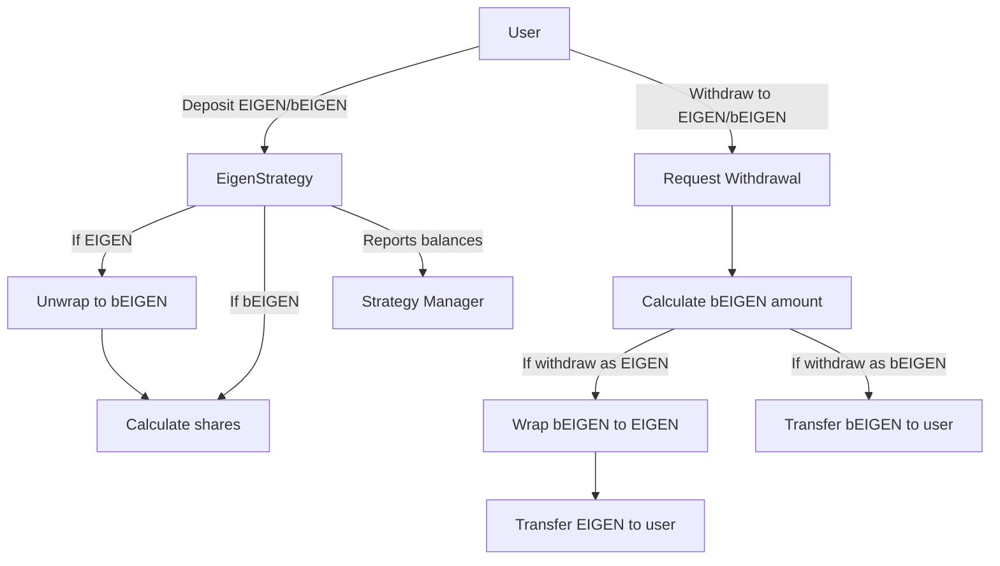

# EigenStrategy

## 1. Contract Overview

### Purpose and Main Functionality
The `EigenStrategy` smart contract is a specialized implementation of Ethereum's EigenLayer protocol that serves as a strategy for managing both EIGEN and bEIGEN tokens. It functions similarly to an ERC4626 tokenized vault but without issuing a token. The contract's primary purpose is to enable users to deposit either EIGEN or bEIGEN tokens and automatically handle the conversion between these two token types when necessary.

### System Architecture Position
This contract inherits from `StrategyBase` and implements functionality specific to the EIGEN token ecosystem. It acts as an intermediary layer between token holders and the broader EigenLayer staking system. In the EigenLayer architecture, this contract serves as a specialized strategy that the StrategyManager can interact with for handling EIGEN-specific tokenomics.

### Key Design Patterns
1. **Proxy Pattern**: The contract is designed to be initializable rather than having constructor-initialized storage, indicating it's meant to be deployed behind a proxy.

2. **Hook Pattern**: Implements hook functions (`_beforeDeposit`, `_beforeWithdrawal`, `_afterWithdrawal`) that are called during key operations and can be overridden by derived contracts.

3. **Virtual Shares Mitigation**: Addresses the "inflation attack" vulnerability common in tokenized vault designs by using share and balance offsets.

4. **Storage Gap Pattern**: Includes a storage gap (`__gap`) to allow for future version upgrades without storage collision issues.

## 2. Contract Interface

### Public/External Functions
- `initialize(IEigen _EIGEN, IERC20 _bEIGEN)`: Initializes the contract with addresses for EIGEN and bEIGEN tokens.
- Inherits functions from `StrategyBase` including deposit and withdrawal functionality.

### Important State Variables
- `EIGEN`: Interface to the EIGEN token contract, which allows wrapping/unwrapping between EIGEN and bEIGEN.
- Inherits `underlyingToken` from `StrategyBase`, which represents the bEIGEN token.

## 3. Logic Flow

### Deposit Flow
1. When a user deposits tokens, `_beforeDeposit` is called to check if the token is either EIGEN or bEIGEN.
2. If the user is depositing EIGEN tokens:
   - The contract unwraps EIGEN into bEIGEN at a 1:1 ratio
   - This bEIGEN is then used for the actual deposit
3. If the user is depositing bEIGEN directly:
   - The deposit proceeds normally as in the base strategy
4. Shares are calculated for the deposited amount using the StrategyBase logic which includes protections against inflation attacks

### Withdrawal Flow
1. When a user withdraws tokens, `_beforeWithdrawal` verifies the requested token type (EIGEN or bEIGEN)
2. The contract calculates the appropriate number of shares to burn based on the requested withdrawal amount
3. In `_afterWithdrawal`:
   - If the user wants to withdraw as EIGEN:
     - The contract wraps bEIGEN into EIGEN at a 1:1 ratio
     - The resulting EIGEN tokens are transferred to the recipient
   - If the user wants to withdraw as bEIGEN:
     - The bEIGEN tokens are transferred directly to the recipient

### Security Mechanisms
- **Inflation Attack Protection**: Uses virtual shares mitigation to prevent manipulation of share price during initial deposits.
- **Token Verification**: Validates token types in deposit and withdrawal operations.
- **Pausability**: Inherits pause functionality from StrategyBase, allowing emergency halting of operations.

## 4. Visual Representation

## 5. Dependencies and Interactions

### External Contract Dependencies
- **IStrategyManager**: The contract interacts with the Strategy Manager to register deposits and withdrawals.
- **IEigen**: Interface for the EIGEN token that allows wrapping and unwrapping between EIGEN and bEIGEN.
- **IERC20**: Standard interface for ERC20 tokens, used for bEIGEN interactions.
- **IPauserRegistry**: Registry of addresses that can pause the contract's functionality in emergency situations.

### Libraries Used
- **SafeERC20**: Provides safe methods for interacting with ERC20 tokens, preventing common pitfalls like tokens that don't return boolean values.

### Key Interactions
1. **Wrapping/Unwrapping**: The strategy interacts with the EIGEN token contract to wrap bEIGEN into EIGEN and unwrap EIGEN into bEIGEN as needed during deposits and withdrawals.
2. **Token Transfers**: Uses SafeERC20 to handle token transfers securely.
3. **Strategy Management**: Implicitly interacts with StrategyManager through the inherited StrategyBase functionality to manage user deposits.

The EigenStrategy serves as a bridge between the EIGEN and bEIGEN token ecosystems in the EigenLayer protocol, enabling users to seamlessly deposit and withdraw either token type while the strategy itself maintains accounting in terms of bEIGEN.