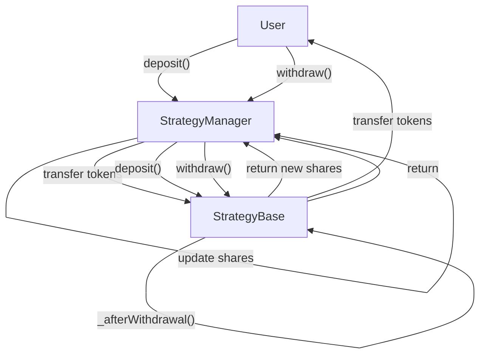

# StrategyBase

## Contract Overview

StrategyBase is a foundational smart contract in the EigenLayer ecosystem that implements the IStrategy interface. It serves as a base layer for more complex investment strategies, providing essential functionality for managing deposits and withdrawals of tokens within the EigenLayer protocol.

The primary purpose of this contract is to provide a secure and standardized way to handle token deposits that can be staked in EigenLayer, while implementing key security mechanisms to prevent common DeFi vulnerabilities like share inflation attacks. In essence, it works similarly to an ERC4626 tokenized vault, but without issuing its own token.

This contract fits into the EigenLayer architecture as the base implementation for all strategies that users can deposit into. The StrategyManager contract (which is referenced as an immutable variable) maintains the accounting of each user's shares within strategies, while the strategies themselves handle the tokens and implement the actual investment logic.

Key design patterns used include:
- Proxy pattern (through Initializable) for upgradability
- Security mechanisms against share inflation attacks
- Hook pattern for extensibility (_beforeDeposit, _beforeWithdrawal, etc.)
- Access control pattern (onlyStrategyManager modifier)

## Contract Interface

### Key State Variables
- `strategyManager`: Immutable reference to EigenLayer's StrategyManager contract
- `underlyingToken`: The ERC20 token that this strategy accepts and manages
- `totalShares`: The total number of shares issued by this strategy
- `SHARES_OFFSET` and `BALANCE_OFFSET`: Constants used to mitigate share inflation attacks

### Public/External Functions
- `initialize(IERC20 _underlyingToken)`: Sets up the strategy with its underlying token
- `deposit(IERC20 token, uint256 amount)`: Accepts token deposits and issues shares in return
- `withdraw(address recipient, IERC20 token, uint256 amountShares)`: Burns shares and returns underlying tokens
- `sharesToUnderlying(uint256 amountShares)`: Converts a share amount to its underlying token value
- `underlyingToShares(uint256 amountUnderlying)`: Converts an underlying token amount to shares
- `userUnderlying(address user)`: Returns the underlying token value of a user's shares
- `shares(address user)`: Returns the number of shares owned by a user

### Events Emitted
- `StrategyTokenSet`: Emitted when the underlying token is set during initialization
- `ExchangeRateEmitted`: Records the current exchange rate between shares and underlying tokens

## Logic Flow

### Initialization Flow
1. The contract is deployed with an immutable reference to the StrategyManager
2. The `initialize` function is called to set the underlying token for the strategy
3. The contract is now ready to accept deposits

### Deposit Flow
1. The StrategyManager transfers tokens to the strategy contract
2. The StrategyManager calls the strategy's `deposit` function
3. `_beforeDeposit` hook is executed to verify the token and perform any pre-deposit checks
4. New shares are calculated based on the current exchange rate, taking into account virtual shares and balance offsets
5. The total share count is updated and exchange rate is emitted
6. The new shares amount is returned to StrategyManager for accounting

### Withdrawal Flow
1. StrategyManager calls the strategy's `withdraw` function with shares to burn
2. `_beforeWithdrawal` hook is executed for validation and any custom logic
3. The amount of underlying tokens to send is calculated based on share value
4. Total shares are reduced
5. The exchange rate is emitted
6. `_afterWithdrawal` hook is called, which transfers tokens to the recipient

### Security Mechanisms
The contract uses two key mechanisms to prevent share inflation attacks:
1. Virtual shares (`SHARES_OFFSET = 1e3`): An offset added to totalShares for calculations
2. Virtual balance (`BALANCE_OFFSET = 1e3`): An offset added to token balance for calculations

These mechanisms protect against first-depositor attacks where they could manipulate the share price by depositing and withdrawing with carefully chosen amounts.

Additionally, the contract implements pausable functionality for both deposits and withdrawals, allowing emergency response in case of discovered vulnerabilities.

## Visual Representation

## Dependencies and Interactions

### Contract Dependencies
- `IStrategyManager`: Interface for interacting with EigenLayer's StrategyManager
- `Pausable`: Provides functions to pause/unpause contract functionality
- `SemVerMixin`: Adds semantic versioning capability to track contract versions
- `Initializable`: OpenZeppelin's upgradable contract functionality
- `IERC20` and `SafeERC20`: Standard interfaces and utilities for ERC20 token interactions

### External Interactions
- **StrategyManager**: The primary interaction point which:
  - Tracks user deposits and withdrawals
  - Manages user share balances across strategies
  - Calls deposit/withdraw functions on strategies after transferring tokens
  
- **Tokens**: The contract interacts with the underlying ERC20 token to:
  - Check balances
  - Transfer tokens during withdrawals

### Child Contract Expectations
This contract is designed to be inherited by more complex strategies which can override:
- `_beforeDeposit`: For custom validation or logic before deposits
- `_beforeWithdrawal`: For custom validation or logic before withdrawals
- `_afterWithdrawal`: To customize how underlying tokens are returned
- `_tokenBalance`: In case a more complex strategy needs custom balance calculation

The contract explicitly notes that it's not intended for use with fee-on-transfer tokens, as this would break the accounting assumptions within the deposit and withdrawal logic.