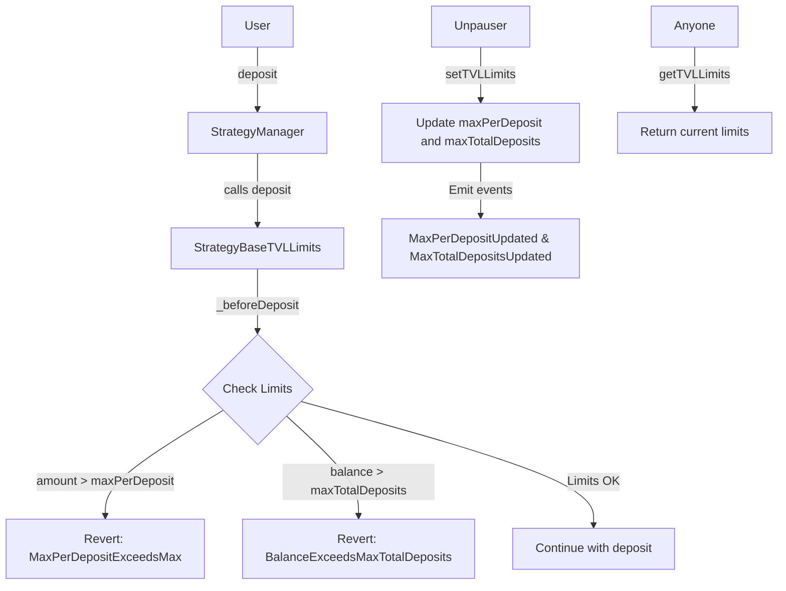

# StrategyBaseTVLLimits

## Contract Overview

StrategyBaseTVLLimits is a specialized implementation of the StrategyBase contract that introduces maximum deposit limits to control the total value locked (TVL) within the strategy. This contract serves two primary purposes:

1. It limits the maximum amount of tokens that can be deposited in a single transaction
2. It caps the total amount of deposits that the strategy will accept overall

The contract is designed as part of the EigenLayer protocol's strategy architecture, providing a way to implement prudent risk management for strategies that might need to control their exposure or growth rate. This approach is common in DeFi protocols that wish to limit risk during early stages or for specific asset classes.

The contract uses the upgradeable proxy pattern, as evidenced by the `initializer` modifier and storage gap, allowing for future upgrades while preserving state. It also follows the inheritance pattern, extending StrategyBase while adding TVL limitation functionality.

## Contract Interface

### Public/External Functions

- **initialize(uint256 _maxPerDeposit, uint256 _maxTotalDeposits, IERC20 _underlyingToken)**: Initializes the strategy with TVL limits and underlying token, can only be called once due to the initializer modifier.
  
- **setTVLLimits(uint256 newMaxPerDeposit, uint256 newMaxTotalDeposits)**: Allows the unpauser to update the maximum per-deposit and total deposit limits.
  
- **getTVLLimits()**: Returns the current maximum per-deposit and maximum total deposit values.

### Important Events

- **MaxPerDepositUpdated(uint256 previousValue, uint256 newValue)**: Emitted when the maximum per-deposit limit is changed.
  
- **MaxTotalDepositsUpdated(uint256 previousValue, uint256 newValue)**: Emitted when the maximum total deposits limit is changed.

### Key State Variables

- **maxPerDeposit**: The maximum amount of underlying tokens that can be deposited in a single transaction.
  
- **maxTotalDeposits**: The maximum total amount of underlying tokens the strategy will accept across all deposits.

## Logic Flow

The StrategyBaseTVLLimits contract implements a straightforward but effective approach to deposit limitations:

1. **Initialization**: When the strategy is first deployed, the `initialize` function is called to set up the TVL limits and the underlying token. This can only happen once due to the initializer modifier.

2. **Deposit Processing**: 
   - When a user attempts to deposit tokens, the contract's inherited `deposit` function from StrategyBase is called.
   - Before processing the deposit, the contract calls the overridden `_beforeDeposit` hook to enforce TVL limits.
   - The hook verifies that:
     - The deposit amount doesn't exceed `maxPerDeposit`
     - The current token balance doesn't exceed `maxTotalDeposits`
   - If either check fails, the transaction reverts

3. **Limits Management**:
   - The unpauser (a privileged role) can adjust the TVL limits using `setTVLLimits`
   - The contract ensures that `maxPerDeposit` never exceeds `maxTotalDeposits`
   - Any changes to limits are logged via events

A key design consideration is that the view functions for converting between shares and underlying tokens purposely do not take the TVL limits into account. This allows for accurate calculations even when deposits might be restricted.

### Security Mechanisms

The contract implements several security features:

1. **Access Control**: Only the unpauser can modify the TVL limits, using the `onlyUnpauser` modifier.
   
2. **Validation Checks**: The contract ensures that `maxPerDeposit` is always less than or equal to `maxTotalDeposits`.
   
3. **Race Condition Awareness**: The contract's documentation explicitly acknowledges potential race conditions that could occur with concurrent deposit attempts or direct token transfers that might push the balance close to the maximum.

4. **Upgradeable Pattern**: The contract includes a storage gap (`__gap`) to allow for future upgrades without disrupting the storage layout.

## Visual Representation

## Dependencies and Interactions

The StrategyBaseTVLLimits contract has several key dependencies and interactions:

1. **StrategyBase**: This contract inherits from StrategyBase, extending its functionality to include TVL limits. It retains all the base strategy behavior while adding deposit limitations.

2. **IStrategyManager**: The contract interacts with the StrategyManager contract, which is responsible for coordinating deposits and withdrawals across the EigenLayer system.

3. **IPauserRegistry**: The contract utilizes a pauser registry to implement access control functionality, particularly for the unpauser role that can modify TVL limits.

4. **IERC20**: The contract interacts with the underlying ERC20 token that it accepts for deposits.

The primary interaction flow involves users depositing tokens through the StrategyManager, which then calls into this strategy. The strategy applies its TVL limit checks before accepting the deposit. The unpauser role has the ability to adjust these limits as needed, perhaps in response to market conditions or risk management requirements.

Note that while the contract implements deposit limitations, it does not modify the share calculation logic from the base strategy. This means that even when deposits are limited, share value calculations remain consistent with the unlimited version of the strategy.