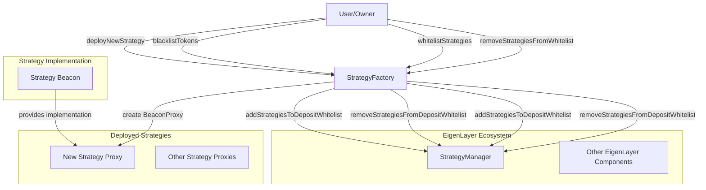

# StrategyFactory

## Contract Overview

The `StrategyFactory` is a crucial component in the EigenLayer ecosystem that enables the deployment of standardized strategy contracts for arbitrary ERC20 tokens. Its primary purpose is to act as a factory for generating proxy instances of strategy contracts, which are then automatically whitelisted in the EigenLayer protocol.

This factory follows the proxy pattern to create minimal, gas-efficient strategy instances that all share the same implementation logic via a beacon contract. The use of beacon proxies allows for upgrading all deployed strategies simultaneously by updating the single beacon implementation.

The contract employs several key design patterns:
- **Proxy Pattern**: Uses OpenZeppelin's BeaconProxy to deploy lightweight clones of the strategy implementation
- **Factory Pattern**: Centralizes the creation of new strategy contracts
- **Upgradeable Pattern**: Inherits from OwnableUpgradeable to support upgradeability
- **Pausability Pattern**: Implements a custom pause mechanism to control strategy creation

Within the EigenLayer system, this contract serves as a gateway for expanding the range of assets that can be staked and delegated, allowing for a more diverse and flexible platform.

## Contract Interface

### State Variables
- `strategyManager` (immutable): Reference to EigenLayer's StrategyManager contract which manages the whitelisting of strategies
- `strategyBeacon` (modifiable): Holds the reference to the beacon contract that contains the strategy implementation
- `deployedStrategies`: Mapping of token addresses to their corresponding deployed strategy contracts
- `isBlacklisted`: Mapping that tracks tokens that have been blacklisted from having strategies

### Public/External Functions
- `initialize(address _initialOwner, uint256 _initialPausedStatus, IBeacon _strategyBeacon)`: Sets up the contract with initial values, can only be called once
- `deployNewStrategy(IERC20 token)`: Deploys a new strategy contract for a specified ERC20 token and adds it to the whitelist
- `blacklistTokens(IERC20[] calldata tokens)`: Owner-only function to prevent specific tokens from having strategies
- `whitelistStrategies(IStrategy[] calldata strategiesToWhitelist)`: Allows the owner to whitelist existing strategy contracts
- `removeStrategiesFromWhitelist(IStrategy[] calldata strategiesToRemoveFromWhitelist)`: Allows the owner to remove strategies from the whitelist

### Events
- `StrategySetForToken(IERC20 token, IStrategy strategy)`: Emitted when a new strategy is set for a token
- `TokenBlacklisted(IERC20 token)`: Emitted when a token is blacklisted
- `StrategyBeaconModified(IBeacon oldBeacon, IBeacon newBeacon)`: Emitted when the strategy beacon is updated

## Logic Flow

### Strategy Deployment Process
1. A user or the protocol owner calls `deployNewStrategy` with an ERC20 token address
2. The contract verifies that:
   - The contract is not in a paused state
   - The specified token is not blacklisted
   - A strategy for this token hasn't already been deployed
3. A new BeaconProxy is created, pointing to the current `strategyBeacon`
4. The proxy is initialized with the token address via the `initialize` function
5. The new strategy is recorded in the `deployedStrategies` mapping
6. The strategy is automatically added to the whitelist in the StrategyManager
7. The new strategy address is returned to the caller

### Token Blacklisting Process
1. The owner calls `blacklistTokens` with an array of token addresses
2. For each token, the contract:
   - Verifies it's not already blacklisted
   - Marks it as blacklisted
   - Emits a `TokenBlacklisted` event
   - If a strategy exists for this token, adds it to a list for whitelist removal
3. If any existing strategies were found for the blacklisted tokens, they're removed from the StrategyManager's whitelist

### Security Mechanisms
- **Pausability**: The contract can be paused to prevent new strategies from being deployed during emergencies
- **Ownership Controls**: Only the contract owner can blacklist tokens or modify the whitelist
- **Token Validation**: Warns about potential risks with non-standard ERC20 tokens, particularly reentrant tokens like ERC777
- **Implementation Separation**: By using the beacon pattern, the implementation logic is separate from the deployed proxies, reducing the attack surface

## Visual Representation

## Dependencies and Interactions

The StrategyFactory interacts with several other contracts:

1. **StrategyManager**: The factory communicates with this core EigenLayer contract to whitelist or remove strategies. This ensures that only vetted strategy contracts can be used for deposits within the EigenLayer protocol.

2. **Strategy Beacon**: This contract holds the implementation logic for all strategy proxies. When the beacon is updated, all deployed proxies will automatically use the new implementation, enabling efficient upgrades.

3. **Strategy Proxies**: The factory deploys minimal proxy contracts that delegate calls to the implementation defined in the beacon. Each proxy handles a specific ERC20 token.

4. **PauserRegistry**: Imported through the Pausable contract, it defines which addresses have permission to pause/unpause certain functions.

The factory relies on several external dependencies:

- **OpenZeppelin Contracts**: For the implementation of BeaconProxy and OwnableUpgradeable
- **SemVerMixin**: For contract versioning
- **StrategyFactoryStorage**: For persistent storage layout
- **StrategyBase**: The base implementation of strategies that proxies will delegate to

The contract serves as a bridge between arbitrary ERC20 tokens and the EigenLayer protocol, enabling a flexible and expandable asset system while maintaining centralized control over which strategies are approved for use.