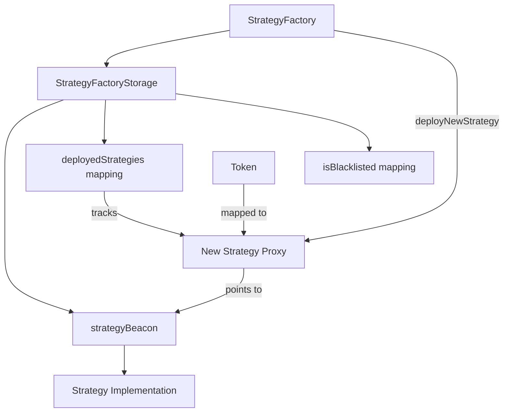

# StrategyFactoryStorage

## Contract Overview

The `StrategyFactoryStorage` contract serves as the storage layer for the StrategyFactory functionality within what appears to be the EigenLayer protocol. This abstract contract defines the core data structures that track deployed strategies and maintains the system's state without implementing the business logic itself.

The primary purpose of this contract is to establish a well-organized storage layout for strategy management, particularly focusing on maintaining references to deployed strategies and their associated token relationships. By separating storage concerns from logic, the system follows a modular design pattern that enhances upgradeability and maintainability.

Within the broader system architecture, this contract likely forms the foundation for a factory pattern implementation that standardizes the deployment and tracking of investment strategies. The use of an abstract contract with a storage gap indicates that this is part of an upgradeable contract system, likely using the proxy pattern common in complex DeFi protocols.

## Contract Interface

### Key State Variables

- **`strategyBeacon`**: An IBeacon interface reference that serves as the implementation pointer for all newly created strategies. Using the beacon pattern allows for all deployed strategies to be upgraded simultaneously by updating a single beacon contract.

- **`deployedStrategies`**: A mapping from ERC20 token addresses to their corresponding Strategy implementations. This mapping tracks which tokens already have strategies deployed for them and provides a way to look up those strategy contracts.

- **`isBlacklisted`**: A mapping that indicates which tokens are restricted from having new strategies deployed. This provides a security mechanism to prevent strategies from being created for problematic or vulnerable tokens.

- **`__gap`**: A storage gap of 48 unused slots reserved for future contract extensions without causing storage collisions, following OpenZeppelin's upgradeability pattern.

### Events and Functions

The contract itself doesn't implement functions or emit events directly. As an abstract storage contract, it inherits from `IStrategyFactory` which would define the function signatures and events that concrete implementations must provide.

## Logic Flow

While the contract doesn't implement logic directly, we can infer the intended data flow:

1. The system maintains a beacon contract that holds the implementation address for strategies
2. When a new strategy is deployed (presumably by `deployNewStrategy` mentioned in comments):
   - The system creates a new beacon proxy pointing to the strategy implementation
   - The relationship between the token and its strategy is stored in `deployedStrategies`
   - The strategy is typically (but not always) whitelisted in a StrategyManager contract
3. Before deploying a strategy, the system checks if the token is blacklisted
4. The contract ensures only one strategy can be deployed per token through this factory, though comments indicate other strategies for the same token might be whitelisted separately

## Visual Representation

## Dependencies and Interactions

The contract has the following key dependencies:

1. **IStrategyFactory**: The interface that defines the functions this storage contract will eventually support when implemented by a concrete factory.

2. **IBeacon**: While not directly imported, this interface is used for the upgrade beacon that all deployed strategies reference.

3. **IERC20**: Referenced in mappings to track tokens associated with strategies.

4. **IStrategy**: The interface that deployed strategy contracts implement.

5. **StrategyManager**: Mentioned in comments but not directly referenced in code. This appears to be a separate contract that maintains a whitelist of approved strategies.

The storage contract is designed to interact within a larger system where:

- A concrete `StrategyFactory` implementation would use this storage to deploy and manage strategies
- Each strategy is associated with a specific token
- The factory maintains a single-strategy-per-token constraint
- A separate manager component controls which strategies are whitelisted for use
- All strategies share the same implementation via the beacon pattern, allowing for mass upgrades

This architecture provides a flexible framework for strategy deployment while maintaining system-wide coherence and upgradeability.