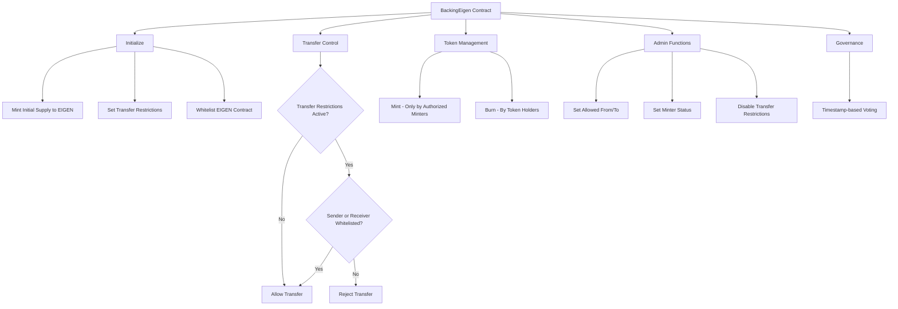

# BackingEigen

## Contract Overview

BackingEigen is a specialized ERC20 token contract that manages the "bEIGEN" token, which serves as a backing token for the EIGEN token. The main purpose of this contract is to create a controlled token environment with transfer restrictions, minting capabilities, and governance features.

The contract fits into a broader ecosystem where it provides a backing mechanism for the EIGEN token, essentially creating a fully backed relationship between bEIGEN and EIGEN. This architecture enables a controlled token economy where certain addresses have special privileges in the ecosystem.

Key design patterns used in this contract include:
- Proxy pattern for upgradeability (using OpenZeppelin's upgradeable contracts)
- Access control (Ownable pattern for administrative functions)
- Token governance (using ERC20Votes extension)
- Whitelisting mechanism for transfer controls

## Contract Interface

### Public/External Functions

- **initialize(address initialOwner)**: Initializes the contract with the specified owner, setting up initial state including transfer restrictions and minting the entire supply to the EIGEN token contract.
- **setAllowedFrom(address from, bool isAllowedFrom)**: Allows the owner to specify addresses that can send tokens to any recipient.
- **setAllowedTo(address to, bool isAllowedTo)**: Allows the owner to specify addresses that can receive tokens from any sender.
- **setIsMinter(address minterAddress, bool newStatus)**: Allows the owner to designate addresses that can mint new tokens.
- **mint(address to, uint256 amount)**: Allows designated minters to create new tokens.
- **burn(uint256 amount)**: Allows any token holder to burn their own tokens.
- **disableTransferRestrictions()**: Allows the owner to permanently disable all transfer restrictions.

### Important Events

- **SetAllowedFrom**: Emitted when an address's status in the `allowedFrom` mapping changes.
- **SetAllowedTo**: Emitted when an address's status in the `allowedTo` mapping changes.
- **TransferRestrictionsDisabled**: Emitted when transfer restrictions are permanently disabled.
- **Backed**: Emitted when the EIGEN token is fully backed with bEIGEN tokens.
- **IsMinterModified**: Emitted when an address's minting privileges are changed.

### Key State Variables

- **EIGEN**: Immutable reference to the wrapped EIGEN token contract.
- **transferRestrictionsDisabledAfter**: Timestamp after which transfer restrictions no longer apply.
- **allowedFrom**: Mapping of addresses that can transfer tokens to any recipient.
- **allowedTo**: Mapping of addresses that can receive tokens from any sender.
- **isMinter**: Mapping of addresses that have permission to mint new tokens.

## Logic Flow

The BackingEigen contract operates with the following main workflows:

1. **Initialization and Initial Backing**:
   - Upon initialization, the contract mints the entire supply of bEIGEN tokens to the EIGEN token contract.
   - This one-time event establishes the backing relationship between bEIGEN and EIGEN.
   - The EIGEN address is whitelisted in both the `allowedFrom` and `allowedTo` mappings to facilitate wrapping and unwrapping operations.

2. **Transfer Control Mechanism**:
   - By default, transfers are restricted to only occur between whitelisted addresses.
   - The contract checks in `_beforeTokenTransfer` if either:
     a) The sender is in the `allowedFrom` mapping
     b) The recipient is in the `allowedTo` mapping 
     c) It's a minting operation (from is address(0))
   - If none of these conditions are met, the transfer is rejected.
   - This restriction mechanism remains in place until the owner calls `disableTransferRestrictions()`.

3. **Minting and Burning**:
   - Only designated minters (addresses with `isMinter[address] == true`) can mint new tokens.
   - Any token holder can burn their own tokens using the `burn` function.
   - Minting and burning operate only after passing the transfer restriction checks.

4. **Governance Features**:
   - The contract inherits from ERC20VotesUpgradeable, enabling token-based governance.
   - The contract overrides `clock()` and `CLOCK_MODE()` to use timestamps instead of block numbers for voting checkpoints.

5. **Security Mechanisms**:
   - Transfer restrictions provide control over token movement until the ecosystem is ready for unrestricted transfers.
   - Owner-only functions for critical operations like whitelisting and disabling transfer restrictions.
   - Requirement checks to prevent unintended operations.

## Visual Representation

## Dependencies and Interactions

The BackingEigen contract has the following dependencies and interactions:

1. **OpenZeppelin Dependencies**:
   - `OwnableUpgradeable`: Provides owner-based access control for administrative functions.
   - `ERC20VotesUpgradeable`: Extends the standard ERC20 with voting and delegation capabilities.
   - `IERC20`: Interface for interacting with the EIGEN token.

2. **Interaction with EIGEN Token**:
   - The contract is initialized with a reference to the EIGEN token.
   - The entire supply of bEIGEN is minted to the EIGEN token contract during initialization.
   - Special transfer permissions are given to the EIGEN contract to facilitate wrapping and unwrapping operations.

3. **Expected Ecosystem Behavior**:
   - The EIGEN contract likely allows users to wrap and unwrap between EIGEN and bEIGEN tokens.
   - The governance features suggest that bEIGEN holders may have voting rights in a broader protocol governance system.
   - The minting capability implies that the supply of bEIGEN might increase over time, potentially based on protocol-specific rules.

This contract serves as a key component in what appears to be a token-based governance system where the EIGEN token is backed 1:1 by bEIGEN, with additional governance features and controlled distribution mechanisms.