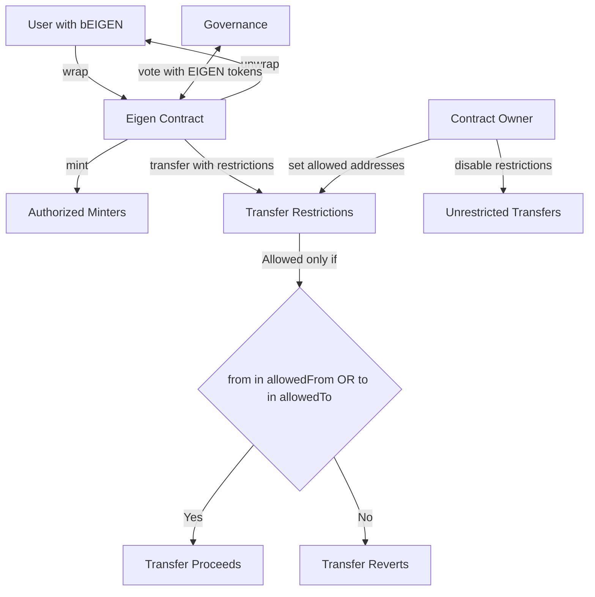

# Eigen

## Contract Overview

Eigen.sol is a governance token contract for the Eigen ecosystem that combines ERC20 functionality with governance features. It's designed to serve as a wrapper around a backing token called bEIGEN, providing voting capabilities and controlled distribution through authorized minters.

The primary purposes of this contract are to:
1. Enable controlled token distribution through authorized minters
2. Provide token holders with voting rights (via the ERC20Votes extension)
3. Allow wrapping and unwrapping between EIGEN and bEIGEN tokens
4. Control token transfers through a whitelist system until restrictions are lifted

The contract implements several key design patterns:
- Upgradeable contract pattern (using OpenZeppelin's upgradeable contracts)
- Proxy pattern (implied by the use of initializer instead of constructor)
- Ownership pattern for privileged operations
- Whitelist pattern for controlling token transfers

## Contract Interface

### Key State Variables
- `bEIGEN`: The immutable address of the backing token
- `mintAllowedAfter`: Maps minter addresses to timestamps after which they can mint
- `mintingAllowance`: Maps minter addresses to the amount they're allowed to mint
- `transferRestrictionsDisabledAfter`: Timestamp after which transfer restrictions are lifted
- `allowedFrom`: Addresses that can send tokens to anyone even during restrictions
- `allowedTo`: Addresses that can receive tokens from anyone even during restrictions

### Public/External Functions
- `initialize(address initialOwner, address[] memory minters, uint256[] memory mintingAllowances, uint256[] memory mintAllowedAfters)`: Initializes the contract with minters and their allowances
- `setAllowedFrom(address from, bool isAllowedFrom)`: Owner can add/remove addresses from the allowedFrom whitelist
- `setAllowedTo(address to, bool isAllowedTo)`: Owner can add/remove addresses from the allowedTo whitelist
- `disableTransferRestrictions()`: Owner can permanently remove transfer restrictions
- `mint()`: Authorized minters can mint their allotted tokens when allowed
- `wrap(uint256 amount)`: Users can wrap bEIGEN tokens into EIGEN tokens
- `unwrap(uint256 amount)`: Users can unwrap EIGEN tokens back to bEIGEN
- `multisend(address[] calldata receivers, uint256[] calldata amounts)`: Allows batch token transfers
- `totalSupply()`: Overridden to return the total supply of the backing bEIGEN token

### Important Events
- `SetAllowedFrom(address indexed from, bool isAllowedFrom)`: Emitted when an address's allowedFrom status changes
- `SetAllowedTo(address indexed to, bool isAllowedTo)`: Emitted when an address's allowedTo status changes
- `Mint(address indexed minter, uint256 amount)`: Emitted when a minter mints tokens
- `TransferRestrictionsDisabled()`: Emitted when transfer restrictions are disabled

## Logic Flow

### Initialization
1. When deployed, the constructor captures the address of the bEIGEN token and disables initializers to prevent re-initialization
2. The `initialize` function must be called once to set up the contract:
   - Sets the contract name and symbol
   - Transfers ownership to the specified initial owner
   - Configures authorized minters with their respective allowances and mint timing
   - Sets transfer restrictions to be active (with a max uint256 value)

### Token Minting Process
1. Authorized minters (set during initialization) can call the `mint()` function
2. The contract checks if:
   - The minter has a remaining allowance greater than zero
   - The current time is past the minter's allowed start time
3. If conditions are met, the contract mints the allowed amount to the minter and resets their allowance to zero

### Wrapping and Unwrapping
1. **Wrapping**: Users with bEIGEN tokens can call `wrap(amount)` to:
   - Transfer their bEIGEN tokens to the contract
   - Receive an equal amount of EIGEN tokens
2. **Unwrapping**: EIGEN holders can call `unwrap(amount)` to:
   - Burn their EIGEN tokens
   - Receive an equal amount of bEIGEN tokens

### Transfer Restrictions
1. The contract implements transfer restrictions through the `_beforeTokenTransfer` hook
2. If the current timestamp is before `transferRestrictionsDisabledAfter`:
   - Transfers are only allowed if either the sender is in `allowedFrom` or the receiver is in `allowedTo`
   - Minting (from address(0)) and burning (to address(0)) are always allowed
3. The owner can disable these restrictions permanently by calling `disableTransferRestrictions()`

### Governance Functionality
1. The contract inherits from ERC20VotesUpgradeable, providing token holders with voting capabilities
2. The clock functionality is overridden to use timestamps instead of block numbers for voting checkpoints
3. This enables token holders to participate in on-chain governance proposals

## Visual Representation

## Dependencies and Interactions

### External Dependencies
1. **OpenZeppelin Contracts**:
   - `IERC20`: Interface for interacting with the bEIGEN token
   - `ERC20VotesUpgradeable`: Provides the base token functionality plus voting capabilities
   - `OwnableUpgradeable`: Provides ownership functionality for restricted operations

### Contract Interactions
1. **bEIGEN Token**: 
   - The Eigen contract interacts with the bEIGEN token contract for wrapping and unwrapping
   - It calls `transferFrom` when users wrap tokens and `transfer` when they unwrap
   - It queries the bEIGEN token for `totalSupply` to ensure consistency

2. **Governance System**:
   - While not explicitly shown in this contract, the ERC20Votes functionality enables integration with governance systems
   - The EIGEN token holders can use their tokens to vote on proposals in a compatible governance contract

### Security Mechanisms
1. **Controlled Distribution**: Only authorized minters can create new tokens and only up to their allowed amount
2. **Time-locked Minting**: Minters can only mint after specific timestamps, allowing for scheduled token distribution
3. **Transfer Restrictions**: Initially, transfers are restricted to a whitelist system until the owner disables restrictions
4. **Owner Controls**: Only the owner can modify the whitelist or disable transfer restrictions
5. **Immutable bEIGEN**: The address of the backing token is immutable, preventing changes to the underlying token

The design of Eigen.sol prioritizes controlled token distribution and governance capabilities while providing flexibility through the owner-controlled whitelist system. The wrapping/unwrapping mechanism maintains a direct relationship with the backing bEIGEN token.